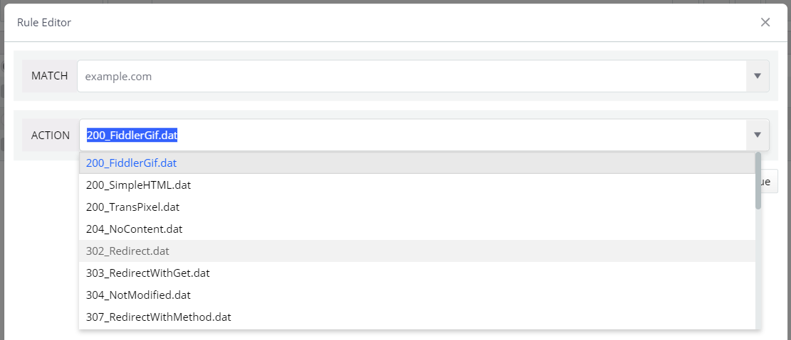
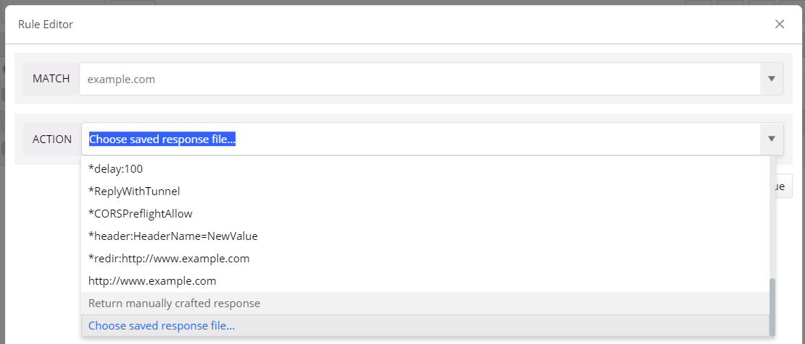
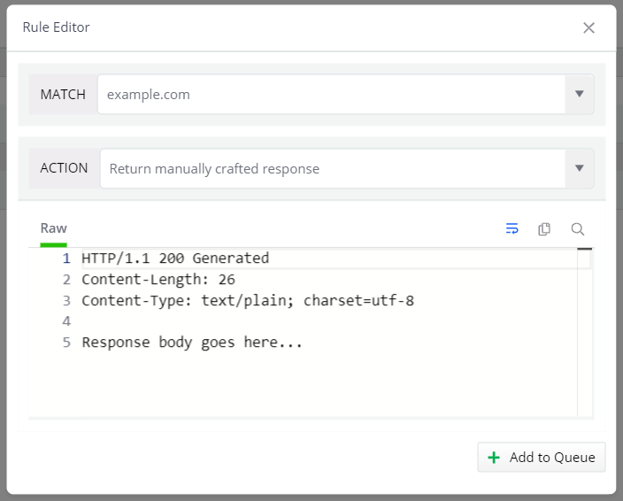

#### Environment

|   |   |
|---|---|
| Product  | Fiddler Everywhere |
| Product Version | 1.5.0 and above  |
| Operating System | macOS, Windows, and Linux |

#### Description

The [Auto Responder]() is one of the most powerful debugging functionalities that Fiddler Everywhere provides. The main idea behind the Auto Responder is to provide a set of rules (based on match rules and actions) that quickly mock a server response and behavior without going through the trouble of modifying the server. Within seconds, you could execute many complex and different rules and test your site against multiple scenarios.

This article is listing in detail each of the predefined actions listed in the Actions drop-down as DAT files.



## Predefined Actions in Auto Responder

The Actions drop-down menu provides several options named *XXX.dat* where *XXX* is a descriptive name of the response. The content of each predefined DAT file is listed below.

1. **200_FiddlerGif.dat**

```HTTP
HTTP/1.1 200 OK
Date: Fri, 25 Jan 2013 16:49:29 GMT
FiddlerTemplate: True
Content-Length: 308
Content-Type: image/gif

GIF89a# #encoded string for a sample GIF follows here
```

1. **200_SimpleHTML.dat**

```HTTP
HTTP/1.1 200 OK
FiddlerTemplate: True
Date: Fri, 25 Jan 2013 16:49:29 GMT
Content-Length: 51

This is a simple Fiddler-returned <B>HTML</B> page.
```

1. **200_TransPixel.dat**

```HTTP
HTTP/1.1 200 OK
Date: Fri, 25 Jan 2013 16:49:29 GMT
FiddlerTemplate: True
Content-Type: image/gif
Content-Length: 49

GIF89a #encoded string for a transparent GIF follows here
```

1. **204_NoContent.dat**

```HTTP
HTTP/1.1 204 No Content
FiddlerTemplate: True
Date: Fri, 25 Jan 2013 16:49:29 GMT
Content-Length: 0
```

1. **302_Redirect.dat**

```HTTP
HTTP/1.1 302 Redirect
FiddlerTemplate: True
Date: Fri, 25 Jan 2013 16:49:29 GMT
Location: http://www.fiddler2.com/sandbox/FormAndCookie.asp
Content-Length: 0
```

1. **303_RedirectWithGet.dat**

```HTTP
HTTP/1.1 303 Redirect Using GET
FiddlerTemplate: True
Date: Fri, 25 Jan 2013 16:49:29 GMT
Location: http://www.fiddler2.com/sandbox/FormAndCookie.asp
Content-Length: 0
```

1. **304_NotModified.dat**

```HTTP

HTTP/1.1 304 Not Modified
FiddlerTemplate: True
Date: Fri, 25 Jan 2013 16:49:29 GMT
Content-Length: 0
```

1. **307_RedirectWithMethod.dat**

```HTTP
HTTP/1.1 307 Redirect using same Method
FiddlerTemplate: True
Date: Fri, 25 Jan 2013 16:49:29 GMT
Location: http://www.fiddler2.com/sandbox/FormAndCookie.asp
Content-Length: 0
```

1. **401_AuthBasic.dat**

```HTTP
HTTP/1.1 401 Authentication Required
FiddlerTemplate: True
Date: Fri, 25 Jan 2013 16:49:29 GMT
WWW-Authenticate: Basic realm="Fiddler"
Content-Type: text/html
Content-Length: 520

Fiddler: HTTP/401 Basic Server Auth Required.    
```

1. **401_AuthDigest.dat**

```HTTP
HTTP/1.1 401 Authentication Required
FiddlerTemplate: True
Date: Fri, 25 Jan 2013 16:49:29 GMT
WWW-Authenticate: Digest realm="realm@example.com",qop="auth,auth-int",nonce="dcd98b7102dd2f0e8b11d0f600bfb0c093",opaque="5ccc069c403ebaf9f0171e9517f40e41"
Content-Type: text/html
Content-Length: 520

Fiddler: HTTP/401 Digest Server Auth Required. 
```

1. **403_AuthDeny.dat**

```HTTP
HTTP/1.1 403 Access Denied
FiddlerTemplate: True
Date: Fri, 25 Jan 2013 16:49:29 GMT
Content-Length: 520

Fiddler: HTTP/403 Access Denied.   
```

1. **404_Plain.dat**

```HTTP
HTTP/1.1 404 Not Found
FiddlerTemplate: True
Date: Fri, 25 Jan 2013 16:49:29 GMT
Content-Type: text/html
Content-Length: 520

Fiddler: HTTP/404 Not Found 
```

1. **407_ProxyAuthBasic.dat**

```HTTP
HTTP/1.1 407 Proxy Auth Required
FiddlerTemplate: True
Date: Fri, 25 Jan 2013 16:49:29 GMT
Proxy-Authenticate: Basic realm="Fiddler (just hit Ok)"
Content-Type: text/html
Content-Length: 520

Fiddler: HTTP/407 Proxy Auth Required.
```

1. **502_Unreachable.dat**

```HTTP
HTTP/1.1 502 Unreachable Server
Date: Fri, 25 Jan 2013 16:49:29 GMT
FiddlerTemplate: True
Content-Type: text/html
Content-Length: 520

Fiddler: HTTP/502 unreachable server. 
```

## Custom DAT File

The Auto Responder actions drop-down provides an option to load your own custom DAT file with an entirely custom HTTP response. 

- Scroll to the bottom of the drop-down Actions menu and select **Choose saved response file...**.
- In the file selection window, select your own DAT file and load it as an action rule.



## Custom HTTP Response

Another option that the Auto Responder provides is to directly create the mocked custom HTTP response.

- Scroll to the bottom of the drop-down Actions menu and select **Return manually crafted response**.
- Write the custom response in the **Raw** inspector.

