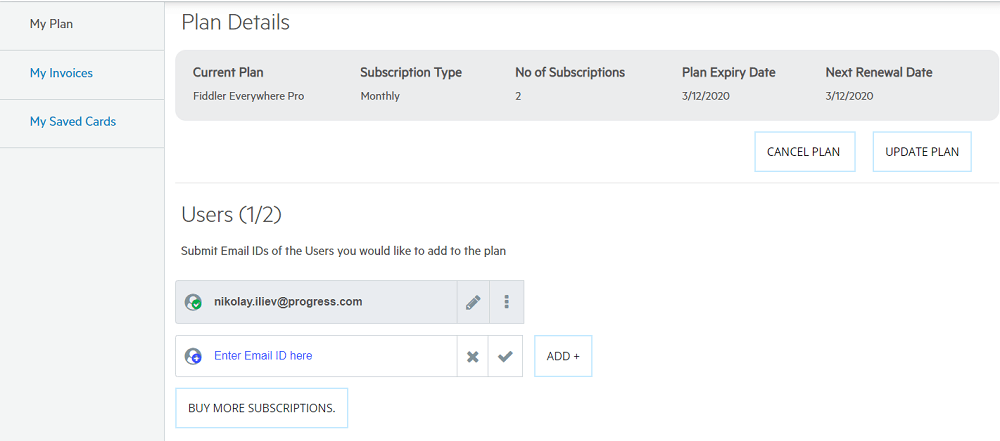
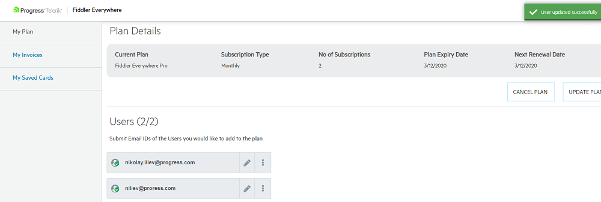
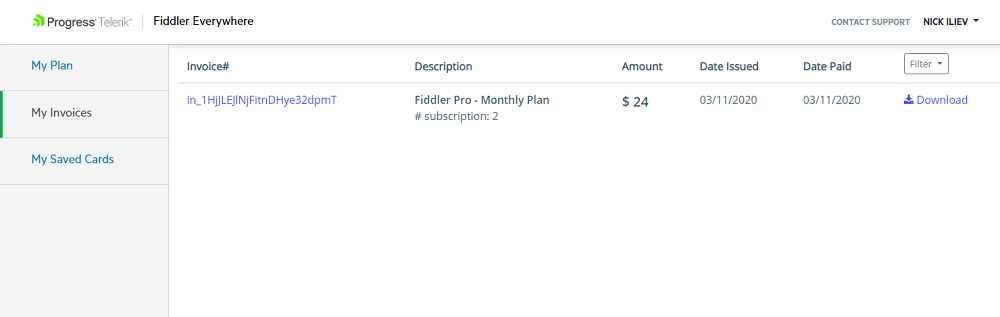

#### Environment

|   |   |
|---|---|
| Product  | Fiddler Everywhere PRO |
| Product Version | 1.0.0 and above  |
| Admin Panel Address | https://dashboard.getfiddler.com  |

#### Description

Fiddler Everywhere PRO activates multiple options for extended collaboration. The PRO dashboard provides means for managing plans, payments, and the activation of multiple subscriptions of different accounts. This KB article demonstrates the functionalities accessible from [https://dashboard.getfiddler.com](https://dashboard.getfiddler.com)

## Fiddler Everywhere Dashboard

Open Fiddler Everywhere client, click on the orange **Upgrade** button (for users without PRO version) or the green **PRO Plan** button (for a user already activated the PRO version). Both are placed in the top-left corner of the Fiddler Everywhere client. Alternatively, you could directly open [https://dashboard.getfiddler.com](https://dashboard.getfiddler.com), where after successful login, you will land on the main dashboard page.

_An example of the dashboard page for users with Free plan_

_An example of the landing dashboard page for users with PRO plan_

## Upgrade to PRO

To activate the PRO version of Fiddler Everywhere, you need to purchase a PRO plan. The PRO plan allows you to choose different payment options (monthly and annual payment).

- Open Fiddler Everywhere and click on the **Upgrade** button. Alternatively, load [https://dashboard.getfiddler.com](https://dashboard.getfiddler.com) and click on **Upgrade to PRO Now** button.

- Choose your payment options and proceed. After a successful payment, you will see a confirmation page.

    

- Restart your Fiddler Everywhere client to complete the PRO version activation.

## Activating Subscriptions

During the payment, you could choose to purchase multiple subscriptions for your team and collaborators. Activating the subscriptions for unique Fiddler Everywhere users are available through the [dashboard](https://dashboard.getfiddler.com/myaccount).

- Open the **My Plan** section in the [dashboard](https://dashboard.getfiddler.com/myaccount).

- To activate a subscription, enter the user's email ID and confirm (via the &#10004;).

    

- The provided ID is now activated subscription. All subscription entries can be canceled or entirely removed at any time.

    

## Invoice Information

Access and download all previously issue invoices via the **My Invoice** section in the [dashboard](https://dashboard.getfiddler.com/myaccount).

