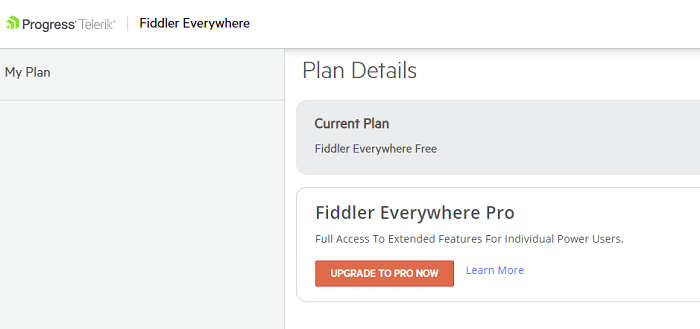
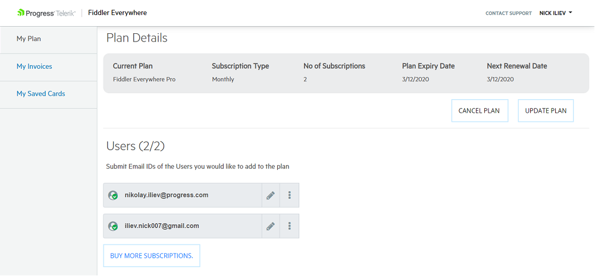
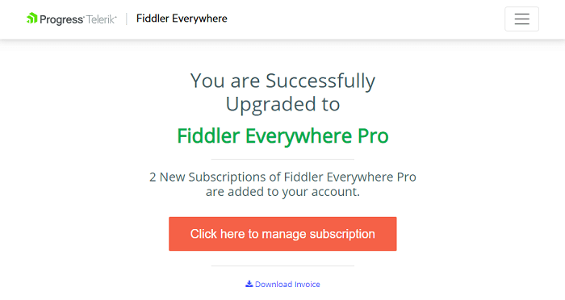

#### Environment

|   |   |
|---|---|
| Product  | Fiddler Everywhere PRO |
| Product Version | 1.0.0 and above  |
| Admin Panel Address | https://dashboard.getfiddler.com  |

#### Description

Fiddler Everywhere PRO activates multiple options for extended collaboration. The PRO dashboard provides means for managing plans, payments and for the activation of multiple subscritions of different accounts. This KB article demonstrates the functionalies accessible from [https://dashboard.getfiddler.com](https://dashboard.getfiddler.com)

## Fiddler Everywhere Dashboard

To open the dashboard site open Fiddler Everywhere and click on the orange **Upgrade** button (for users without PRO version) or the green **PRO Plan** button (for user taht have already activated the PRO version). Both are placed in the top-left corner of the Fiddler Everywhere client. Alternatively, you could directly open [https://dashboard.getfiddler.com](https://dashboard.getfiddler.com) where after successfull login you will land on the main dashboard page.

_An example of the dashboard page for users with Free plan_

_An example of the landing dashboard page for users with PRO plan_

### Upgrade to PRO

To activate the PRO version of Fiddler Everywhere, you need to purchase a PRO plan. The PRO plan allows you to choose different payment options (monthly and annual payment).

- Open Fiddler Everywhere and click on the **Upgrade** button. Alternativelly, load [https://dashboard.getfiddler.com](https://dashboard.getfiddler.com) and click on **Upgrade to PRO Now** button.
- Choose your payment options and proceed. After successfull payment, you will see a confiramtion page.

    

- Restart your Fiddler Everywhere client to complete the PRO version activation.

### Activating Subscriptions

During the payment, you could choose to purchase multiple subscritions for your team and collaboratiors. Activating the subscriptions for unique Fiddler Everywhere users is available through the [dashboard](https://dashboard.getfiddler.com/myaccount).

- Open the **My Plan** section in the [dashboard](https://dashboard.getfiddler.com/myaccount).
- To activate a subscription, enter the email ID of the user and confirm (via the &check;).

    