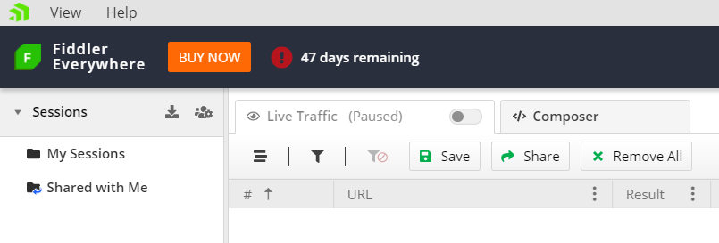

#### Environment

|   |   |
|---|---|
| Product | Fiddler Everywhere, Fiddler Jam |
| Admin Panel Address | https://dashboard.getfiddler.com  |

#### Description

The Fiddler dashboard site provides means for managing plans, payments, and the activation of plan subscriptions and seats for Fiddler Everywhere and Fiddler Jam. This KB article demonstrates the functionalities accessible from [https://dashboard.getfiddler.com](https://dashboard.getfiddler.com) and the steps needed to activate & manage your subscriptions.

## Fiddler Everywhere Dashboard

The Fiddler dashboard site is where you could purchase and manage subscription plans, check and download your invoices, and maintain the payment methods. The site requires login with a Fiddler account or social login (Google authentication is supported).

## Activating Subscription Plan

To purchase the Fiddler Everywhere Pro subscription plan:

- Open the Fiddler Everywhere client, click on the **Buy Now** button (available only to users with active trial version) or follow the link to the dashboard site on the landing screen.
    

- Alternatively, you could directly open [https://dashboard.getfiddler.com](https://dashboard.getfiddler.com), where after successful login, you will land on the main dashboard page.

- Navigate [to the Plans page](https://dashboard.getfiddler.be/plans), select the desired Fiddler product, and use the **Purchase Plan** to proceed order details page.

- The order details page presents you with the option to choose between annual vs. monthly payments, adding additional subscription seats (by default, each plan activates a single seat), and adding promotional coupons. Press **Next** to proceed to the payment details page.

- On the payment details page, you have the option to add a new payment method or to use a saved card. Then, use the **Pay** button to finalize the order.

- Restart your Fiddler Everywhere client to activate the purchased subscription plan fully.

## Manage Subscriptions

To manage active subscription for any Fiddler products:

Open [https://dashboard.getfiddler.com](https://dashboard.getfiddler.com), where you will land on the main dashboard page after successful login.

- Use the **Manage Subscription** link from the active subscription.

- On the subscription management page, you have the options to:
    - View and switch to alternative plans.
    - Cancel ongoing subscriptions.
    - Change the recurring payment method.
    - Assign, unassign, and edit seats.
    - Buy additional seats.

## Invoice Information

Access and download all previously issue invoices via the [**Invoices** section](https://dashboard.getfiddler.be/invoices).

