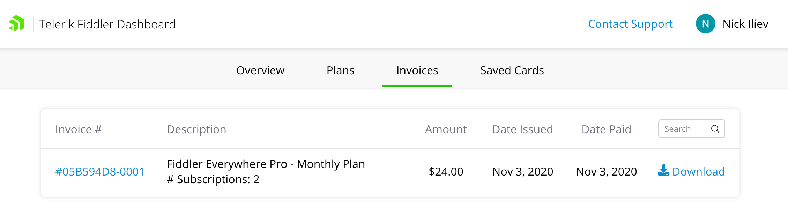

>important The latest version of the Fiddler Everywhere application is now using the unified Telerik system for subscription management and the [Fiddler dashboard site](https://dashboard.getfiddler.com) is now obsolete. Refer to the migration guidelines for instructions on how to migrate your active subscription to https://www.telerik.com. 

## Environment

|   |   |
|---|---|
| Product | Fiddler Everywhere, Fiddler Jam |
| Admin Panel Address | https://dashboard.getfiddler.com  |

## Description

The [Fiddler dashboard site](https://dashboard.getfiddler.com) provides means for managing subscription plans, payments, and the activation of account seats for Fiddler Everywhere and Fiddler Jam. How can I use the functionalities accessible from [https://dashboard.getfiddler.com](https://dashboard.getfiddler.com) to activate and manage my subscriptions?

## Solution

The [Fiddler dashboard site]https://dashboard.getfiddler.com) is where you can purchase and manage subscription plans, check and download your invoices, and maintain payment methods. The site requires you to log in with a Fiddler or social media account.

### Dashboard Main Sections

The Fiddler Everywhere dashboard site contains the following main sections:

- [**Login**](https://dashboard.getfiddler.com/login)&mdash;The landing page for new users and users with expired credentials. You can create a Fiddler account or use your Google social login.
- [**Overview**](https://dashboard.getfiddler.com/overview)&mdash;The landing page for logged-in users. You can manage your active subscriptions and see the actual plan offerings.
- [**Plans**](https://dashboard.getfiddler.com/plans)&mdash;The page contains details and purchase links for the active Fiddler Everywhere and Fiddler Jam offerings.
- [**Invoices**](https://dashboard.getfiddler.com/invoices)&mdash;The page lists all invoices so far. You can download each invoice as a PDF or load it on the Stripe details page.
- [**Saved Cards**](https://dashboard.getfiddler.com/cards)&mdash;You can add, remove, and edit credit card details. The card set as the default card is the one used for your ongoing payments.

### Activating a Subscription Plan

New users can purchase the Fiddler Everywhere Pro subscription plan in the following way:

1. Open the Fiddler Everywhere client and click the **Buy Now** button on the landing page. As a result, the [Fiddler Dashboard](https://dashboard.getfiddler.com) page will be opened. Alternatively, directly open [https://dashboard.getfiddler.com](https://dashboard.getfiddler.com).

    New users only can opt for the **Start Free Trial** button and activate a trial. However, if you are an existing user with an expired trial, go to the next step.

1. Navigate [to the **Plans** page](https://dashboard.getfiddler.com/plans) and select the desired Fiddler product.
1. Click **Purchase Plan** to proceed to the **Order Details** page. The **Order Details** page presents you with the option to choose between annual vs. monthly payments, adding additional subscription seats, and adding promotional coupons. By default, each plan activates a single seat.
1. Click **Next** to proceed to the **Payment Details** page. There you can add a new payment method or use a saved card.
1. Click the **Pay** button to finalize the order.
1. Restart your Fiddler Everywhere client to activate the purchased subscription plan fully.

### Managing Subscriptions

Only the account owners can add or remove seats, change plans, etc.

To address the active subscription for any Fiddler products, open [https://dashboard.getfiddler.com](https://dashboard.getfiddler.com), where you will land on the main dashboard page after a successful login.

- Use the **Manage Subscription** link from the active subscription.

    Alternatively, users with an active subscription can start Fiddler Everywhere and use the **Manage Subscriptions** button from the application.

- The **Subscription Management** page provides the following options:
    - View and switch to alternative plans.
    - Cancel ongoing subscriptions.
    - Change the recurring payment method.
    - Assign, unassign, and edit seats.
    - Buy additional seats.

### Switching from Monthly to Annual Subscription

You can upgrade your monthly subscription plan to annual in the following way:

- Use the **Manage Subscription** link from the active monthly subscription.
- Follow the **Switch to Annual** link and proceed with the subscription upgrade. A charge will occur for the annual subscription minus the remaining unused monthly period.

### Invoice Information

You can access and download all previously issued invoices through the [**Invoices**](https://dashboard.getfiddler.com/invoices) section. Each listed invoice has a unique ID and a quick link to the **Stripe Details** page, where you can download the Stripe invoice and receipt.

### Payment Methods

Set your preferred payment method by adding a credit card through the [**Saved Cards**](https://dashboard.getfiddler.com/cards) section. To set a default card, use the green toggle switch. The default card will be used for ongoing payments and is mandatory for accounts with an active subscription. You can add as many cards as you want. All cards can be deleted except for the default card.
