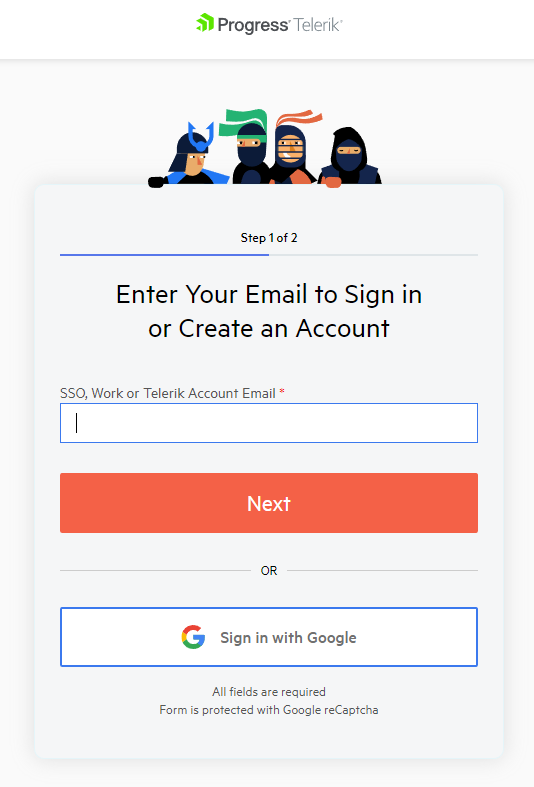
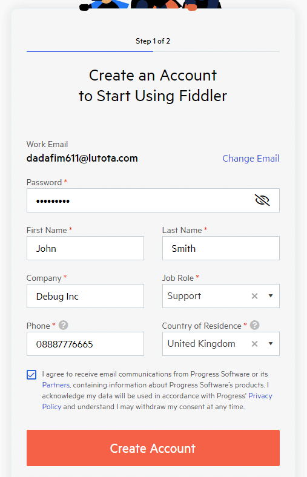
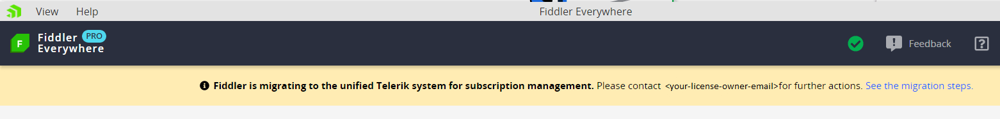

## Environment

|   |   |
|---|---|
| Product | Fiddler Everywhere, Fiddler Jam, Fiddler Dashboard, Fiddler Jam Portal |
| Unified Telerik **My Account** section | https://www.telerik.com/account/ |
| Unified Telerik **Your License** section | https://www.telerik.com/account/your-licenses |

## Description

Until recently, the Fiddler Everywhere license and seats were managed in a dedicated system known as Fiddler Dashboard. However, Fiddler Everywhere is part of an extensive portfolio of products developed by Progress. The Fiddler team decided to improve the overall user experience by integrating the license and seat management at the [unified Telerik system for subscription management](https://www.telerik.com/account/). This way, you will benefit from using a single account and have a single entry point for managing all active product licenses. This article explains how to migrate your existing Fiddler subscription plan from the obsolete system to the new unified Telerik system.

## Migrating Fiddler Licenses

The license owner can migrate the active Fiddler Everywhere subscription and all assigned seats through the following steps:

1. Open [the **latest** version of the Fiddler Everywhere application](https://www.telerik.com/download/fiddler-everywhere). Alternatively, open the login page from the Fiddler Dashboard site at https://dashboard.getfiddler.com/login 

1. Follow the **Sign In** link. You will land on the new login form that prompts you to enter your Fiddler Everywhere email.  You can create new Telerik account or, alternatively, use the Google authetication through the **Sign in with Google** link.

    

    >important Sign in with your existing or create a new Telerik account with the **same** email you registered with your original Fiddler account.

1. Enter the Fiddler Everywhere license owner email.

    * If the email exists as an active Telerik account&mdash;Enter your Telerik credentials. Upon successful login, you can start managing your migrated license at https://www.telerik.com/account/your-licenses and use the Fiddler Everywhere application (in case your owner email is also an assigned seat).

    * If the email does **not** exist as an active Telerik account&mdash;A login form prompts you to create an account by inputting a password and account information. 

        

        Confirm and finalize your Telerik account creation through the received email activation link. Once the activation completes, you can manage your migrated license at https://www.telerik.com/account/your-licenses and use the Fiddler Everywhere application (if your email is also an assigned seat).

## Migrating Fiddler Assigned Seats

After the [account owner completes the license migration](#migrating-fiddler-licenses), all assigned seats are automatically migrated to the new unified Telerik system. Unmigrated seats will be presented with an informative banner within the application.

Each account with active seat must migrate to the new Telerik login system through the following steps:

1. Open the **latest** version of the Fiddler Everywhere application.

1. Follow the **Sign In** link. You will land on the new login form that prompts you to enter your Fiddler Everywhere email. You can create new Telerik account or, alternatively, use the Google authetication through the **Sign in with Google** link.

    

1. Enter the email for the Fiddler Everywhere account with activated seat.

    >important Sign in with your existing or create a new Telerik account with the **same** email you registered with your original Fiddler account.

    * If the email exists as an active Telerik account&mdash;Enter your Telerik credentials and start using the Fiddler Everywhere application immediately.

    * If the email does **not** exist as an active Telerik account&mdash;A login form prompts you to create an account by inputting a password and account information.

        

        Confirm and finalize your Telerik account creation through the received email activation link. Once the activation is completed, you can start using the Fiddler Everywhere application immediately.
