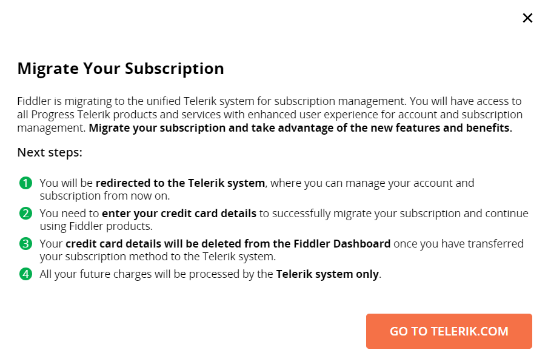
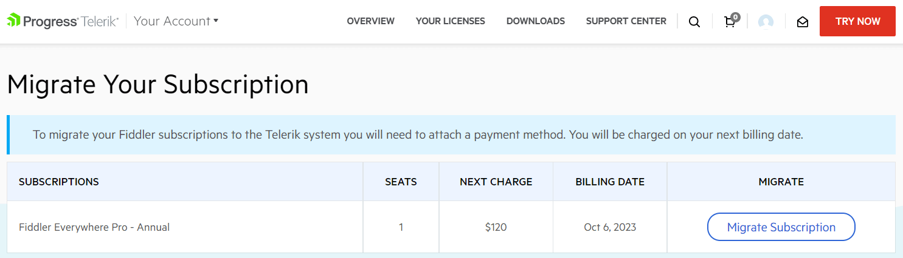
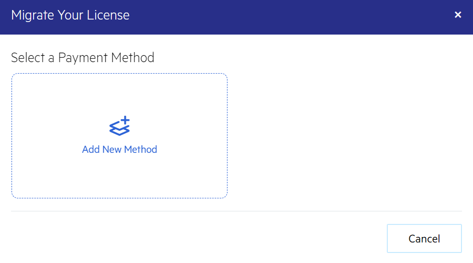
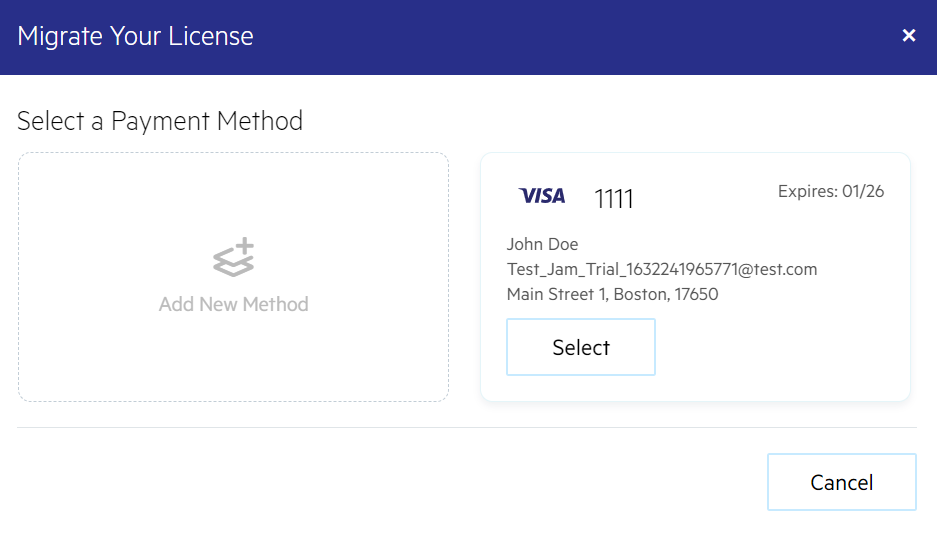
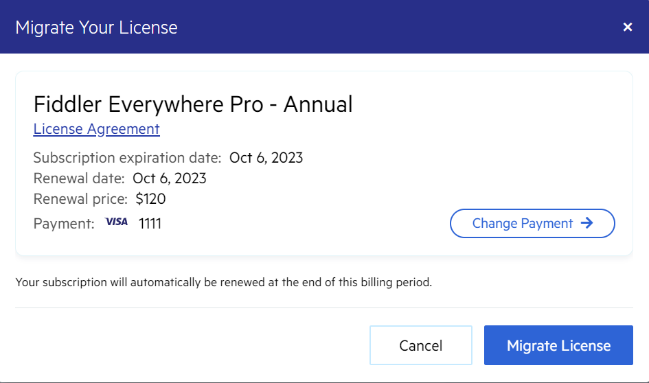
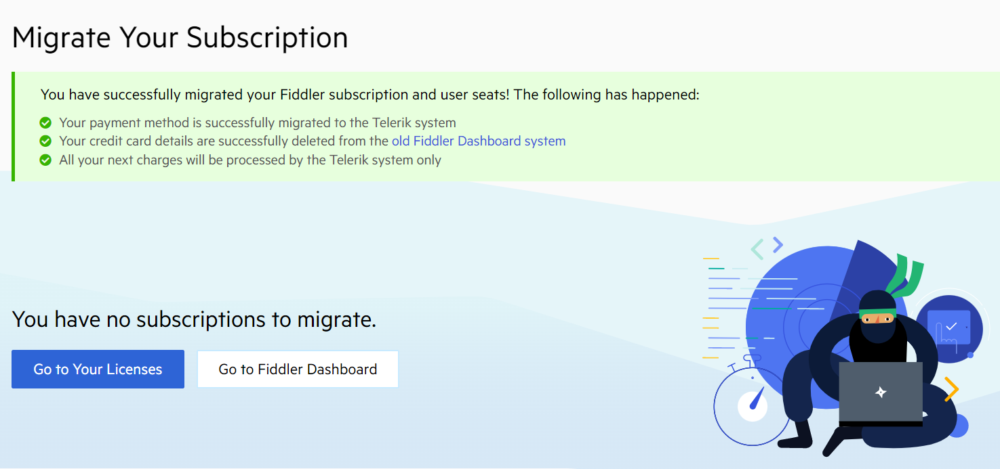

## Description

Fiddler products are now part of an extensive portfolio of products developed by Progress Telerik. This article explains how to migrate your existing Fiddler subscriptions and seats from the obsolete dashboard system to the new unified Telerik system.

## Migrating Fiddler Licensed Seats

Each account with licensed seat must migrate to the new Telerik login system through the following steps:

1. Open the application with an active seat.

    * (Fiddler Everywhere) Open the latest version of the Fiddler Everywhere application.
    
    * (Fiddler Jam) Open the [Fiddler Jam portal](https://jam.getfiddler.com). 

1. Follow the **Sign In** link.

1. Enter the email for the Fiddler account with the activated seat.

    >important Sign in with your existing or create a new Telerik account with the **same** email you registered with your original Fiddler account.

    * If the email exists as an active Telerik account&mdash;Sign in with your Telerik account and start using the Fiddler Everywhere application immediately.

    * If the email does **not** exist as an active Telerik account&mdash;A login form prompts you to create an account by inputting a password and account information.

        Confirm and finalize your Telerik account creation through the received email activation link. Once the activation completes, you can immediately start using the Fiddler application.

## Migrating Fiddler Subscriptions

The license owner can migrate the active Fiddler product subscriptions and all assigned seats through the following steps:

1. Open the login page from the [Fiddler Dashboard site](https://dashboard.getfiddler.com/login).

1. Follow the **Sign In** link.

1. Enter the Fiddler subscription owner's email.

    >important Sign in with your existing or create a new Telerik account with the **same** email you registered with your original Fiddler account.

    * If the email exists as an active Telerik account&mdash;Sign in with your Telerik account.

    * If the email does **not** exist as an active Telerik account&mdash;A login form prompts you to create an account by inputting a password and account information. 

        Confirm and finalize your Telerik account creation through the received email activation link. Once the activation completes, you can manage your migrated subscriptions at https://www.telerik.com/account/your-licenses and use the Fiddler Everywhere application (if your email is also an assigned seat).

1. Back in the Fiddler Dashboard site, follow the **Migrate Your Subscription** popup windows to land at the migration page on Telerik.com

    

1. Choose the subscription to migrate from the migration page and follow the **Migrate Subscription** link.

    

1. Add one or more payment methods.

    

1. Select a payment method to use for your subscription renewals.

    

1. Confirm your subscription migration by following the **Migrate License** link.

    

A success message is displayed to confirm the successful subscription migration to the new unified Telerik system.

 

## Additional Resources

Explore and learn more about the unified Telerik system through the following resources:

- [Account Overview](https://wwwuat.telerik.com/account/)
- [Your Account FAQ](https://www.telerik.com/account/faqs)
- [Your Licenses (available only for license owners)](https://www.telerik.com/account/your-licenses)
- [Purchasing & Licensing FAQs](https://www.telerik.com/purchase/faq/licensing-purchasing)
- [Support Center](https://wwwuat.telerik.com/account/support-center)