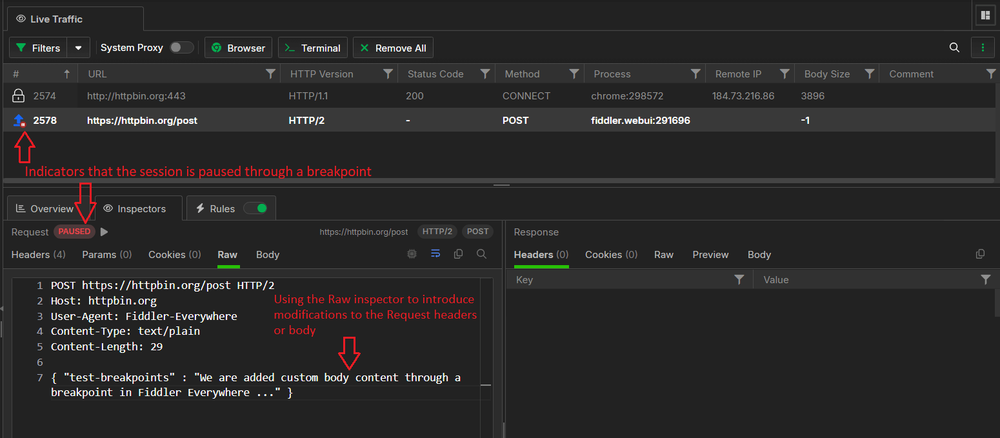

# Breakpoints in Fiddler Everywhere

The **Rules** functionality in Fiddler Everywhere is a sophisticated tool that lets you virtually play with the ongoing traffic in any way possible. With its help, you can easily adjust the ongoing traffic per your requirements by matching all or specific sessions and consequentially applying specific actions that vary from simply highlighting and commenting entries (for easier inspection and analysis) to changing the content and behavior of HTTP Requests (before they reach the target server) or HTTP Responses (before they reach the client application).

Being able to "hack" an HTTP session on the fly provides almost unlimited testing and development opportunities. This article will demonstrate some more complex actions that can be used while using the Fiddler's breakpoints rule action.

## Using Breakpoints

One of the most desired features was the ability to pause the execution of a session before it reaches the server or the client application. Fiddler Everywhere provides that option through the **Set Breakpoint** action and its two sub-actions **Before Sending a Request** and **Before Sending and Response**.

Fiddler Everywhere stands between the client application (that sends a request and receives a response) and a server (that receives a request and returns a response). The breakpoint actions explicitly pause the forwarding of matched requests and responses. You can inspect the paused request/response or make complex changes by editing their HTTP Headers and Body through the **Raw** inspector.

### Request Breakpoint

Setting a breakpoint for HTTP request will pause the request before it reaches the target server. This allows you to modify and mock different request scenarios on the fly.

To create a rule that sets a breakpoint for HTTP request, do the following:

1. Select the **Rules** tab and create new rule through the **Add Rule** button.

1. Add a condition or a set of conditions to match sessions.

1. Add the action called **Set Breakpoint** and choose the sub-action **Before Sending a Request**.

1. Click **Save** and then enable the **Rules** tab and the newly created rule.

1. Start capturing traffic.

The following steps demonstrate how the **Before Sending a Request** action works:

1. The client application sends an HTTP request.

1. The Fiddler Everywhere proxy receives the HTTP request and **pauses** it. At this moment, all sessions that match the condition will be paused. You can select a paused session, load its HTTP request through the **Raw** tab, and modify its HTTP headers or body.

    

1. Once the inspection or modification of the session is completed, resume the request execution. Only at this point is the request forwarded to the server. The session will reach the server with its modified data.

1. The server returns a response (received by Fiddler).

1. Fiddler forwards the response to the client application.

### Response Breakpoint

Setting a breakpoint for HTTP response will pause the request before it reaches the client application. This allows you to modify and mock different response scenarios on the fly.

To create a rule that sets a breakpoint for HTTP response, do the following:

1. Select the **Rules** tab and create new rule through the **Add Rule** button.

1. Add a condition or a set of conditions to match sessions.

1. Add the action called **Set Breakpoint** and choose the sub-action **Before Sending a Response**.

1. Click **Save** and then enable the **Rules** tab and the newly created rule.

1. Start capturing traffic.

The following steps demonstrate how the **Before Sending a Response** action works:

1. The client application sends an HTTP request (received by Fiddler).

1. Fiddler forwards the HTTP request to the server.

1. The server returns a response (received by Fiddler).

1. The Fiddler Everywhere proxy receives the HTTP response and **pauses** it. At this moment, all sessions that match the condition will be paused. Select a paused session, load its HTTP response through the **Raw** tab, and inspect or modify its HTTP headers or body.

1. Once the inspection or modification of the session is completed, resume the response execution. Only at this point does the response go to the client application. The session will reach the client with its modified data.

### Breakpoint Specifics

The following considerations must be made while working with breakpoints:

- An active rule that sets breakpoints applies only to newly captured traffic.
- A breakpoint can be set with all matching conditions in the Rules Builder.
- A session with a hit breakpoint or otherwise paused session will have a "Pause" icon in the Live Traffic grid.
- A session with a hit breakpoint or otherwise paused session will have a "Paused" pill in the paused Inspector section (Request or Response inspector).
- You can resume a paused session by clicking the "Paused" pill.
- You can resume paused sessions through the "Resume Paused Sessions" option in the Live Traffic context menu.
- A paused HTTP request or response can be edited only through the **Raw** inspector.

While the breakpoints are compelling functionality,  the following limitations must be considered:

- A response breakpoint will pause the forwarding from Fiddler's side. However, some client applications have additional caching or replay mechanisms that automatically replay the request if a response is not received within a specific time.
- You can't modify requests and responses that use gzipped bodies.

## Additional Rules Resources

The breakpoints in Fiddler are only one of the exposed [actions](#actions) that you can use in combination with various [matching conditions](#conditions). Use the following online resources for additional insights and examples of what you can achieve using the Fiddler's Rules tab.

- [Understanding the Matching Conditions and Final vs. Non-Final Actions]()
- [Example for using predefined actions in the Rules tab]()
- [Example for redirecting through the Rules tab]()
- [Example for disabling caching through the Rules tab]()
- [Example for creating manual HTTP Responses]()
- [Introducing the Rules tab (blog post)](https://www.telerik.com/blogs/introducing-new-rule-builder-fiddler-everywhere)