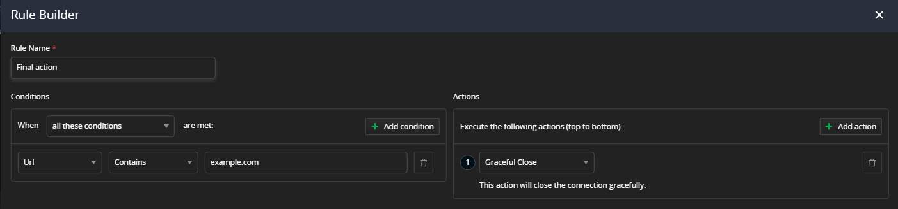
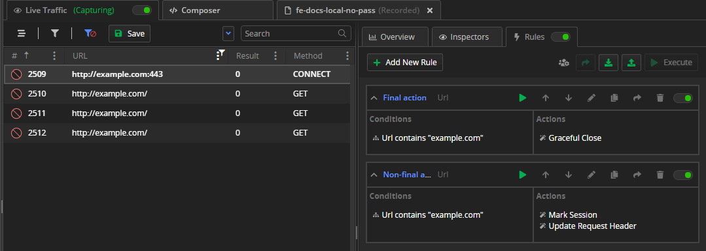
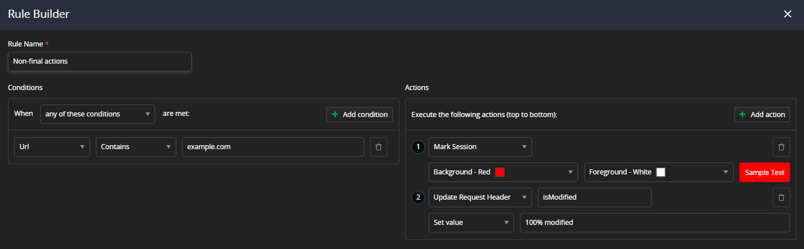
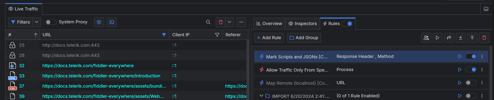

# Using Conditions and Actions

A **rule** in Fiddler Everywhere is a feature that enables you to use a condition to match targeted traffic (HTTP requests and responses) and then apply a specific action to modify its original behavior.

The article lists and explains the supported matching [conditions](#conditions) and applicable [actions](#actions) while creating a rule with the **Rules** tab in Fiddler Everywhere. It also covers the specifics of [final and non-final actions](#final-and-non-final-actions) and their immediate result on the modified traffic.

## Conditions

The **Rule Builder** can add and use single or multiple matching **conditions** needed to trigger different [**actions**](#actions). The conditions are logical structures with different statements whose numbers can vary between two and four. A statement field that handles text (string modifier) is case-insensitive by default (you can use the `Aa` button to change them to case-sensitive) and can be auto-completed with suggestions corresponding to the captured sessions.

For more information, refer to the following list. 

<table style="width: 100%">
    <colgroup>
       <col span="1" style="width: 14%;">
       <col span="1" style="width: 14%;">
       <col span="1" style="width: 14%;">
       <col span="1" style="width: 14%;">
       <col span="1" style="width: 44%;">
    </colgroup>
    <thead>
        <tr>
            <th>Condition Value</th>
            <th>Field Options</th>
            <th>Field Options</th>
            <th>Field Options</th>
            <th>Usage Description</th>
        </tr>
    </thead>
    <tbody>
        <tr>
            <td><b>All Sessions</b></td>
            <td>n/a</td>
            <td>n/a</td>
            <td>n/a</td>
            <td>Matches all captured sessions</td>
        </tr>
        <tr>
            <td><b>URL</b></td>
            <td>String modifiers</td>
            <td>Search value</td>
            <td>n/a</td>
            <td>Matches a specific keyword in the <b>URL</b> column.</td>
        </tr>
        <tr>
            <td><b>Host</b></td>
            <td>String modifiers</td>
            <td>Search value</td>
            <td>n/a</td>
            <td>Matches a specific keyword in the <b>Host</b> column.</td>
        </tr>
        <tr>
            <td><b>Path</b></td>
            <td>String modifiers</td>
            <td>Search value</td>
            <td>n/a</td>
            <td>Matches a specific keyword in the <b>path</b> column.</td>
        </tr>
        <tr>
            <td><b>Protocol</b></td>
            <td>HTTP or HTTPS</td>
            <td>n/a</td>
            <td>n/a</td>
            <td>Differentiate the traffic based on the used protocol (HTTP vs. HTTPS).</td>
        </tr>
        <tr>
            <td><b>Method</b></td>
            <td>String modifiers</td>
            <td>Search value</td>
            <td>n/a</td>
            <td>Matches sessions using specific HTTP <b>Method</b>.</td>
        </tr>
        <tr>
            <td><b>Status Code</b></td>
            <td>String modifiers</td>
            <td>Search value</td>
            <td>n/a</td>
            <td>Matches a specific keyword in the <b>Result</b> column.</td>
        </tr>
        <tr>
            <td><b>HTTP Version</b></td>
            <td>String modifiers</td>
            <td>Search value</td>
            <td>n/a</td>
            <td>Matches a specific <b>HTTP Version</b>.</td>
        </tr>
        <tr>
            <td><b>Session Type</b></td>
            <td>Predefined types</td>
            <td>n/a</td>
            <td>n/a</td>
            <td>Matches a session through its type (e.g., WebSocket, gRPC, Aborted, Tunnels, Images, etc.).</td>
        </tr>   
        <tr>
            <td><b>Request Header</b></td>
            <td>Header name</td>
            <td>String modifiers</td>
            <td>The search value </td>
            <td>Matches sessions with specific keyword in the <b>explicitly mentioned Request header</b> column.</td>
        </tr>
        <tr>
            <td><b>Response Header</b></td>
            <td>Header name</td>
            <td>String modifiers</td>
            <td>The search value </td>
            <td>Matches sessions with specific keyword in the <b>explicitly mentioned Response header</b> column.</td>
        </tr>
        <tr>
            <td><b>Request Body</b></td>
            <td>String modifiers</td>
            <td>Search value</td>
            <td>n/a</td>
            <td>Matches sessions with specific keyword in the <b>Request Body</b> column.</td>
        </tr>
        <tr>
            <td><b>Response Body</b></td>
            <td>String modifiers</td>
            <td>Search value</td>
            <td>n/a</td>
            <td>Matches sessions with specific keyword in the <b>Response body</b>.</td>
        </tr>
        <tr>
            <td><b>Request Cookie</b></td>
            <td>Cookie name</td>
            <td>String modifiers</td>
            <td>Search value</td>
            <td>Matches sessions with specific keyword in the <b>explicitly mentioned Request Cookie</b>.</td>
        </tr>
        <tr>
            <td><b>Response Cookie</b></td>
            <td>Cookie name</td>
            <td>String modifiers</td>
            <td>Search value</td>
            <td>Matches sessions with specific keyword in the <b>explicitly mentioned Response Cookie</b>.</td>
        </tr>
        <tr>
            <td><b>Request Body Size</b></td>
            <td>Number modifiers (compares bytes)</td>
            <td>Search value</td>
            <td>n/a</td>
            <td>Matches session with specific <b>Request Body Size</b>.</td>
        </tr>
        <tr>
            <td><b>Response Body Size</b></td>
            <td>Number modifiers (compares bytes)</td>
            <td>Search value</td>
            <td>n/a</td>
            <td>Matches session with specific <b>Response Body Size</b>.</td>
        </tr>
        <tr>
            <td><b>Request Time</b></td>
            <td>String modifiers</td>
            <td>Search value</td>
            <td>n/a</td>
            <td>Matches specific date string in the <b>Request Time</b> column.</td>
        </tr>  
        <tr>
            <td><b>Request Date</b></td>
            <td>Date modifiers</td>
            <td>Date form</td>
            <td>n/a</td>
            <td>Matches session executed on a specific date.</td>
        </tr>
        <tr>
            <td><b>Duration</b></td>
            <td>Number modifiers (compares milliseconds)</td>
            <td>Search value</td>
            <td>n/a</td>
            <td>Matches sessions with specific <b>Duration</b>.</td>
        </tr>
        <tr>
            <td><b>Client IP</b></td>
            <td>String modifiers</td>
            <td>Search value</td>
            <td>n/a</td>
            <td>Matches session with specific <b>Client IP</b>.</td>
        </tr>
        <tr>
            <td><b>Remote IP</b></td>
            <td>String modifiers</td>
            <td>Search value</td>
            <td>n/a</td>
            <td>Matches session with specific <b>Remote IP</b>.</td>
        </tr>
        <tr>
            <td><b>Certificate Information</b></td>
            <td>Field name</td>
            <td>String modifiers</td>
            <td>Search value</td>
            <td>Matches sessions with specific keyword in the <b>explicitly mentioned certificate field</b>.</td>
        </tr>
        <tr>
            <td><b>TLS Version</b></td>
            <td>String modifiers</td>
            <td>Search value</td>
            <td>n/a</td>
            <td>Matches traffic based on the used <b>TLS Version</b>.</td>
        </tr>
        <tr>
            <td><b>Process</b></td>
            <td>String modifiers</td>
            <td>Search value</td>
            <td>n/a</td>
            <td>Matches a specific <b>Process ID</b>.</td>
        </tr>
        <tr>
            <td><b>Comment</b></td>
            <td>String modifiers</td>
            <td>Search value</td>
            <td>n/a</td>
            <td>Matches sessions with specific <b>Comment</b> column.</td>
        </tr> 
        <tr>
            <td><b>Rules Modified</b></td>
            <td>Boolean</td>
            <td>n/a</td>
            <td>n/a</td>
            <td>Matches sessions modified by a rule.</td>
        </tr>  
        <tr>
            <td><b>Magic String</b></td>
            <td>The "magic string" content</td>
            <td>n/a</td>
            <td>n/a</td>
            <td>Uses <a href="https://docs.telerik.com/fiddler/knowledge-base/autoresponder#matching-rules">the legacy Fiddler Classic string literals and regular expressions</a>.</td>
        </tr>
    </tbody>
</table>

## Actions

When Fiddler Everywhere identifies a request that matches the rule's [**conditions**](#conditions), it automatically maps it to the **action** set in the rule. An action field that handles text (string modifier) is case-insensitive by default (you can use the **Aa** button to change them to case-sensitive) and can be auto-completed with suggestions corresponding to the captured sessions. Note that multiple actions will be executed in their numbered order, and action with the final action type will prevent the execution of all subsequent actions.

Apart from returning files or predefined responses, a rule can perform the following specific actions:

<table style="width: 100%">
    <colgroup>
       <col span="1" style="width: 16%;">
       <col span="1" style="width: 13%;">
       <col span="1" style="width: 13%;">
       <col span="1" style="width: 10%;">
       <col span="1" style="width: 38%;">
       <col span="1" style="width: 10%;">
    </colgroup>
    <thead>
        <tr>
            <th>Action name</th>
            <th>Field Options</th>
            <th>Field Options</th>
            <th>Preview box</th>
            <th>Usage Description</th>
            <th>Action type</th>
        </tr>
    </thead>
    <tbody>
        <tr>
            <td><b>Mark Session</b></td>
            <td>Choose background color</td>
            <td>Choose foreground color</td>
            <td>Sample Preview box</td>
            <td>Marks the session with selected colors.</td>
            <td>Non-final</td>
        </tr>
        <tr>
            <td><b>Update URL</b></td>
            <td>Value modifiers</td>
            <td>New value</td>
            <td>n/a</td>
            <td>Uses the selected value modifier and the new value to update the current URL.</td>
            <td>Non-final</td>
        </tr>
        <tr>
            <td><b>Update Query String</b></td>
            <td>Query Parameter Key</td>
            <td>Value modifiers</td>
            <td>New value</td>
            <td>Uses the selected value modifier and the new value to update the query parameters.</td>
            <td>Non-final</td>
        </tr>
        <tr>
            <td><b>Update Status Code</b></td>
            <td>n/a</td>
            <td>n/a</td>
            <td>n/a</td>
            <td>Modifies the status code returned by the server while preserving the other data untouched.</td>
            <td>Non-final</td>
        </tr>
        <tr>
            <td><b>Update Request Header</b></td>
            <td>Header Name</td>
            <td>Value modifiers</td>
            <td>New value</td>
            <td>Uses the selected value modifier and the new value to update the request header.</td>
            <td>Non-final</td>
        </tr>
        <tr>
            <td><b>Update Response Header</b></td>
            <td>Header Name</td>
            <td>Value modifiers</td>
            <td>New value</td>
            <td>Uses the selected value modifier and the new value to update the response header.</td>
            <td>Non-final</td>
        </tr>
        <tr>
            <td><b>Update Request Body</b></td>
            <td>Value modifiers</td>
            <td>New value</td>
            <td>n/a</td>
            <td>Uses the selected value modifier and the new value to update the request body.</td>
            <td>Non-final</td>
        </tr>
        <tr>
            <td><b>Update Response Body</b></td>
            <td>Value modifiers</td>
            <td>New value</td>
            <td>n/a</td>
            <td>Uses the selected value modifier and the new value to update the response body.</td>
            <td>Non-final</td>
        </tr>
        <tr>
            <td><b>Update Request Cookies</b></td>
            <td>Cookie Key</td>
            <td>Value modifiers</td>
            <td>New value</td>
            <td>Uses the selected value modifier and the new value to update the cookie value.</td>
            <td>Non-final</td>
        </tr>
        <tr>
            <td><b>Update Response Cookies</b></td>
            <td>Cookie Key</td>
            <td>Value modifiers</td>
            <td>New value</td>
            <td>Uses the selected value modifier and the new value to update the cookie value.</td>
            <td>Non-final</td>
        </tr>
        <tr>
            <td><b>Set Breakpoint</b></td>
            <td><b>Before Sending a Request</b> or <b>Before Sending a Response</b></td>
            <td>n/a</td>
            <td>n/a</td>
            <td>Pauses the session before the sending request (to the server) or response (to the client). The action works only for newly established connections.</td>
            <td>Non-final.</td>
        </tr>
        <tr>
            <td><b>Return File</b></td>
            <td>File Picker</td>
            <td>n/a</td>
            <td>n/a</td>
            <td>Returns the picked response file.</td>
            <td>Non-final</td>
        </tr>
        <tr>
            <td><b>Return Manual Response</b></td>
            <td>Text field for creating manual response</td>
            <td>n/a</td>
            <td>n/a</td>
            <td>Returns the manually created response.</td>
            <td>Non-final</td>
        </tr>
        <tr>
            <td><b>Return Predefined Response</b></td>
            <td><a href="https://docs.telerik.com/fiddler-everywhere/knowledge-base/using-ar-predefined-actions">Predefined responses</a></td>
            <td>n/a</td>
            <td>n/a</td>
            <td>Returns the selected predefined response.</td>
            <td>Non-final</td>
        </tr>
        <tr>
            <td><b>Return CONNECT Tunnel</b></td>
            <td>n/a</td>
            <td>n/a</td>
            <td>n/a</td>
            <td>This action should be used when you wish to test a URL, which will not be resolved by your DNS Server. The option is also reffered as "Accept all CONNECTs"</td>
            <td>Final</td>
        </tr>
        <tr>
            <td><b>Do Not Show</b></td>
            <td>n/a</td>
            <td>n/a</td>
            <td>n/a</td>
            <td>Hides the matched session for appearing in Fiddler. When the <b>Do Not Show</b> action is applied, no other actions will be executed.</td>
            <td>Final</td>
        </tr>
        <tr>
            <td><b>Do Not Decrypt</b></td>
            <td>n/a</td>
            <td>n/a</td>
            <td>n/a</td>
            <td>Skips decryption for a matched session and shows only CONNECT tunnels. Only conditions for <b>Host, URL, Process, Client IP, HTTP Version, and Remote IP</b> can be used. The action works only for newly established connections.</td>
            <td>Final </td>
        </tr>
        <tr>
            <td><b>Close Gracefully</b></td>
            <td>n/a</td>
            <td>n/a</td>
            <td>n/a</td>
            <td>This action will close the connection gracefully.</td>
            <td>Final</td>
        </tr>
        <tr>
            <td><b>Close Non Gracefully</b></td>
            <td>n/a</td>
            <td>n/a</td>
            <td>n/a</td>
            <td>This action will close the connection forcefully.</td>
            <td>Final</td>
        </tr>
        <tr>
            <td><b>Delay Request</b></td>
            <td>Number value (milliseconds)</td>
            <td>n/a</td>
            <td>n/a</td>
            <td>Delays the request execution with "n" milliseconds.</td>
            <td>Non-final</td>
        </tr>
        <tr>
            <td><b>Comment</b></td>
            <td>String modifiers</td>
            <td>New value</td>
            <td>n/a</td>
            <td>Action to modify, add, or remove a session comment</td>
            <td>Non-final</td>
        </tr>
        <tr>
            <td><b>Magic String</b></td>
            <td>The "magic string" content</td>
            <td>n/a</td>
            <td>n/a</td>
            <td>Uses the <a href="https://docs.telerik.com/fiddler/knowledge-base/autoresponder#matching-rules">legacy Fiddler Classic string literals and regular expressions.</a></td>
            <td>Non-final</td>
        </tr>
    </tbody>
</table>

## Final and Non-Final Actions

Rule actions can be divided into **final** and **non-final** depending on their behavior and whether their presence will allow our actions and rules to be executed.

When you work with final and non-final actions, take into consideration the following insights:

* Final actions prevent the execution of any other rule with lower priority (placed lower in the Rules list).

* Final actions prevent the execution of any other rule with lower priority (placed lower in the Rules list).

* Final actions are valid (as final) only when the rule matches an HTTP(S) session.

* If a session matches with conditions that depend on its response (for example, a response body contains "HTML"), then any final action in any rule that matches the session will be ignored. The reason for this behavior is that final actions replace the response. By design, Fiddler is not intended to replace a response that was already received and matched conditions in a rule.

* Non-final actions are non-blocking - they will allow actions from any other active rules to execute.

* A non-final action can be explicitly made final by checking the **"Make this action final"** option.

The following table demonstrate what happens when you combine final and non-final actions in one or multiple rules.

| Actions Type          | Result |
|:-----------------|:----------------|
| Only non-final actions | All matching rules have their actions performed and applied |
| Only final actions | When a final action triggers, the execution of the rule immediately stops. No other demoted actions or rules will be executed after that. For example,  **Do Not Show** and **Do Not Decrypt** are final actions. |
| Mix of final and non-final Actions | When a final action triggers, the execution of the rule immediately stops. No other demoted actions or rules will be executed after that. For example, the **Do Not Show** action will block the execution of the **Update Response Body** action |

Note that each rule is prioritized in the **Rules** list and can be demoted and promoted, which will change the execution order. Final rules won't block other active rules that have higher priority the **Rules** list.

For an illustration of this scenario, refer to the following cases:

- You have a rule with a final action (for example, the **Close Gracefully** final action).
 

 In this case, the rule containing the final action has higher priority in the **Rules** list. When the matching request is made, only the first rule will execute, and other demoted rules (and actions) will not be triggered.
 

- You have a rule with non-final action (for example, the **Mark Session** action).
 

 In this case, the rule containing the non-final action has higher priority in the **Rules** list. When the matching request is made, the non-final action will execute, and then the following demoted rule will be triggered as well. If you add additional rules after the rule that contains final actions, they won't be executed.
 
