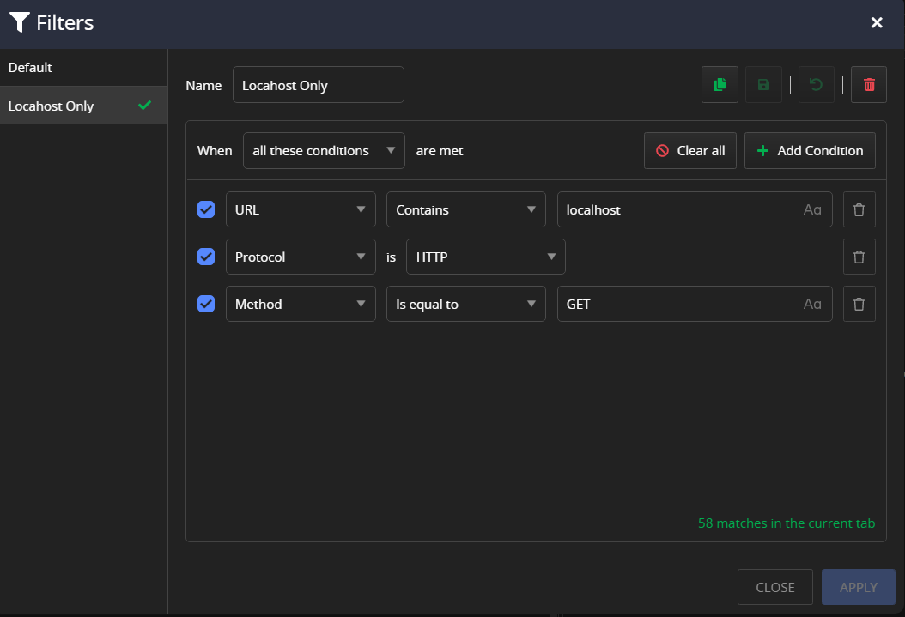

# Filtering Traffic

Fiddler Everywhere sets itself as the operating system proxy once the [system capturing](#system-capturing) activates. The application captures and outputs all HTTP/HTTPS/WebSocket traffic from client applications that respect the system proxy. The [**Live Traffic grid**](#live-traffic-grid) displays the traffic as session entries.

Modern applications often generate hundreds or thousands of requests, polluting your session list with unwanted information. This article reveals some options to filter the captured traffic or lower the amount of captured traffic.

- [Filtering through Filters toolbar option](#filters)
- [Filtering through column filters](#column-filters)
- [Using browser or terminal capturing modes](#using-alternative-capturing-modes)
- [Bypassing requests to specific domains](#bypassing-the-proxy)

## Filters

The **Filters** option enables you to apply complex filtering solutions, such as creating multiple filtering conditions, combining them with logical operations, saving filters for later reuse, and more. An active [column filter](#column-filters) automatically adds as a condition in your active filter (or in the **Default** filter if no saved filters are active).

To open the **Filters** dialog window.

1. Start Fiddler Everywhere and open the **Home** Pane.

1. Follow the **Filters** flow from the **Modify and Filter Traffic** section.

OR

1. Start Fiddler Everywhere and open the **Traffic** Pane.

1. Click the **Filters** button.

As a result the **Filters** dialog window opens where you can apply single or multiple filtering conditions.

### Using Filters

Create and apply a filter through the **Filters** toolbar option as follows:

1. Open the **Filters** dialog window.

1. (**Optional**) Add a filter name. 

    >tip Adding a name will allow you to save and reuse a filter later.

1. Set one of the following filter execution criteria:

    - **all these conditions**&mdash;The rule applies when all conditions are true (logical TRUE).
    - **any of these conditions**&mdash;The rule applies when any conditions are true (logical OR).
    - **none of these conditions**&mdash;The rule applies when none of the conditions is true (logical FALSE).

    >tip Learn more about the available [**match conditions**](#conditions), which apply to both the filters and rule creation.

1. Add one or more match conditions based on the HTTP headers, HTTP bodies, or other specific Fiddler's columns data.

1. (**Optional**) Save the filter.

    >tip Saved filters can be activated and deactivated, simplifying and improving their usage. You can also duplicate, edit or remove a saved filter through the **Filters** editor.

1. Click **Apply** to close the **Filters** editor and immediately apply the newly created filter.   

All condition values connected to a **Live Traffic** column are auto-completed with the auto-completion suggestions based on the captured data. Additionally, after adding a condition, a counter will show the number of matches (from the currently captured sessions).

### Filters Menu

The **Filters** option provides a drop-down menu to manage your active and saved filters. Through the drop-down, you can apply a saved filter, change an active filter, turn off an active filter, save a new filter, or clear an unsaved column filter (the **Clear** option is available only when no other saved filters are activated).

## Column Filters

Each column (including your own [custom columns](#creating-custom-columns)) from the [**Live Traffic grid**](#live-traffic-grid) has its own [filtering submenu](#filtering-options). A filter condition contains different logical operations (for example, **contains**, **starts with**, **ends with**, **is equal to**, and so on). Each logical operation combines with the filter value, which depends on the column type and can be a string, number, boolean, or predefined value. 

A column filter adds a condition to your active filter (from the **Filters** toolbar option). If no active filter is present, applying a column filter adds a condition in the **Default** filter (which, in turn, automatically activates).

When you clear a column filter, it automatically deletes its condition from the active filter. If no active filter exists, the column filter removes its condition from the **Default** filter.

## Using Alternative Capturing Modes

Fiddler Everywhere provides multiple capturing modes, with the system capturing mode being the most "invasive" as it will capture all traffic that goes through the operating system. You can limit the amount of captured traffic by using options like the [independent browser capturing mode]() or the [terminal capturing mode](). These options ensure only traffic from the sandboxed instances is output in the sessions grid. All additional columns and advanced filters remain applicable. 

## Bypassing the Proxy

While bypassing the proxy is not technically related to filtering, requests to specific domains may not go through the Fiddler proxy but directly through the upstream proxy. As a result, these sessions won't pollute your **Live Traffic** grid. You can set a list of domains or URLs to bypass through the [**Connections** menu](), or you can add a root domain or specific subdomain address to the bypass list while using the **Live Traffic** context menu.

## Sorting Options

In addition to filtering, you can create a custom sorting order by clicking on the desired sessions grid's column. For example, you can click the **URL** column to sort alphabetically based on the URL or click the **Body Size** column based on the session size in bytes. The default sorting order is based on the unique identification number (order of appearance in the grid).