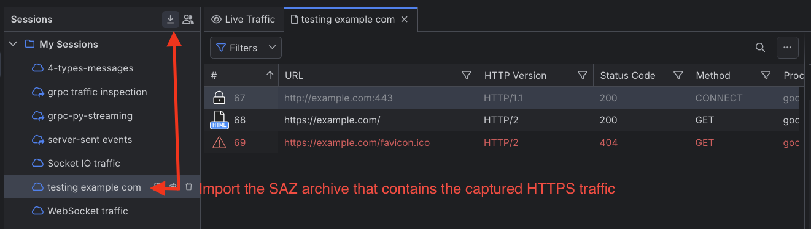
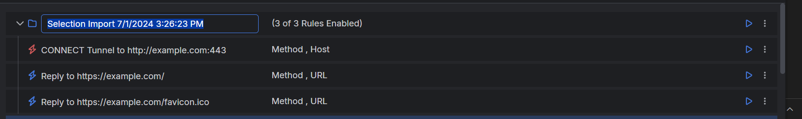
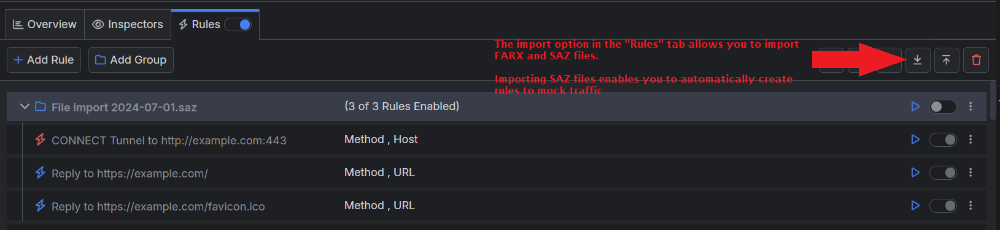
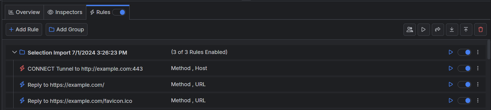

# Mocking Traffic

A typical scenario is when a client, a colleague, or a third party is experiencing a specific issue when loading a web application. The problem is often related to the third-party tools (e.g., specific browser version, added extensions) or a set of specific steps that the user undertakes to result in the observed behavior. With Fiddler Everywhere, the user can easily capture and share the sessions with you for further investigation. Going one step further, Fiddler Everywhere allows you to mock multiple sessions just as they initially appeared.

## Creating and Using a "Mock Traffic" Rule

Fiddler can mock HTTPS traffic captured locally or remotely, for example, as traffic captured by another instance of Fiddler Everywhere and shared as a cloud session or SAZ archive. The following steps showcase how to use a SAZ archive to load and mock the captured traffic (in this case, as loaded from [https://example.com)](https://example.com)).

1. Capture the targeted HTTPS traffic or import an SAZ archive (containing the session snapshot) in the Snapshots list.

 

1. Select all sessions (`Ctrl + A` on Windows or `CMD + A` on macOS).

1. Right-click to invoke the context menu and choose **Add New Rules**. At this point, Fiddler will automatically generate rules for each captured session and create a parent group. The group's name will be "Selection Import" followed by a timestamp.

 

**OR**

1. Import the SAZ archive with the captured traffic in the **Rules** tab. At this point, Fiddler will automatically generate rules for each captured session and create a parent group. The group's name will be "File Import" followed by a timestamp.

 

Once the mock rules are created through the above methods, you can add modifications (within the newly created rules) and then use them with live traffic.

1. (Optional) Modify the newly generated rules (for example, you can change the request/response headers and bodies).

1. Switch the Fiddler's tabs from the saved session snapshot to the **Live Traffic** tab. 

1. Ensure that the switches for the newly created rule group and the **Rules** tab are toggled ON (refer to the screenshot below). Note that the switches are available only when the Live Traffic tab is focused.

 

The next step is to use one of Fiddler's capturing modes and initiate the traffic capturing (the rules will work only for traffic that goes through the Fiddler proxy). For Example:

1. Use the **Browser** to start [the browser captruing mode]().

1. Load the URL used by the client to generate the captured sessions (in our case, that would be [https://example.com)](https://example.com))

That's it! At this very moment, the shown page is not the original one, but the one as mocked from the active Fiddler rules. 

## Additional Resources

- [Modifying HTTPS Traffic]()
- [Using Breakpoints]()
- [Example for using predefined actions in the Rules tab]()
- [Example for redirecting through the Rules tab]()
- [Example for turning off caching through the Rules tab]()
- [Example for creating manual HTTP Responses]()
- [Understanding the matching conditions and Final vs. Non-Final Actions]()
- [Introducing the Rules tab (blog post)](https://www.telerik.com/blogs/introducing-new-rule-builder-fiddler-everywhere)
