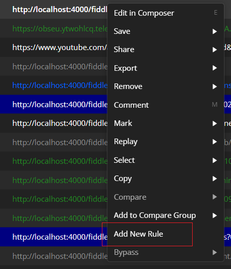
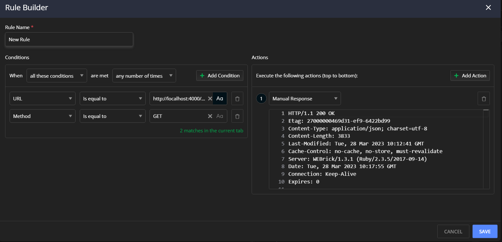
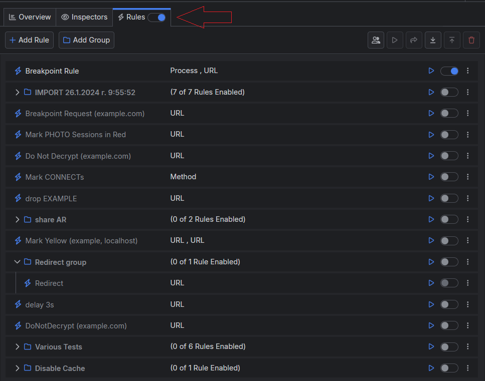

# Modifying Traffic

Fiddler Everywhere provides powerful debugging techniques for testing APIs and mocking server and client behavior. Modifying traffic through the [Rules](#using-rules) tab is crucial to the Fiddler testing and debugging capabilities.

## Creating Rules

One of the most powerful features in Fiddler Everywhere resides in the **Rules** tab. You can create rules that change HTTP Requests & Responses on-the-fly based on different criteria. The rules can combine multiple criteria and apply single or multiple actions, allowing you to mock real-life scenarios with a few clicks. The various combination of matching conditions and actions that can be combined and applied into single or multiple rules enables you to test client and server applications without changing or accessing their code. 

To modify captured session through the **Rules**:

1. Start any [capturing mode]() with Fiddler Everywhere and initiate the request. As a result, the session is captured and displayed in the **Live Traffic** grid.

1. Select the desired session and right-click to open the context menu. From the context menu, select **Add New Rule**.

    

1. The session data is automatically populated in the **Rules Builder**. You can further modify the matching conditions and the desired actions. 

    

1. Click **Save** to preserve the rule.

Fiddler automatically adds the newly created rule on the top of the [**Rules Queue**](#rules-queue), giving it immediate execution priority (you can demote or promote each rule in the queue). The rule is also automatically activated (the rule switch toggles on), so any new requests that match the rule will be affected by it. You can also replay the original session through its context menu (**Replay > Reissue Requests**).

## Using Rules Builder

Use the **Rule Builder** to create custom rules from scratch. Each rule can automatically trigger a specific action that meets the pre-set matching criteria. To mock a client request or server response, enable the **Rules** tab, set a rule, and execute the request that will trigger that rule.

To create and test a rule through the **Rules Builder**:

1. Select the **Rules** tab and click the **Add Rule** button. As a result, the **Rule Builder**opens.

1. Enter a descriptive rule name, which will appear in the **Rules Queue**.

1. Add a condition or a set of conditions to match sessions.

1. Add an action or a set of actions to modify the matched sessions.

1. Click **Save** to save and add the created rule in the **Rules Queue**.

1. Start capturing traffic or replay a specific session that triggers the rule.

    - If you test with system capturing, independent browser, terminal, or through explicit proxy&mdash;Ensure that the switch of the main **Rules** tab is toggled ON. Open the application in the browser and execute a request that matches the set conditions. The rule immediately applies to the ongoing captured traffic.

    - If you test with already saved sessions&mdash;Select the rule and use the **Execute** button (green play arrow). The rule immediately applies to the preloaded saved sessions.

The **Rules** tab can be a powerful ally in testing various complex scenarios without meddling with the server. You can share, import, and export created rules with collaborators to ease your support, development, and QA processes.

### Additional Rules Resources

- [Understanding the Matching Conditions and Final vs. Non-Final Actions]()
- [Using predefined actions in the Rules tab]()
- [Redirecting through the Rules tab]()
- [Returning Custom HTTP Responses]()