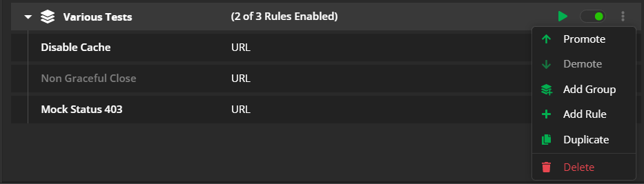

# Organizing Rules

All created rules in the **Rules** tab are organized in the **Rules** list - a visual represenation of all active rules & groups. Each active rule or group has higher execution priority than other rules & groups placed lower in the lists. The **Rules** list allows you to enable, turn on off, promote, denote, edit, export, import, share, and immediately execute the listed rules.

## Using the Rules List

To use a rule (or a group of rules) from the **Rules** list, take into consideration the following tips:

- The **Rules** tab must be active (switch ON).

- Only **active** rules from the list will be applied on ongoing Live traffic capture. If the rule is contained within a group, then the group must be active as well.

- You can explicitly trigger a rule for already captured (including saved) traffic through the **Execute** button (executes the rule on current sessions).

- The **Execute** button is not affected by the active state of groups/rules. Actions from any selected rule or group of rules will be triggered when the **Execute** button is used.

- The rules in the **Rules** list are executed with priority based on their position in the list. Use the **Demote** and **Promote** buttons to change the list rule position (and priority). Alternatively, you can drag and drop rules to change their position in the list. 

- The groups in the **Rules** list are executed with priority based on their position in the list. Use the **Demote** and **Promote** buttons to change the list group position (and priority). Alternatively, you can drag and drop groups to change their position in the list.

- You can drag and drop rules in and out of groups and subgroups. Note that this can change the execution priority when multiple rules are executed simultaneously.

- Some rule actions can trigger [a final action](slug://fiddler-rules-actions), which stops the execution of all other actions and rules with lower priority.

## Rules Priority

By default, the **Rules** list will list all created and imported rules based on their priority. Rules will be executed according to their appearance, starting from the top. When selecting specific rules and using the explicit **Execute** button, they will run in the order they appear in the list.

## Explicit Rules Execution

The **Execute** button from the main toolbar explicitly executes all active rules on captured sessions. The **Execute** functionality is available for both the **Live Traffic** tab and saved sessions.

## Group Options

You can organize multiple rules in groups. Each group consists of the following:
- Group name.
- Indication that shows the number of active and total rules (contained within the group).
- Toolbar with group options.
- List with all contained rules or subgroups.

The group options allow you to further interact with the group's rules:

- The **Play** button executes all active rules from the selected group. The rules will match any loaded sessions.
- The **Enable/Disable** toggle explicitly enables or disables the group execution. Available only for **Live Traffic** grid's sessions and hidden when interacting with saved sessions.
- The **Promote** up arrow promotes the selected group of rules in the **Rules** list.
- The **Demote** down arrow demotes the selected group of rules in the **Rules** list.
- The **Add Group** button automatically creates a subgroup within the selected group.
- The **Add Rule** button opens the **Rules Builder** and places the new rule within the selected group.
- The **Duplicate** button creates a duplicate copy of the selected group.
- The **Delete** button deletes the group and all contained rules from the **Rules** list.

## Additional Resources

- [Modifying HTTPS Traffic](slug://modify-traffic-get-started)
- [Using Breakpoints](slug://rulesbuilder-breakpoints)
- [Example for using predefined actions in the Rules tab](slug://fiddler-ar-actions)
- [Example for redirecting through the Rules tab](slug://rulesbuilder-redirect-traffic)
- [Example for disabling caching through the Rules tab](slug://rule-disable-caching)
- [Example for creating manual HTTP Responses](slug://using-custom-responses)
- [Understanding the matching conditions and Final vs. Non-Final Actions](slug://fiddler-rules-actions)
- [Introducing the Rules tab (blog post)](https://www.telerik.com/blogs/introducing-new-rule-builder-fiddler-everywhere)
