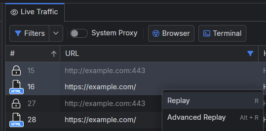

# Replaying Traffic

When developing and testing web applications, it's common to wonder how your server and site will handle many continuous requests. You may also want to test if a specific functionality of your web application will respond correctly to multiple repeating requests. With Fiddler Everywhere, you can replay a session or multiple sessions and set specific repeating conditions such as the number of repeats, repeat behavior, and request behavior for each separate repeat.

## One-Time Replay

To trigger a one-time replay for selected sessions, follow these steps:

1. Select one or more sessions.
2. Invoke the context menu or press `R`.

As a result, the selected sessions will be immediately replayed and displayed as new entries in the Fiddler's traffic grid.

## Advanced Replay

For more advanced replay options, follow these steps:

1. Select one or more sessions.
2. Invoke the context menu or press `Alt + R`/`Control + R`.

The above opens the **Advanced Replay** configuration prompt window, allowing you to control the following aspects of the replay process:

- **Number of Repeats**: Configure how many times the selected session must be replayed. The maximum is 100000 iterations.

- **Repeat Behavior**: Set whether the repeats for each selected session must be triggered sequentially (one after the other) or in parallel (in a batch).
    * **Sequential**: each repeat will start after the previous one has finished. 
    * **Parallel**: all repeats will start at the same time.

- **Request Behavior**: Set whether the requests from multiple selected sessions in each repeat must be triggered sequentially (one after the other) or in parallel (in a batch). This option is available only when multiple different sessions are selected.
    * **Sequential**: each request in the series of repeats will start after the previous one has finished. 
    * **Parallel**: all requests will start simultaneously in the repeats.

[Advanced Replay configuration](../images/rules/replay-advanced.png)

All replay options are available for live traffic and traffic loaded from saved snapshots (for example, saved snapshots loaded from the **Sessions** list or imported SAZ files).