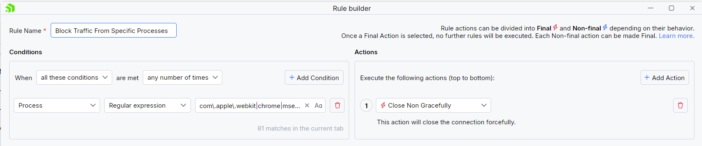
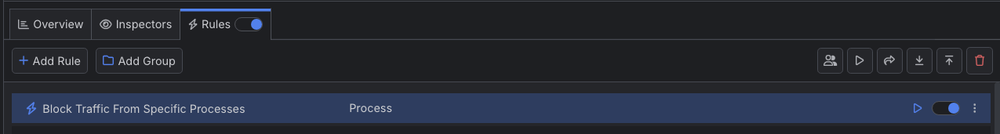

# Blocking Traffic to Specific Processes

With Fiddler Everywhere, you can create a rule that automatically blocks traffic from any matched processes by forcibly closding the ongoing HTTP connection.

## Creating a "Block Traffic to Specific Processes" Rule

Create a "Block Traffic to Specific Processes" rule, by setting the following actions through the [Rules Builder]().

- Create a matching condition that uses the "When **all these conditions** are met **any number of times**". 

- Match by a **Process** where the string value defines the targeted process by its name. In the example below, we will match different browsers on macOS while using the following regular expression **com\.apple\.webkit|chrome|msedge**

- Create a **Close Non Gracefuly** action.

An example rule that matches all sessions where the proces contains one of the string literals set thorugh the regular expression and closes the connection forcibly.

Once the rule is created, enable the **Rules** tab, toggle the rule switch, and start capturing traffic.

The link below provides a ready-to-use rule for download as a FARX file, which you can import through the Rules toolbar.

[A "Block Traffic to Specific Processes" rule as FARX file](https://github.com/telerik/fiddler-everywhere/rules/tooling/block-traffic-to-specific-processes)
 
 