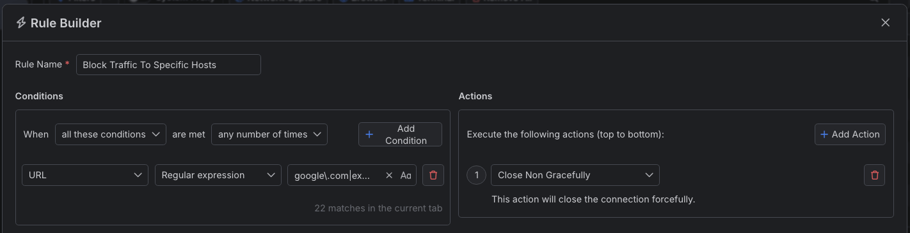
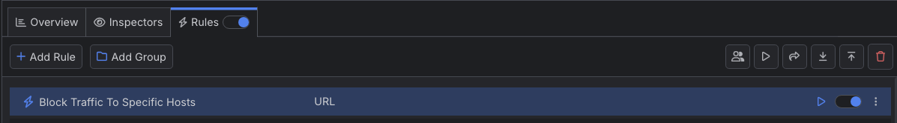

# Blocking Traffic to Specific Hosts

With Fiddler Everywhere, you can create a rule that automatically blocks traffic to any matched host by forcibly closding the ongoing HTTP connection.

## Creating a "Block Traffic to Specific Hosts" Rule

Create a "Block Traffic to Specific Hosts" rule, by setting the following actions through the [Rules Builder]().

- Create a matching condition that uses the "When **all these conditions** are met **any number of times**". 

- Match by a **URL** where the string value defines the targeted hosts. In the example below, we ill use a regular expession that matches hosts like **example.com** and **google.com**

- Create a **Close Non Gracefuly** action.

An example rule that matches all sessions where the host is **example.com** or **google.com** and closes the connection.

Once the rule is created, enable the **Rules** tab, toggle the rule switch, and start capturing traffic.

The link below provides a ready-to-use rule for download as a FARX file, which you can import through the Rules toolbar.

[A "Block Traffic to Specific Hosts" rule as FARX file](https://github.com/telerik/fiddler-everywhere/rules/tooling/block-traffic-to-specific-hosts)
 
 