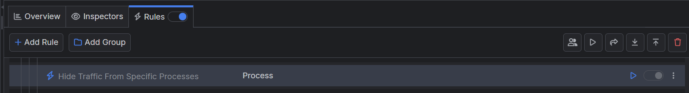

# Hiding Traffic from Specific Processes

By default, when Fiddler Everywhere acts as an intermediate proxy, it will capture and show all traffic that goes through the system proxy. That could overwhelm users as the captured traffic could contain thousands of sessions from multiple applications running in the background. Almost every modern-day application makes some request, so you will notice traffic from all sorts of processes and applications like antivirus tools, firewalls, mail and chat clients, IDEs, and even software for maintaining your keyboard's RGB lights can issue an HTTP request.

With Fiddler Everywhere, you can easily create a rule to hide traffic from specific processes and applications.

## Creating a "Hide Traffic from Specific Processes" Rule

In this example, we will create a rule named "Hide Traffic from Specific Processes" that hides all captured traffic except for traffic generated from a Chromium-based browser.

Create a "Hide Traffic from Specific Processes" rule that sets the following matching conditions and actions through the [Rules Builder]().

- Create a matching condition that uses the "When **all these conditions** are met **any number of times**". Note that in this rule, we will use the negative statements to match and apply actions on anything but our targets.

- Match by a **Process** that uses a regular expression to match an application with a list of specific process names.

    ```regex
    com\.apple\.webkit|chrome|msedge
    ```

- Create a **Do Not Show** action.

    >important Note that the **Do Not Show** action is final, which means that no other action or active rule wplaced lower in the rules queue will be executed.

This example rule hides all sessions coming from a Chromium-based browsers likke Microsoft Edge, or Google Chrome.


Once the rule is created, enable the **Rules** tab, toggle the rule switch, and start capturing traffic.



The link below provides a ready-to-use rule for download as a FARX file, which you can import through the Rules toolbar.

[A "Hide Traffic from Specific Processes" rule as FARX file](https://github.com/telerik/fiddler-everywhere/rules/filters/hide-specific-processes)
 
 