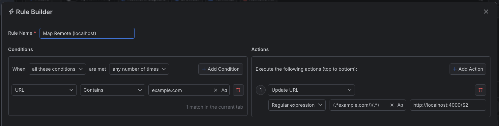
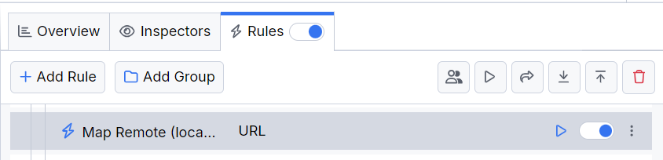

# Mapping Localhost Sources

Remote mapping of a request location means testing changes or fixes locally and avoiding deploying on an actual remote host. However, testing against a localhost environment is often the more straightforward, quicker, and cheaper solution. With mapping destination to localhost, you can test partial or complete solutions. With Fiddler Everywhere, you can easily create a rule that redirects or maps traffic to and from localhost addresses.

## Creating a "Map Remote (localhost)" Rule

Create a "Map Remote (localhost)" rule by setting the following actions through the [Rules Builder]().

- Create a matching condition that uses the "When **all these conditions** are met **any number of times**". 

- Match by a **URL** that uses a string value to match the desired URL (for demonstration purposes, we match **example.com**).

- Create an **Update URL** action and set the desired new target **localhost** path. In the demonstration, we use a regular expression that will replace only the request's **host** while preserving the **path**. Effectively that means that a request made to **https://example.com/my-test-api** will be mapped to **http://localhost:4000/my-test-api**

Once the rule is created, enable the **Rules** tab, toggle the rule switch, and start capturing traffic.

The link below provides a ready-to-use rule for download as a FARX file, which you can import through the Rules toolbar.

[A "Map Remote (localhost)" rule as FARX file](https://github.com/telerik/fiddler-everywhere/rules/tooling/rmap-remote-localhost)
 
 