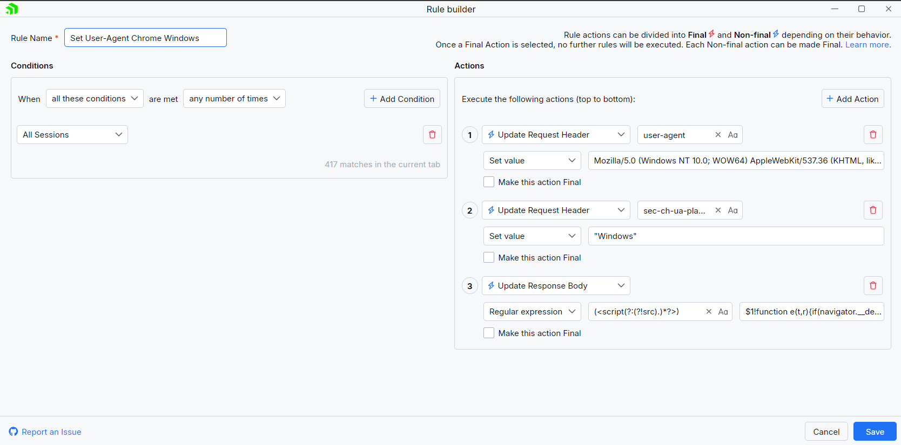
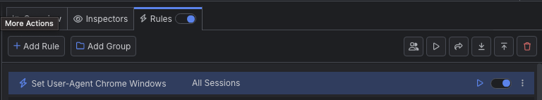
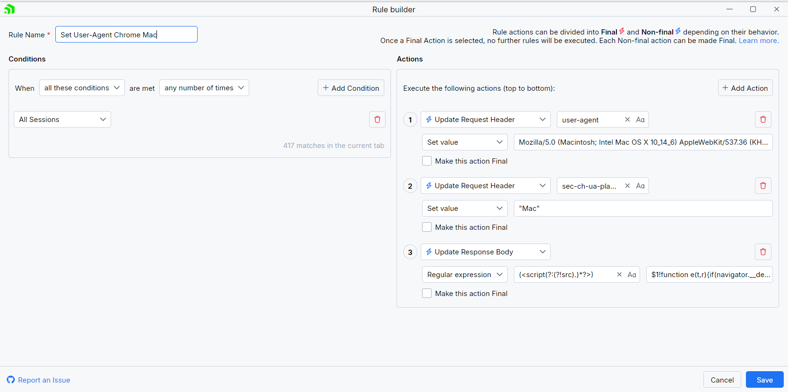
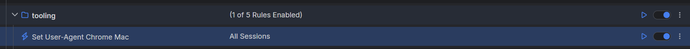

# The User-Agent Header

The **User-Agent** HTTP Header lets server identify the application, operating system, vendor, and/or version of the client that sends the request. Usually, each application sends its own specific **User-Agent** string value, but in some cases developers might want to quickly test server responses based on multiple different user agents. Additionally, when Fiddler issues a request thorugh its **Composer** it will also automatically set its own **User-Agent** value - the same could also happen while using other third-party proxy tools chained to Fiddler.

You can easily create a rule that changes the **User-Agent** for any HTTP request that goes through Fiddler while using the Fiddler's rules.


In the below examples, we will create afew different rules named "Change User-Agent" that effectively changes the pre-set user agent header with predefined user agents that mock Chrome browser on Windows and on macOS.

## Creating a "Set User-Agent" Rule for Chrome Browser on Windows

Create a "Set User-Agent Chrome Windows" rule, by setting the following actions through the [Rules Builder]().

- Create an action that sets the HTTP Request header **user-agent** with the following value 

    ```bash
    Mozilla/5.0 (Windows NT 10.0; WOW64) AppleWebKit/537.36 (KHTML, like Gecko) Chrome/123.0.0.0 Safari/537.36`.
    ```

- Create an action that sets the HTTP Request header **sec-ch-ua-platform** with value **"Windows"**.

- Create an action **Update Response Body** that sets the following regular expression match
    
    ```javascript
    (<script(?:(?!src).)*?>)
    ```

    and update as 

    ```javascript
    $1!function e(t,r){if(navigator.__defineGetter__?navigator.__defineGetter__("userAgent",function(){return r}):Object.defineProperty&&Object.defineProperty(navigator,"userAgent",{get:function(){return r}}),t.navigator.userAgent!==r){var n={get:function(){return r}};try{Object.defineProperty(t.navigator,"userAgent",n)}catch(i){t.navigator=Object.create(navigator,{userAgent:n})}}}(window,"Mozilla/5.0 (Windows NT 10.0; WOW64) AppleWebKit/537.36 (KHTML, like Gecko) Chrome/123.0.0.0 Safari/537.36");
    ```


An example rule that matches all sessions and explicitly changes the user agent.



Once the rule is created, enable the **Rules** tab, toggle the rule switch, and start capturing traffic.
g


The link below provides a ready-to-use rule for download as a FARX file, which you can import through the Rules toolbar.

[A "Set User-Agent Chrome Windows" rule as FARX file](https://github.com/telerik/fiddler-everywhere/rules/tooling/changing-user-agent-chrome-windows)

## Creating a "Set User-Agent" Rule for Chrome Browser on macOS

Create a "Set User-Agent Chrome Mac" rule, by setting the following actions through the [Rules Builder]().

- The HTTP Request header **user-agent** must be set with the following value 

    ```bash
    Mozilla/5.0 (Macintosh; Intel Mac OS X 10_14_6) AppleWebKit/537.36 (KHTML, like Gecko) Chrome/123.0.0.0 Safari/537.36
    ```

- The HTTP Request header **sec-ch-ua-platform** must be set with a value **"Mac"**.

- The last **Update Response Body** action must use regular expression to match 

    ```javascript
    (<script(?:(?!src).)*?>)
    ```

    and update as 

    ```javascript
    $1!function e(t,r){if(navigator.__defineGetter__?navigator.__defineGetter__("userAgent",function(){return r}):Object.defineProperty&&Object.defineProperty(navigator,"userAgent",{get:function(){return r}}),t.navigator.userAgent!==r){var n={get:function(){return r}};try{Object.defineProperty(t.navigator,"userAgent",n)}catch(i){t.navigator=Object.create(navigator,{userAgent:n})}}}(window,"Mozilla/5.0 (Macintosh; Intel Mac OS X 10_14_6) AppleWebKit/537.36 (KHTML, like Gecko) Chrome/123.0.0.0 Safari/537.36");
    ```


An example rule that matches all sessions and explicitly changes the user agent.



Once the rule is created, enable the **Rules** tab, toggle the rule switch, and start capturing traffic.
g


The link below provides a ready-to-use rule for download as a FARX file, which you can import through the Rules toolbar.

[A "Set User-Agent Chrome Mac" rule as FARX file](https://github.com/telerik/fiddler-everywhere/rules/tooling/changing-user-agent-chrome-macos)
 
 
 