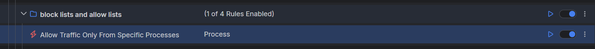

# Allowing Traffic from Specific Processes

With Fiddler Everywhere, you can create a rule that automatically allows traffic only from specific processes and forcibly closes HTTP connections triggered from any other process.

## Creating an "Allow Traffic from Specific Processes" Rule

Create an "Allow Traffic from Specific Processes" rule by setting the following actions through the [Rules Builder]().

1. Create a matching condition that uses the "When **none of these conditions** are met **any number of times**" pattern. This rule uses the negative statement **none ...** to apply the desired actions to everything but the matched entries.

1. Match by a **Process** where the string value defines the targeted process by its name. The process name varies depending on the used operating system and version of the client application. The example below matches different browsers on macOS while using the following regular expression: **com\.apple\.webkit|chrome|msedge**.

1. Create a **Close Non Gracefully** action.

This sample Fiddler rule matches all sessions where the processes contains one of the string literals set through the regular expression and then closes the connections made by any other unmatched process.

>tip The blocking actions are not final can be combined with other action. [Learn more about final and non-final actions here]()

Once the rule is created, enable the **Rules** tab, toggle the rule switch, and start capturing traffic.

Download a ready-to-use <a href="https://github.com/telerik/fiddler-everywhere/tree/master/rules/allow-traffic-only-from-specific-processes/" target="_blank">"Allow Traffic from Specific Processes"</a> rule as a FARX file, which you can import through the Rules toolbar.

## See Also

* [Learn more about the Rules functionality in FIddler Everywhere here...]()
* [Learn more about all rules presets in Fiddler Everywhere here...]()
* [Learn more on how to organize your rules here...]()
* [Learn more about the matching conditions here...](#conditions)
* [Learn more about the supported actions here...](#actions)
* [Learn more about final and non-final rules here...](#final-and-non-final-actions)