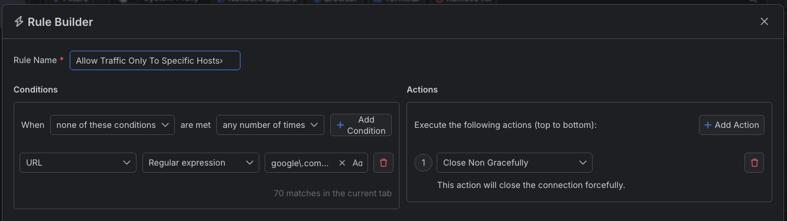
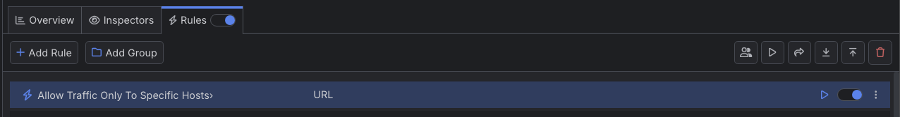

# Allowing Traffic to Specific Hosts

With Fiddler Everywhere, you can create a rule that automatically allows traffic to specific host or number of hosts and forcibly closes all other HTTP connections made to different hosts.

## Creating a "Allow Traffic Only to Specific Hosts" Rule

Create an "Allow Traffic To Specific Hosts" rule by setting the following actions through the [Rules Builder]().

1. Create a matching condition that uses the "When **none of these conditions** are met **any number of times**" pattern. This rule uses the negative statement **none ...** to apply the desired actions to everything but the matched entries.

1. Match by a **URL** where the string value defines the targeted hosts. For example: a regular expression that matches hosts like **example.com** and **google.com**

1. Create a **Close Non Gracefully** action.

This sample Fiddler rule matches all sessions where the host is **example.com** or **google.com** and closes the connection.

>tip The blocking actions are not final can be combined with other action. [Learn more about final and non-final actions here]()

Once the rule is created, enable the **Rules** tab, toggle the rule switch, and start capturing traffic.

Download a ready-to-use <a href="https://github.com/telerik/fiddler-everywhere/tree/master/rules/allow-traffic-only-from-specific-hosts" target="_blank">"Allow Traffic To Specific Hosts"</a> rule as a FARX file, which you can import through the Rules toolbar.

## See Also

* [Learn more about the Rules functionality in FIddler Everywhere here...]()
* [Learn more about all rules presets in Fiddler Everywhere here...]()
* [Learn more on how to organize your rules here...]()
* [Learn more about the matching conditions here...](#conditions)
* [Learn more about the supported actions here...](#actions)
* [Learn more about final and non-final rules here...](#final-and-non-final-actions)
 