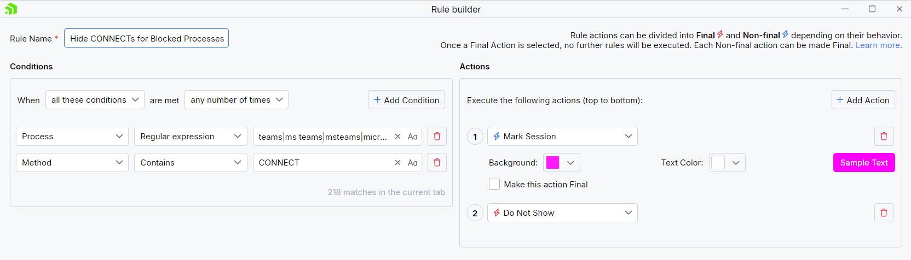
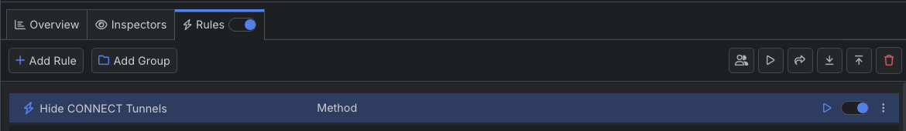

# Hiding CONNECT Tunnels

One of the first things you will notice while capturing HTTPS traffic with Fiddler Everywhere (or with other HTTPS proxies) is the presence of multiple HTTP sessions utilizing the CONNECT method. These are the so-called CONNECT Tunnels that the client applications configured to go through the Fiddler proxy are sending to establish a two-way connection.

The CONNECT tunnels are used by the Fiddler proxy so that it knows where the requests should be directed&mdash;otherwise, the connection will be encrypted and Fiddler won't be able to direct the request to its target. While the CONNECT Tunnels are crucial for the proper work of an intermediate HTTPS proxy, they bear little information that can be used for web debugging and could cause an additional distraction while handling large portions of captured traffic.

With Fiddler Everywhere, you can easily hide the CONNECT Tunnels so that you can see and concentrate only on the sessions that matter.

## Creating a "Hide CONNECT Tunnels" Rule

In this example, we will create a rule named "Hide CONNECT Tunnels" that hides all requests made with HTTP method CONNECT (also known as proxy CONNECT Tunnels).

Create a "Hide CONNECT Tunnels" rule that sets the following matching conditions and actions through the [Rules Builder]().

1. Create a matching condition that uses the "When **all these conditions** are met **any number of times**" pattern. 

1. Match by a **Method** that contains **CONNECT** as a string.

1. Create a **Do Not Show** action.

    > >important The **Do Not Show** action is final. No other action or active rule placed lower in the rules queue will be executed.

This sample Fiddler rule hides all HTTP sessions that use the **CONNECT** method.

Once the rule is created, enable the **Rules** tab, toggle the rule switch, and start capturing traffic.

Download a ready-to-use <a href="https://github.com/telerik/fiddler-everywhere/tree/master/rules/hide-connect-tunnels" target="_blank">"Hide CONNECT Tunnels"</a> rule as a FARX file, which you can import through the Rules toolbar.

## See Also

* [Learn more about the Rules functionality in FIddler Everywhere here...]()
* [Learn more about all rules presets in Fiddler Everywhere here...]()
* [Learn more on how to organize your rules here...]()
* [Learn more about the matching conditions here...](#conditions)
* [Learn more about the supported actions here...](#actions)
* [Learn more about final and non-final rules here...](#final-and-non-final-actions)