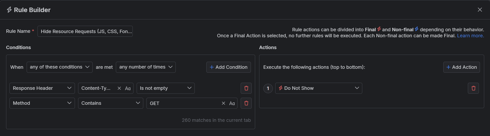
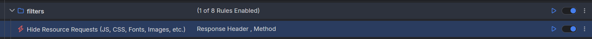

# Hiding Resource Requests 

In real life, most applications and web sites are executing multiple different requests to use multiple API endpoints. As a result, when capturing all HTTPS traffic, you will quickly notice an overwhelming amount of logged HTTPS sessions requesting different resources like PNG images, CSS files, JavaScript modules, SVG icons, font files and more. That can make finding and inspecting a specific session hard when you have thousands of captured sessions.

With Fiddler Everywhere, you can easily hide resource requests based on your own matching criteria so that you can see and concentrate only on the sessions that matter.

## Creating a "Hide Resource Requests" Rule

This example shows how to create a rule named "Hide Resource Requests" that matches and hodes all session that contains a `Content-Type` header. This will effecitively remove any resource request from the Live Traffic grid.

Create a "Hide Resource Requests" rule that sets the following matching conditions and actions through the [Rules Builder]().

1. Create a matching condition that uses the "When **all these conditions** are met **any number of times**" pattern. 

1. Match by a **Response Header** with name `Content-Type` where the value is not null.

1. Match by a **Method** of type `GET`.

1. Create a **Do Not Show** action.

    >important The **Do Not Show** action is final. No other action or active rule placed lower in the rules queue will be executed.

This sample Fiddler rule hides all resource requests.

Once the rule is created, enable the **Rules** tab, toggle the rule switch, and start capturing traffic.

Download a ready-to-use <a href="https://github.com/telerik/fiddler-everywhere/tree/master/rules/hide-resource-requests" target="_blank">"Hide Resource Requests"</a> rule as a FARX file, which you can import through the Rules toolbar.
  
## See Also

* [Learn more about the Rules functionality in Fiddler Everywhere here...]()
* [Learn more about all rules presets in Fiddler Everywhere here...]()
* [Learn more on how to organize your rules here...]()
* [Learn more about the matching conditions here...](#conditions)
* [Learn more about the supported actions here...](#actions)
* [Learn more about final and non-final rules here...](#final-and-non-final-actions)