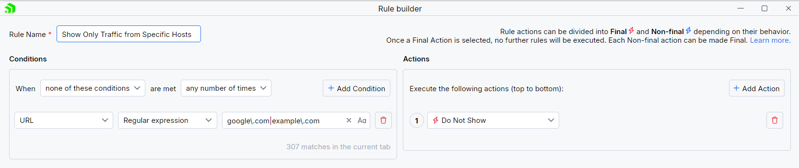

# Showing Only Traffic from Specific Hosts

Similar to [showing traffic only from localhost](), there are scenarios where you would like to test and see traffic generated from a specific hostname.

With Fiddler Everywhere, you can easily create rules that limit the captured traffic so that you can see and concentrate only on the sessions that matter.

## Creating a "Show Only Host Traffic" Rule

This example shows how to create a rule named "Show Only Host Traffic" that hides all captured traffic except for traffic generated from the specified host.

Create a "Show Only Host Traffic" rule that sets the following matching conditions and actions through the [Rules Builder]().

1. Create a matching condition that uses the "When **none of these conditions** are met **any number of times**" pattern. This rule uses the negative statements to match and apply actions on anything but the desired targets.

1. For the matching condition, match by a **URL** that uses a regular expression for addresses that contain **google.com** and **example.com**.

    ```regex
    google\.com|example\.com
    ```

1. Create a **Do Not Show** action.

    >important The **Do Not Show** action is final. No other action or active rule placed lower in the rules queue will be executed.

This sample Fiddler rule hides all sessions except those containing **google.com** or **example.com** in their URLs.



Once the rule is created, enable the **Rules** tab, toggle the rule switch, and start capturing traffic.


Download a ready-to-use <a href="https://github.com/telerik/fiddler-everywhere/tree/master/rules/show-only-specific-hosts" target="_blank">"Show Only Host Traffic"</a> rule as a FARX file, which you can import through the **Rules** toolbar.
 
## See Also

* [Learn more about the Rules functionality in Fiddler Everywhere here...]()
* [Learn more about all rules presets in Fiddler Everywhere here...]()
* [Learn more on how to organize your rules here...]()
* [Learn more about the matching conditions here...](#conditions)
* [Learn more about the supported actions here...](#actions)
* [Learn more about final and non-final rules here...](#final-and-non-final-actions)
* [Learn more about using breakpoints here...]()