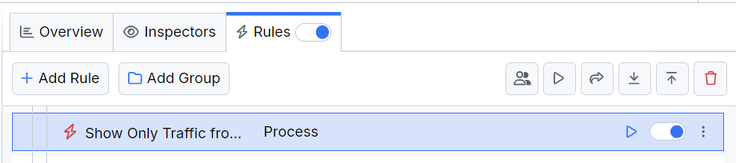

# Showing Traffic Only from Specific Processes

By default, when Fiddler Everywhere acts as an intermediate proxy, it captures and shows all traffic that goes through the system proxy. That could overwhelm users as the captured traffic could contain thousands of sessions from multiple applications running in the background. Almost every modern-day application makes some request, so you will notice traffic from all sorts of processes and applications like antivirus tools, firewalls, mail and chat clients, IDEs, and even the software for maintaining your keyboard's RGB lights.

With Fiddler Everywhere, you can easily create a rule to show traffic from specific processes and applications.

## Creating a "Show Only Traffic from Specific Processes" Rule

In this example, we will create a rule named "Show Only Traffic from Specific Processes" that hides all captured traffic except for traffic generated from a Chromium-based browser.

Create a "Show Only Traffic from Specific Processes" rule that sets the following matching conditions and actions through the [Rules Builder]().

1. Create a matching condition that uses the "When **none of these conditions** are met **any number of times**" pattern. This rule uses the negative statements to match and apply actions on anything but the desired targets.

1. Match by a **Process** that uses a regular expression to match an application with a list of specific process names.

    ```regex
    com\.apple\.webkit|chrome|msedge
    ```

1. Create a **Do Not Show** action.

    >important The **Do Not Show** action is final. No other action or active rule placed lower in the Rules list will be executed.

This sample Fiddler rule hides all sessions except those coming from a Chromium-based browsers like Microsoft Edge or Google Chrome.


Once the rule is created, enable the **Rules** tab, toggle the rule switch, and start capturing traffic.



Download a ready-to-use <a href="https://github.com/telerik/fiddler-everywhere/tree/master/rules/show-only-specific-processes" target="_blank">"Show Only Traffic from Specific Processes"</a> rule as a FARX file, which you can import through the Rules toolbar.

## See Also

* [Learn more about the Rules functionality in Fiddler Everywhere here...]()
* [Learn more about all rules presets in Fiddler Everywhere here...]()
* [Learn more on how to organize your rules here...]()
* [Learn more about the matching conditions here...](#conditions)
* [Learn more about the supported actions here...](#actions)
* [Learn more about final and non-final rules here...](#final-and-non-final-actions)
* [Learn more about using breakpoints here...]()