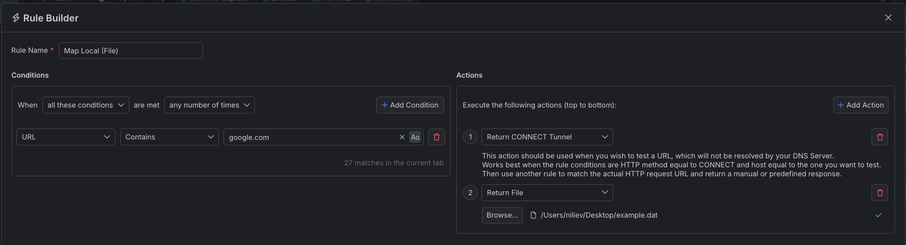
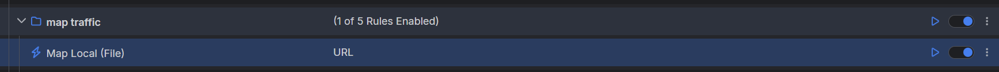

# Mapping Local Files


Mapping HTTP requests can be done to remote locations and local sources like files, Fiddler's predefined responses, or manual responses (through the Fiddler user interface). This article will showcase how to create a rule that **maps HTTP requests to a local DAT file** (which contains the modified HTTP response).


## Creating a "Map Local (File)" Rule

Create a "Map Local (File)" rule by setting the following actions through the [Rules Builder]().

1. Create a matching condition that uses the "When **all these conditions** are met **any number of times**". 

1. Match by a **URL** that uses a string value to match the desired URL (for demonstration purposes, we match **example.com**).

1. (Optional) Create a **Return CONNECT Tunnel** action. This action should be used when you wish to test a URL that your DNS server will not resolve.

1. Create **Return File** action and set the path to the DAT file that contains the modified HTTP request. For demonstration, we use a DAT file with the following content:

    ```
    HTTP/2 200
    accept-ranges: bytes
    age: 339925
    cache-control: max-age=604800
    content-type: text/html; charset=UTF-8
    date: Fri, 05 Apr 2024 08:26:52 GMT
    etag: "3147526947"
    expires: Fri, 12 Apr 2024 08:26:52 GMT
    last-modified: Thu, 17 Oct 2019 07:18:26 GMT
    server: ECS (sed/58EA)
    vary: Accept-Encoding
    x-cache: HIT
    content-length: 1382

    <!doctype html>
    <html>
    <head>
        <title>Fiddler Everywhere - Example Domain</title>

        <meta charset="utf-8" />
        <meta http-equiv="Content-type" content="text/html; charset=utf-8" />
        <meta name="viewport" content="width=device-width, initial-scale=1" />
        <style type="text/css">
        body {
            background-color: #f0f0f2;
            margin: 0;
            padding: 0;
            font-family: -apple-system, system-ui, BlinkMacSystemFont, "Segoe UI", "Open Sans", "Helvetica Neue", Helvetica, Arial, sans-serif;
            
        }
        h1 {
            color: white
        }
        div {
            width: 600px;
            margin: 5em auto;
            padding: 2em;
            background-color: darkslategray;
            border-radius: 0.5em;
            box-shadow: 2px 3px 7px 2px rgba(0,0,0,0.02);
        }
        a:link, a:visited {
            color: #38488f;
            text-decoration: none;
        }
        @media (max-width: 700px) {
            div {
                margin: 0 auto;
                width: auto;
            }
        }
        </style>    
    </head>

    <body>
    <div>
        <h1>Modified by Fiddler Everywhere</h1>
        <p>This domain is for use in illustrative examples in documents. You may use this
        domain in literature without prior coordination or asking for permission.</p>
    </div>
    </body>
    </html>
    ```

This sample Fiddler rule maps an HTTP request to return a manually-crafted response.



>tip As alternative to manually creating a DAT file that contains a proper response, Fiddler present a set of predefined DAT files available through [the **Return Predefined Response** action]().

Once the rule is created, enable the **Rules** tab, toggle the rule switch, and start capturing traffic.



Download a ready-to-use <a href="https://github.com/telerik/fiddler-everywhere/tree/master/rules/map-local-file" target="_blank">"Map Local (File)"</a> rule as a FARX file, which you can import through the Rules toolbar.

  
## See Also

* [Learn more about the Rules functionality in FIddler Everywhere here...]()
* [Learn more about all rules presets in Fiddler Everywhere here...]()
* [Learn more on how to organize your rules here...]()
* [Learn more about the matching conditions here...](#conditions)
* [Learn more about the supported actions here...](#actions)
* [Learn more about final and non-final rules here...](#final-and-non-final-actions)