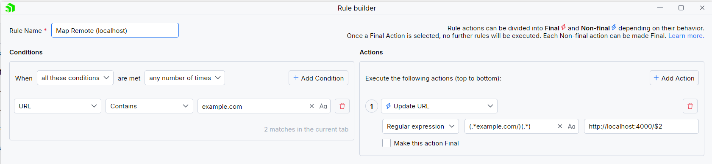
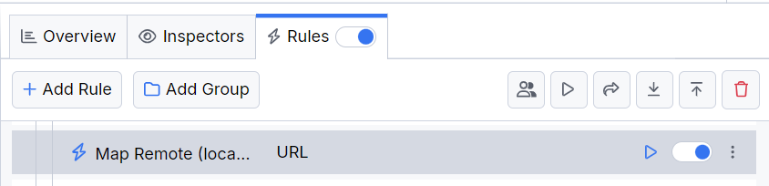

# Map Localhost Sources

Remote mapping of a request location means testing changes or fixes locally and avoiding deploying on an actual remote host. However, testing against a localhost environment is often the more straightforward, quicker, and cheaper solution. By mapping the destination to localhost, you can test partial or complete solutions.

With Fiddler Everywhere, you can easily create a rule that redirects or maps traffic to and from localhost addresses.

## Creating a "Map Remote (localhost)" Rule

Create a "Map Remote (localhost)" rule by setting the following actions through the [Rules Builder](slug://modify-traffic-get-started).

1. Create a matching condition that uses the "When **all these conditions** are met **any number of times**" pattern. 
1. Match by a **URL** that uses a string value to match the desired URL. For example: `example.com`.
1. Create an **Update URL** action and set the desired new target `localhost` path. For example, you can use a regular expression that replaces only the request's **host** while preserving the **path**.

This sample Fiddler rule matches requests made to `https://example.com/my-test-api` and maps them to `http://localhost:4000/my-test-api`.

Once the rule is created, enable the **Rules** tab, toggle the rule switch, and start capturing traffic.

Download a ready-to-use <a href="https://github.com/telerik/fiddler-everywhere/tree/master/rules/map-remote-localhost" target="_blank">"Map Remote (localhost)"</a> rule as a FARX file, which you can import through the Rules toolbar.
 
## See Also

* [Learn more about the Rules functionality in Fiddler Everywhere here...](slug://modify-traffic-get-started)
* [Learn more about all rules presets in Fiddler Everywhere here...](slug://adv_techniques_fiddler)
* [Learn more on how to organize your rules here...](slug://rulesbuilder-get-started)
* [Learn more about the matching conditions here...](slug://fiddler-rules-actions#conditions)
* [Learn more about the supported actions here...](slug://fiddler-rules-actions#actions)
* [Learn more about final and non-final rules here...](slug://fiddler-rules-actions#final-and-non-final-actions)
* [Learn more about using breakpoints here...](slug://rulesbuilder-breakpoints)