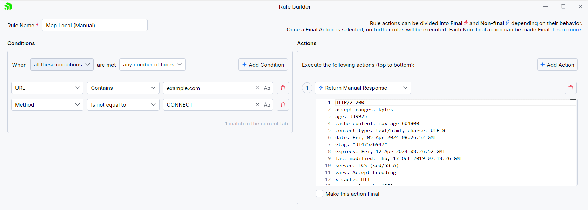
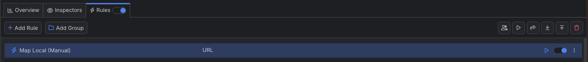

# Map Manual Response


Remote mapping of a request location means testing changes or fixes locally and avoiding deploying on an actual remote host. However, testing against a localhost environment is often the more straightforward, quicker, and cheaper solution. Mapping HTTP requests can be done to remote locations and local sources like files, Fiddler's predefined responses, or manual responses (through the Fiddler user interface). 

With Fiddler Everywhere, you can easily create a rule that **maps an HTTP request to a locally created HTTP Response**.

## Creating a "Map Local (Manual)" Rule

Create a "Map Local (Manual)" rule by setting the following actions through the [Rules Builder]().

1. Create a matching condition that uses the "When **all these conditions** are met **any number of times**" pattern. 

1. Match by a **URL** that uses a string value to match the desired URL. For example: **example.com**.

1. (Optional) If you need to test a URL that your DNS server cannot resolve, create a **Return CONNECT Tunnel** action.

1. Create a **Return Manual Response** action and provide the modified response. For example:

 ```
 HTTP/2 200
 accept-ranges: bytes
 age: 339925
 cache-control: max-age=604800
 content-type: text/html; charset=UTF-8
 date: Fri, 05 Apr 2024 08:26:52 GMT
 etag: "3147526947"
 expires: Fri, 12 Apr 2024 08:26:52 GMT
 last-modified: Thu, 17 Oct 2019 07:18:26 GMT
 server: ECS (sed/58EA)
 vary: Accept-Encoding
 x-cache: HIT
 content-length: 1382

 <!doctype html>
 <html>
 <head>
 <title>Fiddler Everywhere - Example Domain</title>

 <meta charset="utf-8" />
 <meta http-equiv="Content-type" content="text/html; charset=utf-8" />
 <meta name="viewport" content="width=device-width, initial-scale=1" />
 <style type="text/css">
 body {
 background-color: #f0f0f2;
 margin: 0;
 padding: 0;
 font-family: -apple-system, system-ui, BlinkMacSystemFont, "Segoe UI", "Open Sans", "Helvetica Neue", Helvetica, Arial, sans-serif;
 
 }
 h1 {
 color: white
 }
 div {
 width: 600px;
 margin: 5em auto;
 padding: 2em;
 background-color: darkslategray;
 border-radius: 0.5em;
 box-shadow: 2px 3px 7px 2px rgba(0,0,0,0.02);
 }
 a:link, a:visited {
 color: #38488f;
 text-decoration: none;
 }
 @media (max-width: 700px) {
 div {
 margin: 0 auto;
 width: auto;
 }
 }
 </style> 
 </head>

 <body>
 <div>
 <h1>Modified by Fiddler Everywhere</h1>
 <p>This domain is for use in illustrative examples in documents. You may use this
 domain in literature without prior coordination or asking for permission.</p>
 </div>
 </body>
 </html>
 ```
 
This sample Fiddler rule maps an HTTP request to return an HTTP response created within the Fiddler user interface.



Once the rule is created, enable the **Rules** tab, toggle the rule switch, and start capturing traffic.



Download a ready-to-use <a href="https://github.com/telerik/fiddler-everywhere/tree/master/rules/map-local-manual" target="_blank">"Map Local (Manual)"</a> rule as a FARX file, which you can import through the Rules toolbar.

## See Also

* [Learn more about the Rules functionality in Fiddler Everywhere here...]()
* [Learn more about all rules presets in Fiddler Everywhere here...]()
* [Learn more on how to organize your rules here...]()
* [Learn more about the matching conditions here...](#conditions)
* [Learn more about the supported actions here...](#actions)
* [Learn more about final and non-final rules here...](#final-and-non-final-actions)