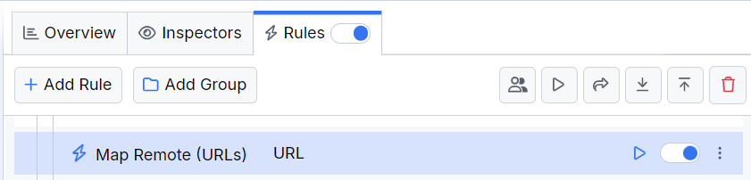
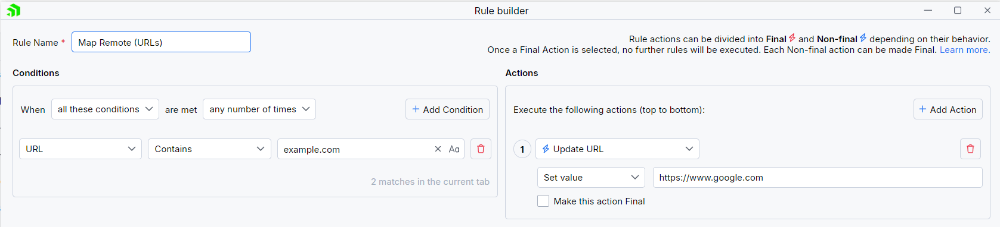

# Map Remote URL

Developers often need to test partial changes to a site from testing (staging) environments to production and vice versa. Deploying small changes can be a burden, especially if you have a complex infrastructure and the build time takes longer.

With a proxy tool in the middle, you can map local and remote resources, which enables you to quickly and efficiently test (mock) changes on the fly.

With Fiddler Everywhere, you can easily create a rule that redirects or maps traffic to and from remote hosts while enabling you to mock HTTP responses so that they are transparently served to client applications.

## Creating a "Map Remote (URLs)" Rule

Create a "Map Remote (URLs)" rule by setting the following actions through the [Rules Builder](slug://modify-traffic-get-started).

1. Create a matching condition that uses the "When **all these conditions** are met **any number of times**" pattern. 
1. Match by a **URL** that uses a string value to match the desired URL. For example: `example.com`, `localhost`, or a more specific path.
1. Create an **Update URL** action and set the desired new target URL. For example: `google.com`,`localhost`, or another more specific path.

This sample Fiddler rule matches all sessions where the host is `example.com` and redirects (maps) to `google.com`.

Once the rule is created, enable the **Rules** tab, toggle the rule switch, and start capturing traffic.

Download a ready-to-use <a href="https://github.com/telerik/fiddler-everywhere/tree/master/rules/map-remote-utls" target="_blank">"Map Remote (URLs)"</a> rule as a FARX file, which you can import through the Rules toolbar.

## See Also

* [Learn more about the Rules functionality in Fiddler Everywhere here...](slug://modify-traffic-get-started)
* [Learn more about all rules presets in Fiddler Everywhere here...](slug://adv_techniques_fiddler)
* [Learn more on how to organize your rules here...](slug://rulesbuilder-get-started)
* [Learn more about the matching conditions here...](slug://fiddler-rules-actions#conditions)
* [Learn more about the supported actions here...](slug://fiddler-rules-actions#actions)
* [Learn more about final and non-final rules here...](slug://fiddler-rules-actions#final-and-non-final-actions)
* [Learn more about using breakpoints here...](slug://rulesbuilder-breakpoints)