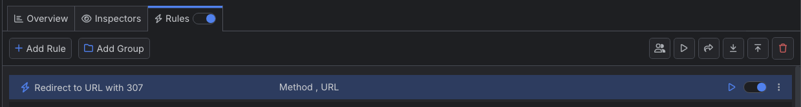

# Create 307 Redirect

The redirect status codes (3xx) are indicators that a page or resource has been moved (temporarily or permanently) from its original destination. During server updates, redesigns, and other application changes, developers often use the <a href="https://developer.mozilla.org/en-US/docs/Web/HTTP/Status/307" target="_blank">temporary **307** redirect</a>, also known as an internal redirect. The 307 redirect points users to new URLs using the `location` header, while at the same time indicating (to search engines) that the change is only temporary. This helps with SEO (search engine optimization).

With Fiddler Everywhere, you can easily create a rule that redirects traffic with status code 307.

## Creating a "Redirect to URL with 307" Rule

Create a "Redirect to URL with 307" rule by setting the following actions through the [Rules Builder]().

1. Create a matching condition that uses the "When **all these conditions** are met **any number of times**" pattern. 

1. Match by a **Method** where the string value equals the desired HTTP method. For example: a **GET** method.

1. Match by a **Method** where the string value defines the targeted hosts. For example: a regular expression that matches the **example.com** domain.

1. Create an **Update Status Code** action and set it to **307 Internal Redirect**.

1. Create an **Update Response Header** action and set the **Location** header to the desired new value. For example: `https://www.example.com`.

This sample Fiddler rule matches all sessions where the host is **example.com** and then creates a temporary 307 redirect.

Once the rule is created, enable the **Rules** tab, toggle the rule switch, and start capturing traffic.

Download a ready-to-use <a href="https://github.com/telerik/fiddler-everywhere/tree/master/rules/redirect-utl-307" target="_blank">"Redirect to URL with 307"</a> rule as a FARX file, which you can import through the Rules toolbar.

## See Also

* [Learn more about the Rules functionality in FIddler Everywhere here...]()
* [Learn more about all rules presets in Fiddler Everywhere here...]()
* [Learn more on how to organize your rules here...]()
* [Learn more about the matching conditions here...](#conditions)
* [Learn more about the supported actions here...](#actions)
* [Learn more about final and non-final rules here...](#final-and-non-final-actions)
 