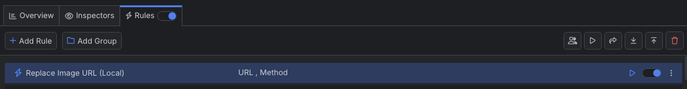

# Modifying API Endpoints

Apart from mapping requests to different host destinations (that return entirely new responses), you can use Fiddler to modify the ongoing traffic by changing API endpoints through their paths, or by changing and substituting parts of the HTTP requests and response headers and bodies.

## Creating a "Modify Image Endpoint" Rule

Create a "Modify Image Endpoint" rule by setting the following actions through the [Rules Builder]().

1. Create a matching condition that uses the "When **all these conditions** are met **any number of times**" pattern. 

1. Match by a **URL** that uses a string value to match the desired URL. For example, match **googlelogo** from the following URL `https://www.google.com/images/branding/googlelogo/1x/googlelogo_light_color_272x92dp.png`.

1. Match by a **Method** equal to **GET**.

1. Create an **Update URL** action and set the desired new target URL. For example:  `https://www.gstatic.com/ac/cb/youtube_logo_v2.svg`.

This sample Fiddler rule maps an HTTP request to return a custom image.

Once the rule is created, enable the **Rules** tab, toggle the rule switch, and start capturing traffic.

Download a ready-to-use <a href="https://github.com/telerik/fiddler-everywhere/tree/master/rules/modify-image-endpoint-local" target="_blank">"Modify Image Endpoint"</a> rule as a FARX file, which you can import through the Rules toolbar.

## See Also

* [Learn more about the Rules functionality in FIddler Everywhere here...]()
* [Learn more about all rules presets in Fiddler Everywhere here...]()
* [Learn more on how to organize your rules here...]()
* [Learn more about the matching conditions here...](#conditions)
* [Learn more about the supported actions here...](#actions)
* [Learn more about final and non-final rules here...](#final-and-non-final-actions)