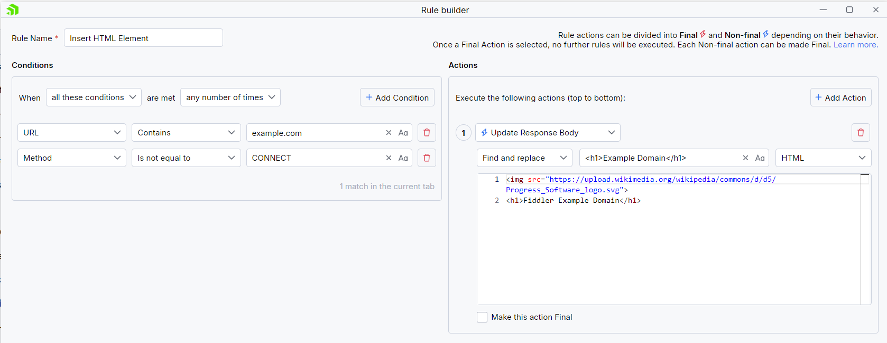
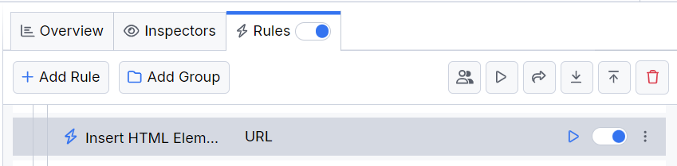
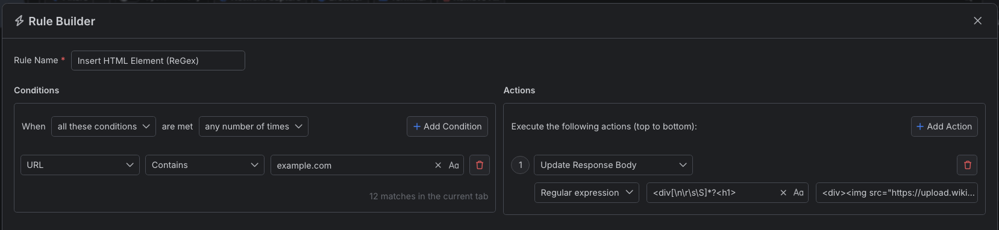
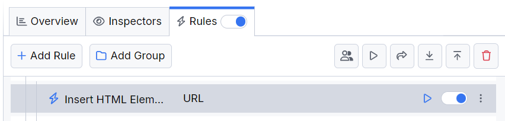

# Modifying Response Bodies

One of the most common testing practices is quickly changing a piece of code or a resource and rebuilding it to visualize the results. This can be time-consuming if the rebuild also involves deploying your application online.

With Fiddler Everywhere, you can quickly modify the content of the received HTTP responses by inserting, substituting, or entirely changing the targeted entries.

## Creating an "Insert HTML" Rule

Create an "Insert HTML" rule by setting the following actions through the [Rules Builder](slug://modify-traffic-get-started).

1. Create a matching condition that uses the "When **all these conditions** are met **any number of times**" pattern. 

1. Match by a **URL** that uses a string value to match the desired URL. For example: **example.com**.

1. Create an **Update Response Body** action and use the **Find and Replace** string modifier.

This sample Fiddler rule finds a selected H1 HTML element and inserts a logo before it.

Once the rule is created, enable the **Rules** tab, toggle the rule switch, and start capturing traffic.

Download a ready-to-use <a href="https://github.com/telerik/fiddler-everywhere/tree/master/rules/modify-insert-html" target="_blank">"Insert HTML"</a> rule as a FARX file, which you can import through the Rules toolbar.

## Creating an "Insert HTML (ReGex)" Rule

Create an "Insert HTML (RegEx)" rule by setting the following actions through the [Rules Builder](slug://modify-traffic-get-started).

1. Create a matching condition that uses the "When **all these conditions** are met **any number of times**" pattern. 

1. Match by a **URL** that uses a string value to match the desired URL. For example: **example.com**.

1. Create an **Update Response Body** action and use the **Regular expession** modifier.

This sample Fiddler rule finds the H1 HTML element using the following regular expression `<div[\n\r\s\S]*?<h1>` and then inserts a logo before it.

Once the rule is created, enable the **Rules** tab, toggle the rule switch, and start capturing traffic.

Download a ready-to-use <a href="https://github.com/telerik/fiddler-everywhere/tree/master/rules/modify-insert-html-regex" target="_blank">"Insert HTML via regex"</a> rule as a FARX file, which you can import through the Rules toolbar.

>tip You can identify different parts of the same response by combining multiple actions in a single rule. Actions are executed from top to bottom with the top actions or rules having the higher priority. Any final action immediately prevents the execution of all other actions and rules that are with lower priority. If there are no final actions, you can execute all actions from top to bottom, which means that you can overwrite the same part of the modification by actions placed lower in the list.
 
## See Also

* [Learn more about the Rules functionality in Fiddler Everywhere here...](slug://modify-traffic-get-started)
* [Learn more about all rules presets in Fiddler Everywhere here...](slug://adv_techniques_fiddler)
* [Learn more on how to organize your rules here...](slug://rulesbuilder-get-started)
* [Learn more about the matching conditions here...](slug://fiddler-rules-actions#conditions)
* [Learn more about the supported actions here...](slug://fiddler-rules-actions#actions)
* [Learn more about final and non-final rules here...](slug://fiddler-rules-actions#final-and-non-final-actions)
* [Learn more about using breakpoints here...](slug://rulesbuilder-breakpoints)