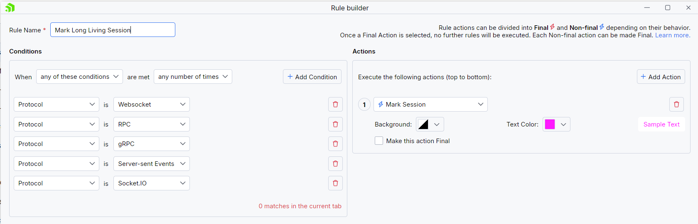
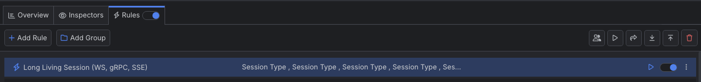

# Marking Long Living Sessions

The Fiddler Everywhere user interface can be dynamically changed based on your preferences. You can highlight matched sessions through the **Mark Sessions** action, which allows you to set the background and the text color.

## Creating a "Mark Long Living Sessions" Rule

Create an "Mark Long Living Sessions" rule by setting the following actions through the [Rules Builder]().

1. Create a matching condition that uses the "When **all these conditions** are met **any number of times**". 

1. Match by a **Session Type** that uses string values that match the desired session's types. For demonstration purposes, we match **WebSocket**, **gRPC**, **RPC**, **Socket.IO**, and **Server-Side Events** sessions.

1. Create a **Mark Session** action and set the preferred background and foreground (text) colors.

Once the rule is created, enable the **Rules** tab, toggle the rule switch, and start capturing traffic.

>tip You can create the rule and then use the **Play** button to immediately apply the new UI effect to all captured sessions in the Live Traffic grid.

Download a ready-to-use <a href="https://github.com/telerik/fiddler-everywhere/tree/master/rules/mark-long-living-sessions" target="_blank">"Mark Long Living Sessions"</a> rule as a FARX file, which you can import through the Rules toolbar.

 
## See Also

* [Learn more about the Rules functionality in FIddler Everywhere here...]()
* [Learn more about all rules presets in Fiddler Everywhere here...]()
* [Learn more on how to organize your rules here...]()
* [Learn more about the matching conditions here...](#conditions)
* [Learn more about the supported actions here...](#actions)
* [Learn more about final and non-final rules here...](#final-and-non-final-actions)