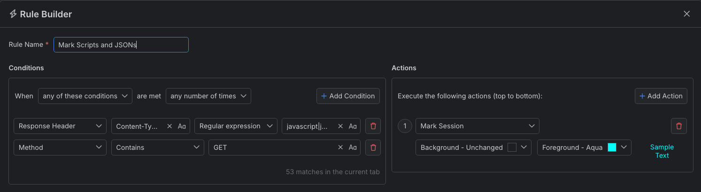
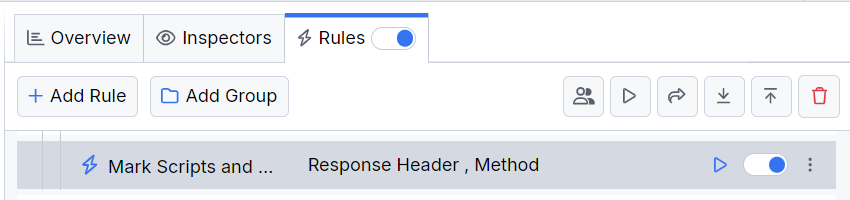

# Marking Scripts and JSON Files

You can dynamically change the Fiddler Everywhere user interface based on your preferences. You can highlight matched sessions through the **Mark Sessions** action and set their the background and text color. For example, you can highlight all sessions that are returning JavaScript or JSON files.

## Creating a "Mark Scripts and JSONs" Rule

Create a "Mark Scripts and JSONs" rule by setting the following actions through the [Rules Builder]().

1. Create a matching condition that uses the "When **all these conditions** are met **any number of times**" pattern. 

1. Match by a **Response Header** where the header **Content-Type** matches the regular expression: **javascript|json**.

1. Match by **Method** of type **GET**.

1. Create a **Mark Session** action and set the preferred background and foreground (text) colors.

This sample Fiddler rule highlights all sessions where the **Content-Type** header matches the specified values.

Once the rule is created, enable the **Rules** tab, toggle the rule switch, and start capturing traffic.

>tip You can create the rule and then use the **Play** button to immediately apply the new UI effect to all captured sessions in the **Live Traffic** grid.

Download a ready-to-use <a href="https://github.com/telerik/fiddler-everywhere/tree/master/rules/mark-scripts-and-jsons" target="_blank">"Mark Scripts and JSONs"</a> rule as a FARX file, which you can import through the Rules toolbar.

## See Also

* [Learn more about the Rules functionality in Fiddler Everywhere here...]()
* [Learn more about all rules presets in Fiddler Everywhere here...]()
* [Learn more on how to organize your rules here...]()
* [Learn more about the matching conditions here...](#conditions)
* [Learn more about the supported actions here...](#actions)
* [Learn more about final and non-final rules here...](#final-and-non-final-actions)
