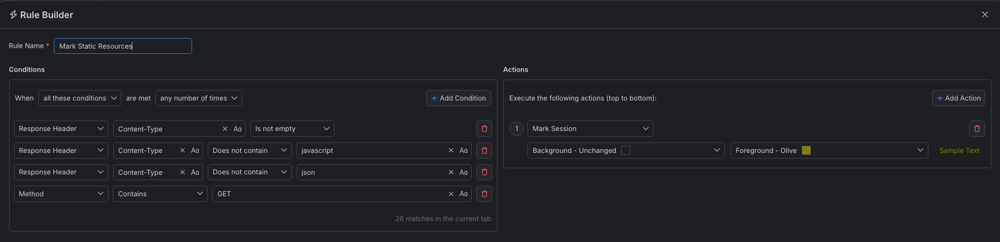
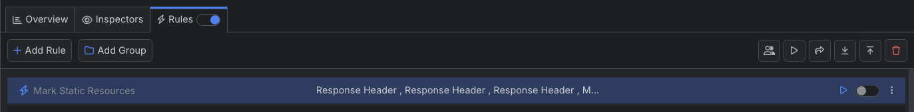

# Marking Static Resources

The Fiddler Everywhere user interface can be dynamically changed based on your preferences. You can highlight matched sessions through the **Mark Sessions** action, which allows you to set the background and the text color. This article will showcase how to highlight all sessions that are returing static resources like images, text files.

## Creating a "Mark Scripts and JSONs" Rule

Create an "Mark Scripts and JSONs" rule by setting the following actions through the [Rules Builder]().

- Create a matching condition that uses the "When **all these conditions** are met **any number of times**". 

- Match by a **Response Header**  where the header **Content-Type** is not empty (matches any sessions where the header is present and has any value).

- Match by a **Response Header**  where the value of the header **Content-Type** does not equals **javascript** (excluding dynamic content).

- Match by a **Response Header**  where the value of the header **Content-Type** does not equals **json** (excluding dynamic content).

- Match by **Method**  of type **GET**.

- Create a **Mark Session** action and set the preferred background and foreground (text) colors.

Once the rule is created, enable the **Rules** tab, toggle the rule switch, and start capturing traffic.

>tip You can create the rule and then use the **Play** button to immediately apply the new UI effect to all captured sessions in the Live Traffic grid.

Download a ready-to-use <a href="https://github.com/telerik/fiddler-everywhere/tree/master/rules/mark-static-objects" target="_blank">"Mark Static Resources"</a> rule as a FARX file, which you can import through the Rules toolbar.
 
