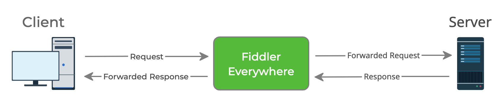
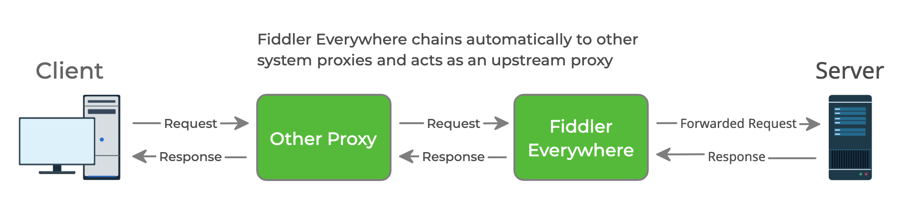
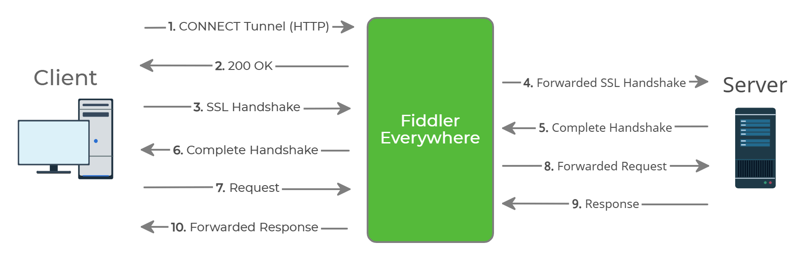

# Fiddler Everywhere Security

The Fiddler Everywhere application acts as a MITM (man-in-the-middle, meddler-in-the-middle) proxy that uses a unique certificate per machine. It will capture all incoming and ongoing internet activities of the application by using system HTTP/HTTPS proxies.

This article highlights the primary security concerns and provides technical information about how Fiddler Everywhere acts as a MITM and what you need to consider when handling the Fiddler root trust certificate and captured data.

## How Fiddler Everywhere Works

Fiddler Everywhere is an HTTP/HTTPS proxy that runs on your Windows, Linux, or macOS operating systems. It stands between your client application (for example, a browser or other application that sends HTTP/HTTPS requests) and the server (that receives the HTTP/HTTPS requests). The HTTP/HTTPS responses are returned to the Fiddler Everywhere proxy, passing the traffic back to the client application.

This type of proxy configuration is a MITM proxy. It uses the MITM-attack approach to intercept communication between the client and the server.

### Fiddler as an HTTP Proxy

By default, Fiddler Everywhere captures only non-secure HTTP traffic. The proxy may process this web traffic before forwarding it upstream through the [**Rules** tab]().

As an HTTP proxy, Fiddler Everywhere acts in the following way:

1. The client application (for example, browser, mobile application, or any other application that uses the system proxy and makes HTTP requests) connects to the Fiddler Everywhere proxy and makes a request.

1. The Fiddler Everywhere proxy forwards the request to the upstream server. Any active Fiddler Everywhere rules (modifying the requests) are applied here.

1. The server sends the response to the Fiddler Everywhere proxy.

1. The Fiddler Everywhere proxy forwards the response to the client application. Any active Fiddler Everywhere rules (modifying the responses) are applied here.



### Fiddler as a Chained Proxy

By default, Fiddler Everywhere will automatically chain to other system proxies that are preset on the host machine.



### Fiddler as an HTTPS Proxy

All modern applications use additional security layers like [TLS](https://en.wikipedia.org/wiki/Transport_Layer_Security) to protect user data and prevent third parties from capturing the traffic.

To capture secure traffic over HTTPS with Fiddler Everywhere, you need to explicitly elevate the trust by [installing and enabling the Fiddler root trust certificate](). By adding the Fiddler Everywhere certificate in the Trusted Certificate Authority manager of the used operating system, you allow the man-in-the-middle approach to intercept the encoded TLS data. This practically means that the Fiddler Everywhere application can now decode the otherwise encoded HTTPS traffic.

The following image demonstrates how Fiddler Everywhere acts as if it is the client when speaking to the server, and the other way around&mdash;it works as if it is the server when communicating with the client applications.



## Security Highlights

While using Fiddler Everywhere, consider the following security indicators and highlights:

- With the initial state for [the system capturing option](#system-capturing), Fiddler Everywhere will capture only non-secure HTTP traffic. This traffic is not encrypted and can expose sensitive information like visited URLs, internal API endpoints, and so on.

- With the initial state for [the preconfigured browser capturing option](#browser-capturing), Fiddler Everywhere will capture both non-secure HTTP and secure HTTPS traffic. The Fiddler Everywhere application will encrypt the HTTPS traffic.

- Fiddler Everywhere generates a unique root certificate. Avoid sharing this certificate with anyone as it might pose a significant security threat (for example, anyone with access to that certificate can decode your secure traffic).

- When HTTPS capturing is enabled, the captured data will contain readable information that is usually encrypted. Share that data with trusted parties only and carefully consider what the requests and responses include.

- All users who have access to the Fiddler Everywhere application or saved sessions can also access the captured data.

- Consider using password protection to prevent unauthorized access to saved sessions stored locally or in the cloud. All saved sessions are held as SAZ files, and using the password protection option adds a 256-bit AES encryption. Unprotected saves can be opened with anyone with access to the SAZ file.

- Fiddler Everywhere will not store your data in the cloud if you do not use sharing or cloud capabilities. Everything is stored locally once you sign in (where your credentials are verified in the cloud). The only way to get something in the cloud is to explicitly upload saved **Sessions** collections, **Requests** collections, or **rules**, or share them with collaborators.

- Sessions uploaded to the Fiddler cloud space are encrypted when password-protection is enabled. Unencrypted sessions are stored in the cloud as Fiddler archive clouds.

## Application Analytics

By default, the Fiddler Everywhere application comes with an integrated Analytics solution that collects application usage data to improve product stability, UI, and UX. The collected information is stored on an external server, and it does not contain any data related to the captured traffic and the data that the sessions include. You can opt-out from the analytics data collection by navigating to **Settings** > **Privacy** > **Automatically send data to help us improve the product**.

## Using Captured Traffic Securely

Fiddler Everywhere provides options for securely saving and sharing captured traffic.

### Saving Traffic

Once Fiddler Everywhere captures the traffic, you have the option to [save the sessions for later usage](#saving). Consider the following security highlights before saving sessions.

- All saved sessions are stored locally on the Fiddler Everywhere host machine as SAZ files (Fiddler Sessions Archive ZIP). The absolute path is different and depends on the used OS and the unique ID of the currently logged user:

    * Windows path
        ```curl
        C:\Users\<currently-logged-user>\.fiddler\<unique-fiddler-user-GUID>\Snapshots
        ```

    * macOS path

        ```curl
        ~\.fiddler\<unique-fiddler-user-GUID>\Snapshots
        ```

    * Linux path

        ```curl
        ~\.fiddler\<unique-fiddler-user-GUID>\Snapshots
        ```

- The `fiddler` folder will continue to exist even when the Fiddler Everywhere application is uninstalled. Any previously saved sessions will be available on the host machine until they are explicitly removed. Explicitly removing the `.fiddler` folder removes all previously saved sessions (the SAZ files in the Snapshots `GUID` folders) permanently. Consider keeping them in the Fiddler cloud as a backup option before clearing the folder.

- Other users can open any unprotected SAZ file at any time by getting access to the SAZ file. Consider using password protection for your captured traffic to add 256-bit AES encryption to the saved SAZ files and prevent unauthorized access to sensitive data.

  Fiddler Everywhere provides the following options to add password protection for your sessions:

    * [Setting a password when saving the session](#saving)

    * [Setting a password for already saved sessions](#encrypting)

  Sessions saved in the cloud will continue to exist locally through the `.fiddler` folder until they are explicitly removed. Removing the SAZ files from the `./fiddler` folder will remove their presence in the Fiddler Everywhere UI.

- The only way to recover a deleted session from the **Sessions** list or a deleted SAZ file from the `.fiddler` folder is to download their cloud copy. Consider using the saving option of the Fiddler Everywhere cloud as a backup option.

- Sessions are stored in Fiddler Everywhere cloud space as SAZ files. Consider protecting your sensitive data by adding password protection for all cloud saves, which effectively adds a 256-bit AES encryption.

### Sharing Traffic

Fiddler Everywhere comes with [collaboration in mind]() and provides sharing functionalities. Consider the following security highlights when sharing sessions:

- Before sharing, a session is saved. Therefore, you should consider the [saving-related security highlights](#saving-traffic).

- Sharing an unprotected session might expose your sensitive data to unauthorized third parties. Always consider adding a password-protection to your sessions before sharing them.


## Additional Resources

- [Fiddler Everywhere Official Product Page](https://www.telerik.com/fiddler/fiddler-everywhere)
- [Fiddler Everywhere End User License Agreement](https://www.telerik.com/purchase/license-agreement/fiddler-everywhere)
- [Fiddler Everywhere Official Download Llink](https://www.telerik.com/download/fiddler-everywhere)

