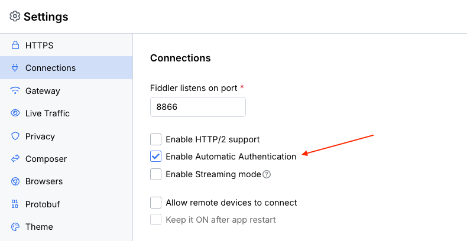

# Configuring Fiddler alongside Proxy with Authentication

The Fiddler Everywhere application supports upstream proxies that require authentication through Kerberos, Negotiate, and NTLM protocols. For Fiddler to obtain the proxy credentials as stored in the operating system credential management tool, do the following:

- Start the Fiddler Everywhere application.

- Open the [**Settings > Connections**]() window.

- Check the **Enable Automatic Authentication** option.

    