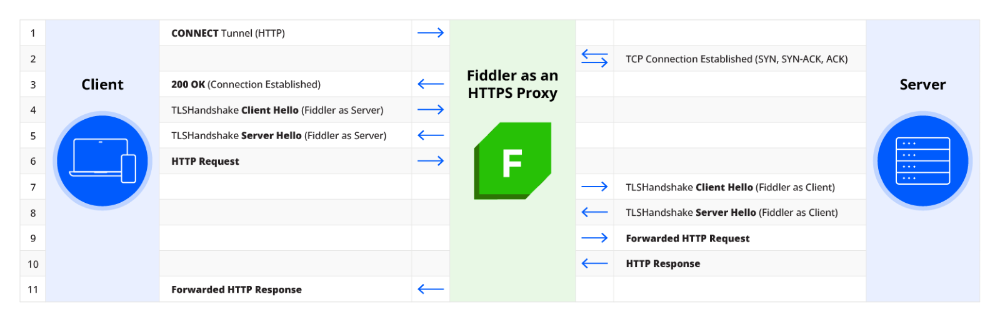

# Fiddler Everywhere Fundamentals

The Fiddler Everywhere application acts as an intermediate (also referred to as MITM or man-in-the-middle) forward proxy that uses a unique CA (certificate authority) per machine. It will capture the application's incoming and ongoing internet activities using HTTP(S) proxies. As a proxy, Fiddler stands between your client application (for example, a browser or other application that sends HTTP/HTTPS requests) and the server (that receives the HTTP/HTTPS requests). The HTTP/HTTPS responses are returned to the Fiddler Everywhere proxy, passing the traffic back to the client application.

## Fiddler as an HTTP Proxy

By default, Fiddler Everywhere captures only non-secure HTTP traffic. As an HTTP proxy, Fiddler Everywhere acts in the following way:

1. The client application (for example, browser, mobile application, or any other application that uses the system proxy and makes HTTP requests) connects to the Fiddler Everywhere proxy and makes a request.
1. The Fiddler Everywhere proxy forwards the request to the upstream server. Any active Fiddler Everywhere rules (modifying the requests) are applied here.
1. The server sends the response to the Fiddler Everywhere proxy.
1. The Fiddler Everywhere proxy forwards the response to the client application. Any active Fiddler Everywhere rules (modifying the responses) are applied here.

## Fiddler as a Chained Proxy

By default, Fiddler Everywhere will automatically chain to other system proxies preset on the host machine.

## Fiddler as an HTTPS Proxy

All modern applications use additional security layers like [TLS](https://en.wikipedia.org/wiki/Transport_Layer_Security) to protect user data and prevent third parties from capturing the traffic.

To capture secure traffic over HTTPS with Fiddler Everywhere, you need to explicitly elevate the trust by [installing and enabling the Fiddler root trust certificate](slug://trust-certificate). Adding the Fiddler Everywhere CA in the Trusted Certificate Authority manager of the used operating system allows the man-in-the-middle approach to intercept the encoded TLS data. The Fiddler Everywhere application can now decode the otherwise encoded HTTPS traffic.

The following image demonstrates how Fiddler Everywhere acts as if the client is speaking to the server, and the other way around&mdash;it works as if the server is communicating with the client applications.

## Additional Resources

- [Fiddler Everywhere Official Product Page](https://www.telerik.com/fiddler/fiddler-everywhere)
- [Fiddler Everywhere End User License Agreement](https://www.telerik.com/purchase/license-agreement/fiddler-everywhere)
- [Fiddler Everywhere Official Download Link](https://www.telerik.com/download/fiddler-everywhere)

