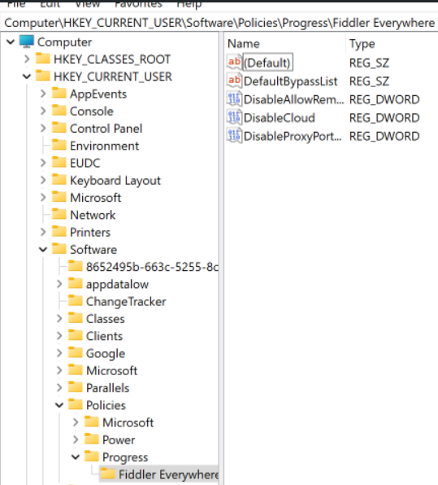

# Restricting Fiddler

Users of Fiddler Everywhere often work in a secure corporate environment where specific policies are imposed. That means that administrators need to have options to limit or hardcode particular features of the Fiddler Everywhere application. With the Fiddler Everywhere Enterprise tier, administrators can control a set of functionalities through policy management systems on macOS and Windows.

## Restricting Features on macOS


Users on macOS with administrative privileges set policies through the [**defaults**](https://macos-defaults.com/) command and by using the `com.progress-telerik.fiddler` domain alongside the following policies:

| Policy          | Description | Value Type |  Value to apply the policy
|:-----------------|:----------------|:----------------|:-----------------
| **DisableCloud**   | Disables sharing options  | integer  | 1
| **DefaultProxyPort**   | Sets default proxy port  | integer  | A number between 0 and 95535
| **DisableProxyPortChange**   | Disables the change of port  | integer  | 1
| **DefaultBypassList**   | Sets default bypass list  | string  | Add URLs with “;” in between
| **DisableBypassListChange**   | Disables the change of the bypass list | integer  | 1
| **DisableAllowRemoteDevicesToConnect**   | Disables option to connect to remote devices | integer  | 1
| **DisableAnalytics**   | Disables Fiddler's analytics  | integer  | 1

Setting a policy through the **defaults** command
```sh
defaults write com.progress-telerik.fiddler DisableAllowRemoteDevicesToConnect 1
```

For the `DefaultProxyPort` policy, set the value to be integer as follows:
```sh
defaults write com.progress-telerik.fiddler DefaultProxyPort -integer 8899
```

Reading the set policies for the Fiddler Everywhere application
```sh
defaults read com.progress-telerik.fiddler
```

Deleting set policies for the Fiddler Everywhere application
```sh
defaults delete com.progress-telerik.fiddler
```

## Restricting Features on Windows

Users on Windows with administrative privileges set policies through the Windows registry editor by setting the following policies:

| Policy          | Description | Regedit Value Type |  Value to apply the policy
|:-----------------|:----------------|:----------------|:-----------------
| **DisableCloud**   | Disables sharing options  | DWORD-32 (hexadecimal)  | 1
| **DefaultProxyPort**   | Sets default proxy port  | DWORD-32 (decimal)  | A number between 0 and 95535
| **DisableProxyPortChange**   | Disables the change of port  | DWORD-32 (hexadecimal)  | 1
| **DefaultBypassList**   | Sets default bypass list  | String Value  | Add URLs with “;” in between
| **DisableBypassListChange**   | Disables the change of the bypass list | DWORD-32 (hexadecimal)  | 1
| **DisableAllowRemoteDevicesToConnect**   | Disables option to connect to remote devices | DWORD-32 (hexadecimal)  | 1
| **DisableAnalytics**   | Disables Fiddler's analytics  | DWORD-32 (hexadecimal)  | 1

Set the above policies as follows:

1. Open the Windows Registry Editor.

1. Navigate to **HKEY_CURRENT_USER\SOFTWARE\Policies**

1. Create keys **Progress\Fiddler Everywhere**

 

1. Set the targeted policy by clicking on **Fiddler Everywhere > New> DWORD 32-bit**, and for the name type policy you want to set. Note that **DefaultBypassList** uses String Value and not DWORD-32.

1. Double-click on the policy name and set the value to **1**. Use hexadecimal values for all integer-type policies, excluding the **DefaultProxyPort**` which uses decimal values.

If you need to turn off a policy, you delete the created DWORD-32 key.