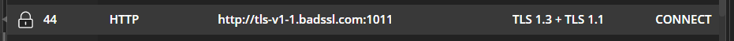
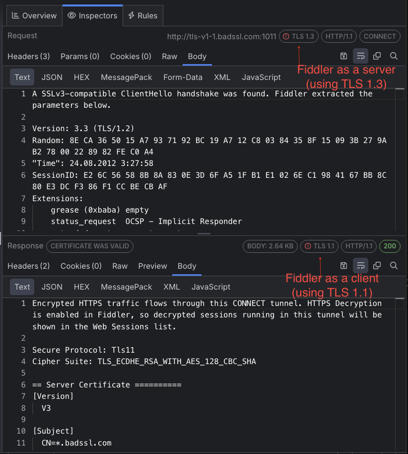

# TLS Version Specifics

Fiddler Everywhere acts as an intermediate - it will act as a server for the client (that sends the HTTPS request) and as a client to the server (that receives the HTTPS request and returns the HTTPS response). It is important to note that Fiddler will negotiate the TLS connections with the client and the server separately. When Fiddler Everywhere establishes the HTTPS connection, it will select the client's preferred TLS version. Then Fiddler will send the list of the supported TLS versions to the server. If the server supports the client's TLS version, it will select it for the connection. However, if the server negotiates a lower TLS version, Fiddler will successfully establish the connection (with the server) while using a lower TLS version.

The above behavior has a significant consequence that could "fix" your application, which might otherwise appear broken. For example:

- Suppose your client application only supports modern-day protocol versions like TLS 1.3. Upon executing an HTTPS request to a server that does not support TLS 1.3 (but supports an older TLS version like [https://tls-v1-1.badssl.com:1011](https://tls-v1-1.badssl.com:1011/)), the request will typically fail with a failed handshake and error message like **ERR_SSL_VERSION_OR_CIPHER_MISMATCH**. This is expected and informs you that the server does not understand how to complete the TLS handshake due to the SSL/TLS version or cipher mismatch.

- Now, let's assume that you retry the very same request ([https://tls-v1-1.badssl.com:1011](https://tls-v1-1.badssl.com:1011/)) but while the Fiddler Everywhere proxy acts as an intermediate. As a result, the HTTPS handshake will be successful, and Fiddler will show the HTTPS response successfully. What is happening is that Fiddler acts as a server for the client app and completes a TLS 1.3 handshake. Then it acts as a client (for the BadsSSL server) and sends a list of all supported TLS versions. The server responds with a TLS 1.1 handshake which Fiddler establishes successfully.

As a result, a connection that will usually fail due to an unsupported version of TLS will flawlessly work when Fiddler stands in the middle as a forward proxy. Because the behavior differs from the real-life result, Fiddler will notify you in similar cases through the **TLS Version** column and the TLS chips in the HTTP Request and Response inspectors.

>tip TLS is the cryptographic protocol that provides end-to-end security in HTTPS. It evolved from SSL 3.0, and currently, [TLS 1.2](https://www.ietf.org/rfc/rfc5246.txt) and [TLS 1.3](https://www.rfc-editor.org/rfc/rfc8446) are the most commonly used TLS versions. In contrast, versions like SSL 2.0, SSL 3.0, TLS 1.0, and TLS 1.1 are considered insecure and might be disabled on an operating system or application (e.g., browser) level. Fiddler Everywhere supports [all listed versions](#tls-version), including TLS 1.3, introduced with version 4.2.0.