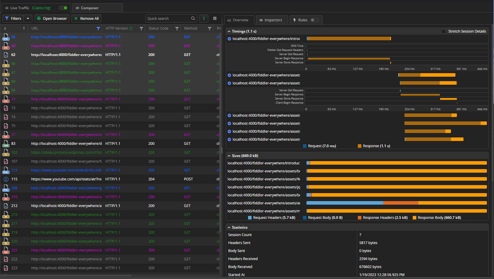

# Inspecting Traffic

When the traffic is already captured, you can start analyzing the data.

To extract information about the captured sessions, go to the [**Live Traffic**]() tab, where each request/response entry (session) is listed in a row with multiple columns fields in the **Sessions** list. There you can extract valuable data such as the returned status code, the host and the URL, the type of the used protocol (HTTP or HTTPS), the body sizer in bytes, and the HTTP method (GET or POST), and more. The output traffic can be [filtered](), [exported](#exporting), [commented on](#commenting), and [shared]() for further and detailed inspection.

To open the structured information about the session timings, sizes, requests, and response details in the [**Overview** tab](), single-click a session or select multiple sessions.

To load [the request and response inspectors](), double-click a session. The [**Inspectors** tab]() is a powerful tool that allows you to deep-dive in each session so you and your teammates can debug it or find performance bottlenecks.

The following rules are applied when you are selecting and changing sessions and using the **Inspectors** tab:

- Double-click a session to activate the default Inspectors for a selected session. Fiddler Everywhere will automatically decide which inspector is best suited to display the request and response of the chosen session when the inspectors are activated.

- Single-click a session to activate the last shown Inspectors. This is useful when you want to inspect specific inspectors for many sessions, and you don't need Fiddler Everywhere to load the best inspector based on the requests or response data.

To save a selected session or multiple selected sessions, use the [context menu](#save) or use a keyboard shortcut. Saved sessions are available in the [**Sessions list**]() from which they can be reloaded or shared with collaborators.

The inspection of sessions often happens with teammates or external collaborators. Share a selected session or multiple selected sessions directly from the [__Live Traffic__ list](#share) or by using the [__Sessions__ list]().

## Additional Resources

- [Modifying Traffic]()
- [Capturing and Inspecting iOS Traffic]()
- [Capturing and Inspecting Android Traffic]()
- [Filtering Traffic]()
- [Live Traffic Section in details]()
- [Inspecting Server Certificates]()
- [Inspector's UI in details]()
- [Live Traffic Columns in details]()