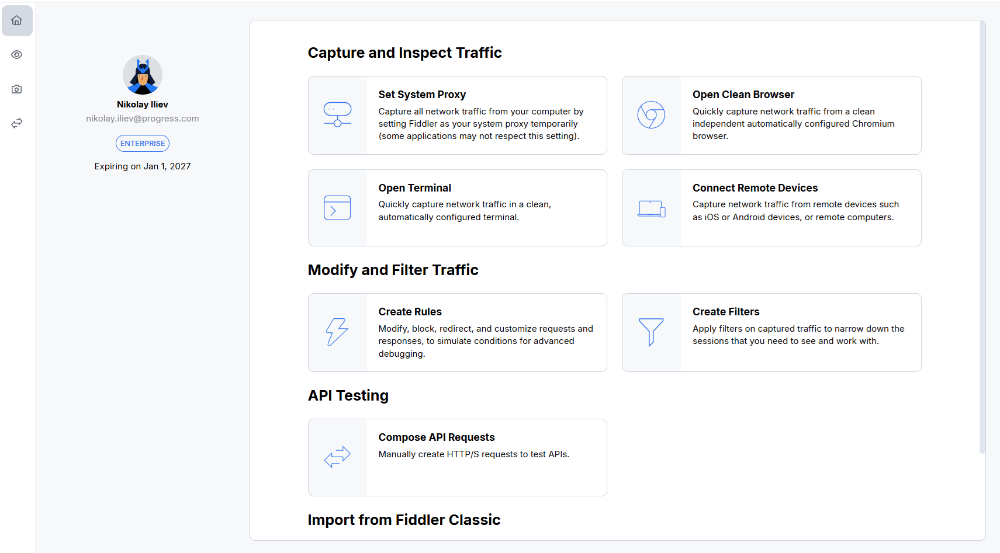
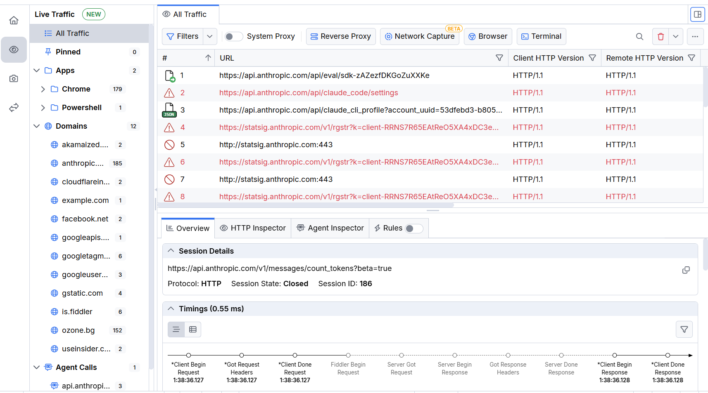
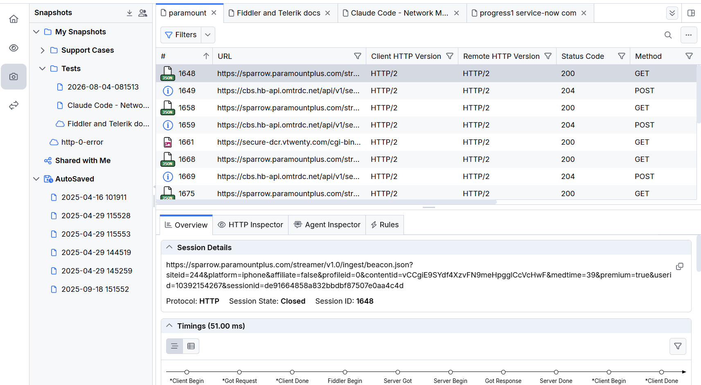
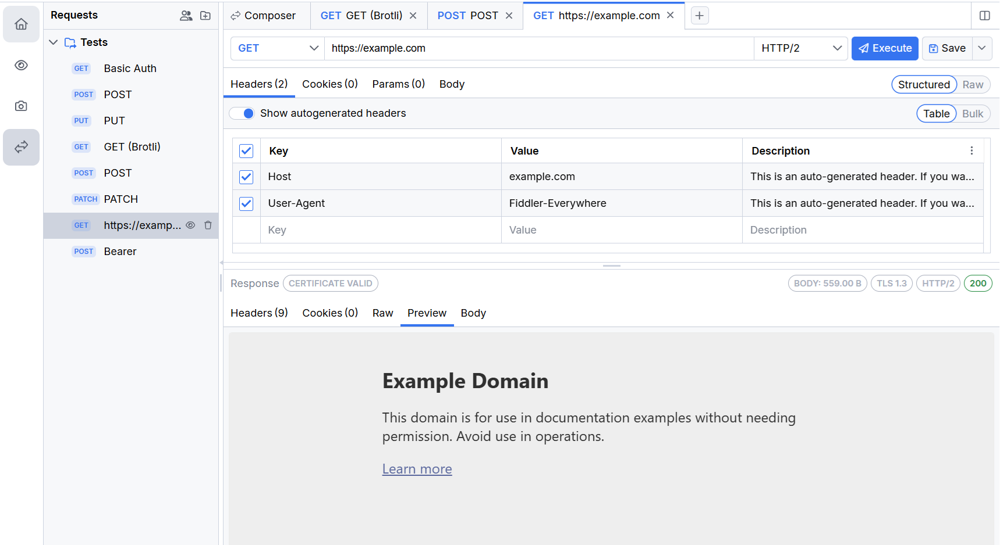

# Application Panes

Fiddler Everywhere organizes its functionality into four main panes. You switch between them using the navigation rail on the left edge of the application window. Each pane is dedicated to a distinct stage of the web-debugging workflow.

The four panes are:

- [**Home**](#home-pane)&mdash;A launchpad with quick actions for capturing, modifying, and composing traffic.
- [**Traffic**](#traffic-pane)&mdash;The main workspace for capturing, grouping, and inspecting live sessions.
- [**Snapshots**](#snapshots-pane)&mdash;A dedicated pane for saved, organized, and shared traffic snapshots.
- [**Composer**](#composer-pane)&mdash;A workspace for manually creating and sending API requests.

>tip The **Traffic**, **Snapshots**, and **Composer** panes open and close independently, so you can keep your work in one pane while switching to another without losing context.

## Home Pane

The **Home** pane is the entry point of Fiddler Everywhere. It surfaces the most common actions as quick-access cards grouped by workflow—**Capture and Inspect Traffic**, **Modify and Filter Traffic**, **API Testing**, and **Import from Fiddler Classic**.

From the **Home** pane you can, for example, set the system proxy, open a clean browser or terminal, connect remote devices, create rules and filters, compose API requests, or import your settings from Fiddler Classic.

The pane also displays your account information, license type, and license expiration date.

## Traffic Pane

The **Traffic** pane is the core workspace of Fiddler Everywhere. It captures HTTP(S), WebSocket, Server-Sent Events, gRPC, and Socket.IO traffic and visualizes each captured session in the **Live Traffic** grid.

A key part of the **Traffic** pane is the [**grouped traffic panel**](slug://web-sessions-list#grouped-traffic-panel) on the left-hand side, which automatically organizes captured sessions into sections such as **All Traffic**, **Pinned**, **Apps**, **Domains**, **Agent Calls**, and **Bypassed**. Selecting a section filters the **Live Traffic** grid to the corresponding sessions.

[Learn more about working with the Traffic pane and the Live Traffic grid...](slug://web-sessions-list)

## Snapshots Pane

The **Snapshots** pane is a standalone pane for storing, organizing, and sharing snapshots of previously captured traffic. It opens and closes independently of the **Traffic** pane, similar to how the **Composer** pane works.

The pane contains the **Snapshots** tree, where saved snapshots are organized into collections (for example, **My Snapshots**, **Shared with Me**, and **AutoSaved**). From the pane you can save, open, encrypt, export, import, and share snapshots.

 

[Learn more about organizing traffic in the Snapshots pane...](slug://fe-organize-sessions)

## Composer Pane

The **Composer** pane lets you manually create, send, save, and share HTTP/S requests to test REST and SOAP APIs. You can define the method, URL, HTTP version, headers, cookies, parameters, and body of a request, execute it, and inspect the response.

Saved requests are organized in the **Requests** collection on the left side of the pane.

[Learn more about composing API requests...](slug://composer-get-started)

## See Also

- [Live Traffic Grid](slug://web-sessions-list)
- [Organizing Traffic](slug://fe-organize-sessions)
- [Compose API Requests](slug://composer-get-started)
- [Application Menu](slug://app-menu-section)
