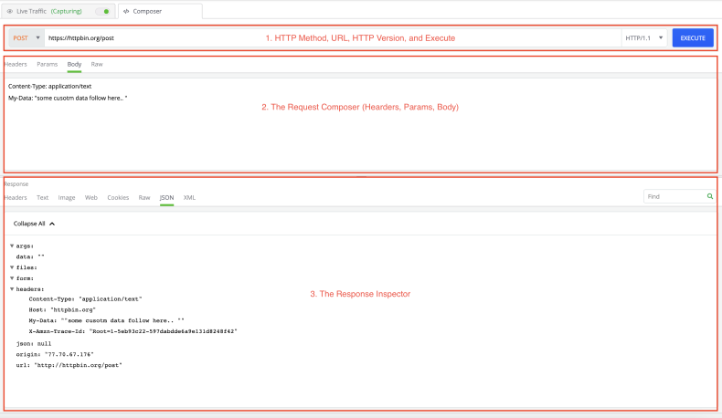
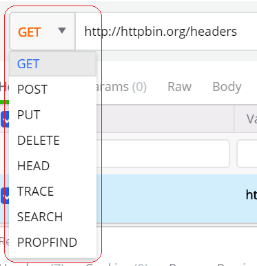
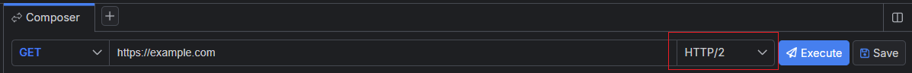
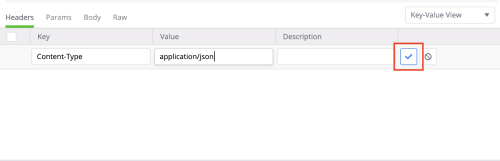
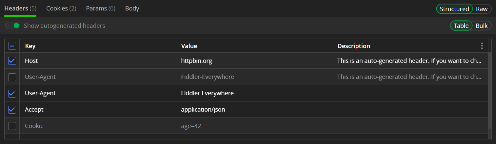
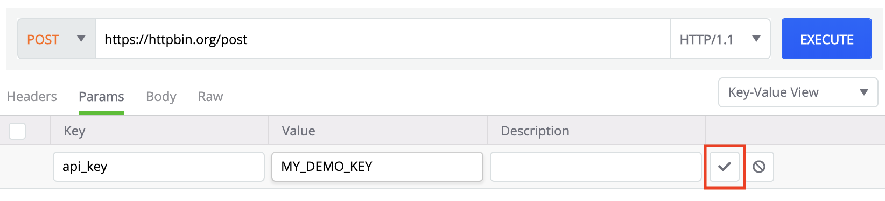
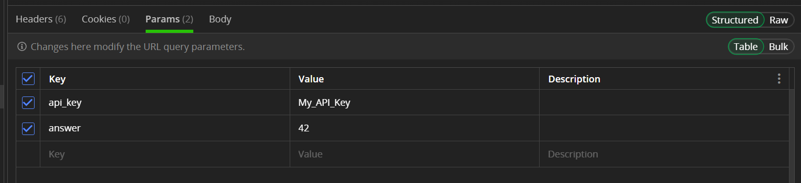
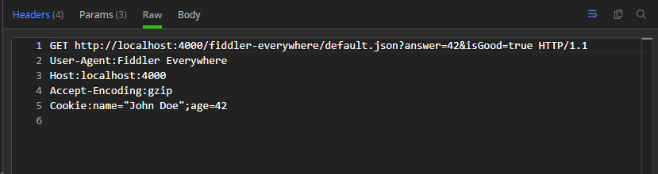
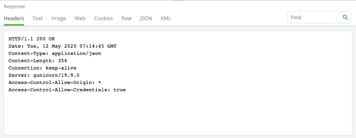

## Composer

The __Composer__ tab enables you to manually build and send HTTP, HTTPS, and FTP requests.

## Get Started

The __Composer__ contains three major sections used to construct a request and observe the response.

The top section contains a drop-down for selecting __HTTP Methods__, an __URL field__, a drop-down to select the used __HTTP version__, and an __Execute__ button.

The mid-section is  a __request composer__ that provides options to further modify your request via __Headers__, __Body__, __Params__, or __Raw__ views.

The bottom section is a __response inspector__, which shows the response from the executed request.

>important Fiddler's Composer is adding by default its own `User-Agent` so that it sends HTTPS request correctly. You could remove the default `User-Agent` header but notice that this could break composing a secure request (HTTPS). The default key-value

## HTTP Methods

The __Composer__ supports creating a request while using one of the following HTTP methods:

- __GET__ - Requests a representation of the specified resource. Requests using GET should only retrieve data.
- __PUT__ - replaces all current representations of the target resource with the request payload.
- __POST__ - Used to submit an entity to the specified resource, often causing a change in state or side effects on the server.
- __DELETE__ - Deletes the specified resource.
- _HEAD_ _ - Asks for a response identical to that of a GET request, but without the response body.
- __TRACE__ - Performs a message loop-back test along the path to the target resource.
- __SEARCH__ - Used by a client to ask the server to perform a query operation (described by the request payload) over some set of data scoped to the effective request URI.
- __PROPFIND__ - Retrieves properties defined on the resource identified by the Request-URI.

## URL Field

The  __URL field__ is the place to endpoint URL for the composed request.

## HTTP Version selection

From the __HTTP Version__ drop-down, you can select the following HTTP versions:
- __HTTP 2.0__
- __HTTP 1.2__
- __HTTP 1.1__
- __HTTP 1.0__
- __HTTP 0.9__

## Request Composer

The __Request Composer__ is allowing you to further modify your request by adding your custom __Headers__, __Params__, __Body__, and observing the composed request via the __Raw__ view.

#### Headers

Enables you to add/modify your request headers (e.g., `Content-Type`, `Authorization`, etc.). 

Add a new header by entering the header key-value pair and then clicking the tick.

Adds the new header to your request. The header can now be disabled/enabled or completely deleted.

>important Most of the servers using newer versions of TLS will require a **User-Agent** header to be set. By default, Fiddler Everywhere will a **User-Agent** key set with value **Fiddler Everywhere** and description **_Lets servers and network peers identify the application, operating system, vendor, and version of the requesting user agent_**. The header is non-mandatory, but keep in mind that without valid **User-Agent**, some requests to secure servers might fail.

#### Params

Enables you to add query parameters to your request URL easily. Adds any key-value pair appended through the  __Params__ view to the request URL.

Add new query params by entering the params key-value pair and then clicking the tick.
 

Add the new query params to your request URL. The params can be disabled/enabled or completely deleted.
 

#### Body

Enables you to manually specify the data that should be sent with the request.

#### Raw

The view is a raw representation of the composed request. This view is non-editable.

## Response Inspector

With the __Response Inspector__, you can inspect the received response (from the executed request). The inspector provides several views to visualize different parts of the request in specific formats. Find detailed information on each inspector type in the dedicated article about [__Inspector Types__]()

