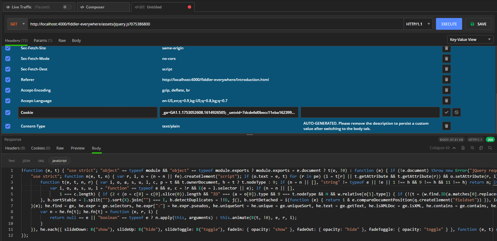

# Composer Tab

The __Composer__ tab enables you to manually create a new HTTP or HTTPS request from scratch and edit an existing captured request as well as send and test them.

To get started, open the **Composer** tab next to the [**Live Traffic**]() tab. Alternatively, you can open a new **Composer** tab by clicking the **New Request** (**+**) button in the [**Requests**]() tab.

The **Composer** tab houses the **Request Composer** and the **Request Inspector**, and contains major sections to construct a request, to observe the response, and to save, replay and share previously composed requests.

The top section contains a drop-down list with the following functionalities:
  * [__HTTP Methods__](#http-methods) enable you to specify the request method&mdas;for example, GET, POST, and so on.
  * The [__URL field__](#url-field) enables you to enter the endpoint URL.
  * The [__HTTP version__](#http-version-selection) is a drop-down where you can select the used HTTP version. By default, the version is **HTTP 1.1**.
  * The [__Execute__](#execute-button) button is an action button for executing the composed request.
  * The [__Save__](#save-button) button enables you to save your composed request in the [**Requests**]() list.

The mid-section provides options to further modify your request through the following options:
  - The [__Headers__](#headers) section allows you to add and modify the HTTP headers of the request.
  - The [__Params__](#params) section allows you to add and modify the request parameters.
  - The [__Raw__](#raw) section is a read-only representation of the composed request.
  - The [__Body__](#body) section allows you to modify the request body and supports various formats such as JSON, form-data, XML, text, and more.

The bottom section is a [__response inspector__](#response-inspector), which shows the response from the executed request.

In the **Requests** list to the left you can save the composed request for later usage. From the **Requests** list, you can share the entry of saved requests with collaborators.

By default, the **Composer** adds the `User-Agent` header so that the HTTPS request is sent correctly. You can remove the default `User-Agent` header but note that this may break the composition of a secure (HTTPS) request.

## HTTP Methods

The __Composer__ supports the creation of a request with the following HTTP methods:

- __GET__&mdash;Requests a representation of the specified resource. Requests using GET have to retrieve data only.
- __PUT__&mdash;Replaces all current representations of the target resource with the request payload.
- __POST__&mdash;Submits an entity to the specified resource, often causing a change in the state or side effects on the server.
- __DELETE__&mdash;Deletes the specified resource.
- __HEAD__&mdash;Asks for a response identical to a __GET__ request, but without the response body.
- __TRACE__&mdash;Performs a message loop-back test along the path to the target resource.
- __SEARCH__&mdash;Used by a client to ask the server to perform a query operation, described by the request payload, over a set of data scoped to the effective request Uniform Resource Identifier (URI).
- __PROPFIND__&mdash;Retrieves properties defined on the resource and identified by the Request-URI.
- __PATCH__&mdash;Applies partial modifications to a resource.
- __MKCOL__&mdash;You can include the method in the scope of a transaction by submitting a **Transaction Header** with a lock token that corresponds to that transaction.
- __MOVE__&mdash;Used to move a resource to the location that is specified by a request URI.
- __LOCK__&mdash;Used to take out a lock of any access type on a resource so that another principal will not modify the resource while it is being edited.
- __UNLOCK__&mdash;Used to remove the lock on the resource at the request URI.
- __OPTIONS__&mdash;Used to describe the communication options for the target resource.

## URL Field

The  __URL field__ is the place where you enter an endpoint URL for the composed request.

## HTTP Version

The __HTTP Version__ drop-down list renders the following HTTP versions:
- __HTTP 2.0__
- __HTTP 1.2__
- __HTTP 1.1__
- __HTTP 1.0__
- __HTTP 0.9__

## Execute Button

The **Execute** button enables you to effectively execute the composed request. After a successful execution, the [**Response inspector**](#response-inspector) will be populated with the received response content.

## Save Button

The **Save** button enables you to save the composed request in the [**Requests**]() list. Note that if you are editing an already saved request entry, the changes will overwrite the previous version of that entry. To save the edits as an entirely new entry, use the drop-down option and click **Save as** (available for already saved requests only).

## Headers, Params, Raw, and Body

The middle section allows you to modify your request by adding your custom __Headers__, __Params__, and __Body__, and observing the composed request through the read-only __Raw__ view.

### Headers

The **Headers** section enables you to add or modify your request headers&mdash;for example, `Content-Type`, `Authorization`, and so on. By default, a key-value UI is activated.

To change it to raw UI through the drop-down in the top-right corner of the section:

1. Add a new header by entering the header key-value pair. Click the **tick**.
2. The new header is now part of your request headers. The header can now be disabled or enabled by using the tick to the left, or completely deleted by using the **Delete** icon to the right.

>important Most of the servers using newer versions of TLS will require you to set an **User-Agent** header. By default, Fiddler Everywhere will a **User-Agent** key set with the **Fiddler Everywhere** value and the **Lets servers and network peers identify the application, operating system, vendor, and version of the requesting user agent** description. The header is not mandatory, yet keep in mind that without a valid **User-Agent**, some requests for securing servers might fail.

### Params

The **Params** section enables you to add query parameters to your request URL and enables you to add any key-value pair appended through the __Params__ view to the request URL. By default, a key-value UI is activated.

You can change it to raw UI through the drop-down in the top-right corner of the section:

1. Add new query parameters by entering the params key-value pair. Click the **tick**.
2. The new query parameters are now added to your API endpoint URL. The params can now be disabled or enabled by using the tick to the left, or completely deleted by using the **Delete** icon to the right.

### Body

The **Body** section enables you to manually specify the data that has to be sent with the request. By default, a key-value UI is activated and you can change it to raw UI through the drop-down in the top-right corner of the section.

The **Body** delivers the following specific editors:

- Text
- JSON
- XML
- HTML
- Form-Data
- x-www-form-urlencoded

### Raw

The **Raw** view is a raw text representation of the composed request. It is read-only and cannot be edited.

## Response Inspector

With the __Response Inspector__, you can inspect the received response from the executed request. The inspector provides a set of views to visualize different parts of the request in specific formats. For detailed information on each inspector type, refer to the article about [the **Inspector** types Fiddler Everywhere provides]().

## Editing in the Composer

You can load a session that was previously captured in the [**Live Traffic**]() list in the **Composer** and apply further modifications to it:

1. Select the desired session entry and right-click to open the context menu. From the context menu, select **Edit in Composer**. Alternatively, select the session and use the keyboard shortcut by pressing the **E** key.

    

2. The session opens in a new **Composer** window and then you can change the desired values. For example, change the data payload, modify the headers, test the authentication, and so on.

    
