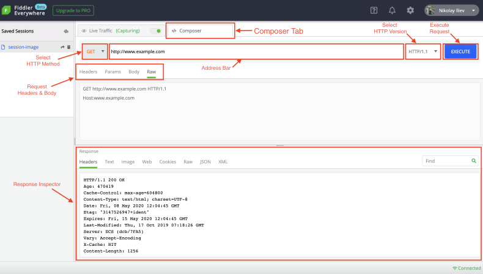

# Composer

The __Composer__ tab enables you to manually build and send HTTP, HTTPS, and FTP requests.

## Get Started

## HTTP Methods

_content goes here_

## URL TextField

_content goes here_

## HTTP Version selection

_content goes here_

## Headers

_content goes here_

## Params

_content goes here_

## Body

_content goes here_

## Raw

_content goes here_

## Response Inspector

_content goes here_