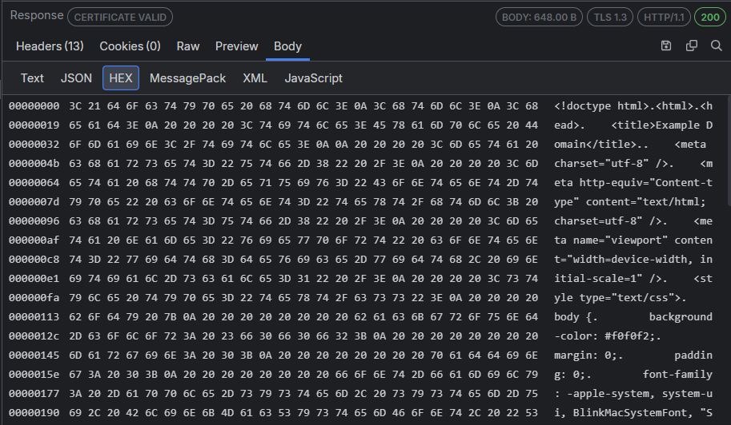
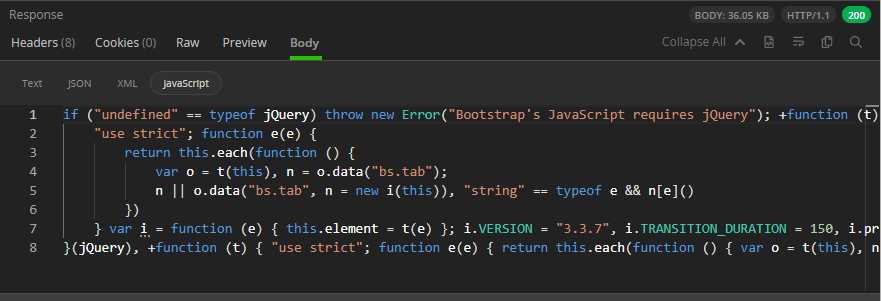
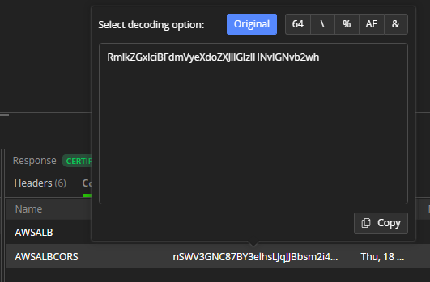
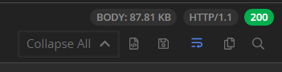

# Inspectors Tab

The Fiddler Everywhere [**HTTP(S) Inspectors**](#http\(s\)-inspectors) tab renders the **Request** and the **Response** sections, which display the request and the response information for the selected HTTP(S) sessions from the **Live Traffic** list. In the case where the captured traffic uses [the WebSocket API](https://developer.mozilla.org/en-US/docs/Web/API/WebSockets_API), a special [**WebSocket inspectors**](#websocket-and-grpc-inspectors) tan renders, which display the connection handshake details, messages, and each message content and metadata. For secure connections in the Live Traffic section, Fiddler Everywhere can show detailed [server certificate information](#server-certificate-details).

The inspectors are based on the [Monaco editor](https://microsoft.github.io/monaco-editor/) and provide several features, among which:

- Great performance for loading large chunks of data.
- Line IDs to quickly identify and mark a specific portion of the request or response.
- Powerful search functionality that supports strings and regular expressions.
- Automatic context styling that highlights the content based on its type&mdash;for example, image renderers, HTML and XML formatters, JSON formatter, JavaScript, and more.
- A **Preview** inspector type that recognizes and visualizes multiple formats.
- A **Raw** inspector that shows the received HTTP requests/responses as is. It also allows you to encode bodies received in unreadable decoded form.
- A **Copy all content to clipboard** option (in the toolbar at the top-right corner) to extract information efficiently.

To load the data of a session in the **Inspectors** section, select an HTTP(S) or WebSocket session from the __Live Traffic__ list.


To switch the loaded name of the inspector, click the desired inspector name&mdash;for example, __Image__ or __Raw__.

## HTTP(S) Inspectors

The **HTTP(S) Inspectors** provide the following types of inspecting tools that enable you to examine different parts of the requests and responses:

* [Headers inspector](#headers-inspector)
* [Params inspector](#params-inspector)
* [Cookies inspector](#cookies-inspector)
* [Raw inspector](#raw-inspector)
* [Preview inspector](#preview-inspector)
* [Body inspector](#body-inspectors)

### Headers Inspector

The **Headers** inspector allows you to view the HTTP headers of the request and the response.


>tip Fiddler Everywhere supports HTTP/2 and shows the HTTP/2 pseudo-headers in their original order precisely as they are sent/received.

### Params Inspector

The **Params inspector**, available in the **Request** section only, displays the content from any input endpoints parameters.


### Cookies Inspector

The **Cookies inspector** displays the contents of any outbound `Cookie` and `Cookie2` request headers and any inbound `Set-Cookie`, `Set-Cookie2`, and `P3P` response headers.


### Raw Inspector

The **Raw Inspector** allows you to view the complete request and response, including headers and bodies, as text. Most of the inspector represents a large text area that displays the body text interpreted using the detected character set with the headers, the byte-order-marker, or an embedded `META` tag declaration.

By default, the request or response will be displayed as received, which means that encoded or compressed content will be in a non-human readable format and displayed as is. The **Raw Inspector** comes with a special **decode** button (located in the [toolbar](#inspectors-toolbar)), decoding encoded content.

The following figure displays the encoded raw content with the **decode** button in an inactive state.


The following figure displays decoded raw content with the **decode** button in an active state.


#### Request Raw Inspector Details

Every HTTP(S) request begins with plain text headers that describe what the client requests as a resource or operation. The first line of the request (the **Request line**) contains the following values:

* The HTTP method&mdash;For example, __GET__.
* The URL path which is being requested&mdash;For example, `/index.html`.
* The HTTP version&mdash;For example, `HTTP/1.2`.

The **Request line** can consist of one or more headers listed in rows that contain name-value pairs of metadata about the request and the client, such as the `User-Agent` and `Accept-Language`.

The **Request body** (if such exists) appears at the bottom and is separated by an empty line from the last header.

#### Response Raw Inspector Details

Like the HTTP request, every response begins with plain text headers describing the request's result. The first line of the response (the **Status line**) contains the following values:

* The HTTP version&mdash;For example, `HTTP/1.1`.
* The response status code&mdash;For example, `200`.
* The response status text&mdash;For example, `OK`.

The **Status line** can consist of one or more headers listed in rows that contain name-value pairs of metadata about the response and the server, such as the length of the response file, the content type, and how the response can be cached.

The **Response body** (if such exists) appears at the bottom and is separated by an empty line from the last header.

### Preview Inspector

The **Preview Inspector**, available in the **Request** section only, allows you to view the response bodies as an image or an HTML page, depending on the response content. The inspector can display the most common web image formats, including JPEG, PNG, GIF, and less common formats like cursors, WebP, JPEG-XR, bitmaps, and TIFF.


If the content is in HTML format, then the **Preview** inspector allows you to view responses in a web browser control, which provides a quick preview of how a given response may appear in a browser. The web browser control is configured to prevent additional downloads when rendering the response (to avoid flooding the **Live Traffic** list), which means that most images and styles will not be displayed. Additionally, scripting and navigating are blocked and provide a read-only preview.


### Body Inspectors

The **Body** inspectors are suitable for different requests and responses. Depending on the received content type, Fiddler Everywhere automatically tries to load the most appropriate body inspector. Fiddler Everywhere provides the following body inspectors:

- [Text](#text-body-inspector)
- [JSON](#json-body-inspector)
- [HEX](#hex-body-inspector)
- [XML](#xml-body-inspector)
- [Form-Data](#form-data-body-inspector)
- [JavaScript](#javascript-body-inspector)

#### Text Body Inspector

The **Text** inspector lets you view the request and response bodies as text. It truncates the data it renders at the first null byte it finds, making it inappropriate for displaying binary content. Most body inspectors represent a large text area that reveals the body text interpreted using the detected character set with the headers, the byte-order-marker, or an embedded META tag declaration.


#### JSON Body Inspector

The **JSON** inspector interprets the selected request or response body as a JavaScript Object Notation (JSON) formatted string, showing a tree view of the JSON object nodes. The tree view will remain empty if the body can't be interpreted as JSON. The JSON inspector can render the data even if the request or response is compressed or has HTTP chunked encoding.

>important If the JSON data is malformed, for example, the name component of a name/value pair is unquoted, the JSON inspector will show a warning in the footer.


#### HEX Body Inspector

The **HEX** inspector loads a hex representation of the HTTP request/response bodies. The hex data can help identify hidden information in the requests/responses and find special characters (for example, CRLF, Tab, etc.). The HEX inspector's primary goal is to help people analyze bodies with binary data while providing performance optimization for working with larger files.

The **HEX** inspector consists of an offset column, a hex view column, and a text view column.



#### XML Body Inspector

The **XML** inspector interprets the selected request or response body as an Extensible Markup Language (XML) document, showing a tree view of the XML document nodes. The tree view will remain empty if the body can't be interpreted as XML (that includes valid HTML). Each XML element is represented as a node in the tree. The attributes of the element are displayed in square brackets after its name. The inspector provides an __Expand All / Collapse All__ toggle button to expand or collapse all XML tree nodes.


#### Form Data Body Inspector

The **Form Data** inspector, available in the **Request** section only, parses the request query string and body for any HTML form-data. The parsed name/value pairs are displayed in the grid view if a form is found. The inspector works best with **application/x-www-form-urlencoded** data used by most simple web forms.


#### JavaScript Body Inspector

The **JavaScript** inspector interprets and formats the selected request or response body as a JavaScript/TypeScript code. The inspector will recognize and properly format the following MIME types:

```
application/ecmascript
application/javascript
application/x-ecmascript
application/x-javascript
text/ecmascript
text/javascript
text/javascript1.0
text/javascript1.1
text/javascript1.2
text/javascript1.3
text/javascript1.4
text/javascript1.5
text/x-ecmascript
text/x-javascript
```




## WebSocket and GRPC Inspectors

The **WebSocket Inspector** and the **GRPC Inspector** share identical user interfaces. The inspectors provide the following types of inspecting tools that enable you to examine different parts of a WebSocket or GRPC connection:

- [Handshake tab](#handshake-tab)
- [Messages tab](#messages-tab)


### Handshake Tab

Similarly to an HTTP(S) request and response, the **Handshake tab** for the WebSocket and GRPC APIs provide the following types of inspecting tools that enable you to examine different parts of the WebSocket requests and responses:

- [Headers inspector](#headers-inspector)

- [Params inspector](#params-inspector)

- [Cookies inspector](#cookies-inspector)

- [Raw inspector](#raw-inspector)

- [Preview inspector](#preview-inspector)

- [Body inspector](#body-inspectors)


### Messages Tab

The **Messages tab** renders a list of the WebSocket or GRPC messages sent from the client or received from the server. The list is constantly populated with new upcoming messages until the two-way communication is disconnected. Each received WebSocket message can be inspected separately through the [**Metadata inspector**](#metadata-inspector) and through the [**Message Inspector**](#message-inspector).

The list of messages is rendered as a grid with multiple columns:

- **ID**&mdash;Number indicating the consecutive number of the message.

- **Sender**&mdash;Inidicates whether the **Client** or **Server** sent the message.

- **Type**&mdash;(WebSocket only)Indicates the type of the message. The supported values are as follows:
    * **Text**&mdash;message with text payload.
    * **Binary**&mdash;message with binary payload.
    * **Cont.**&mdash;represents a continuation message from a fragmented message. Use the **Unfragment all messages** button to unfragmented messages of type **Cont.** and remove them from the **Messages** list.
    * [**Ping**](https://datatracker.ietf.org/doc/html/rfc6455#section-5.5.2).
    * [**Pong**](https://datatracker.ietf.org/doc/html/rfc6455#section-5.5.3).

- **Size**&mdash;The length of the message in bytes.

- **Time**&mdash;Renders the date and the time when the message is received.

- **Message**&mdash;The string representation of the message sent/received.


#### Messages Toolbar

The top-right corner of the **Messages tab** contains a toolbar with the following functionalities:

- **Search** field to filter received WebSocket messages.

- **Unfragment all messages** button to combine all continuation type messages with their original message and remove them from the **Messages** list.

- **Copy all content to clipboard** button that immediately puts all captured messages into the operating system clipboard.


#### Metadata inspector

The **Metadata inspector** (available only for WebSocket traffic) contains timestamps and masking information about the selected WebSocket message.

- **DoneRead**&mdash;Indicates when the Client/Server finished processing the message.

- **BeginSend**&mdash;Indicates when the Client/Server sent the message.

- **DoneSend**&mdash;Indicates when the Client/Server finished sending the message.

- **Data masked by key**&mdash;The key that masks the message.


#### Message Inspector

The **Message Inspector** contains the non-masked message content visualized in [Text](#text-body-inspector), [JSON](#json-body-inspector), or [HEX](#hex-body-inspector) body inspector. The inspector has a toolbar that allows you to word-wrap the message content and highlight content through a search term.


## Inspector's Context Menu

All inspectors provide further interaction options through a context menu. The context menu options vary depending on the inspectors' type (refer to the list below).

- **Copy**&mdash;Basic copy operation for selected content. Available in most inspectors.
- **Copy Value**&mdash;An option to copy only the value (from a key-value pair). Available in **Headers** inspector.
- **Copy Key/Value**&mdash;An option to copy the key-value pair. Available in **Headers** inspector.
- **Copy Response Cookie Value**&mdash;An option to copy the value of a selected cookie. Available in **Cookies** inspector.
- **Decode Value**&mdash;An option that allows you to decode selected value. The decode option support out-of-the-box decoding of Base64, EscapedSequences, Encoded URL, Hex, and Encoded HTML. Available in **Headers**, **Form Data** and **Cookies** inspectors.
- **Decode Selection**&mdash;An option that allows you to decode selected content (encoded). The decode option support out-of-the-box decoding of Base64, EscapedSequences, Encoded URL, Hex, and Encoded HTML. Available in **Raw** inspector and all **Body** inspectors (**Text, JSON, XML, JavaScript**).




## Inspector's Toolbar

Each inspector has a toolbar that provides a different set of functionalities and data as follows:

- Tooltips that output the request URL, the HTTP version, the HTTP method (for each HTTP Request) or the body size, the HTTP version, and the status code (for each HTTP Response).

- **Expand All / Collapse All**&mdash;Toggle to expand or collapse all the output data. Available for all Body inspectors.

- **Decode / Encode**&mdash;Toggle between compressed/uncompressed or decoded/encoded content. Available only for the Raw inspector.

- **Reformat Text**&mdash;Formats the text with the built-in Monaco editor optimizations. Available only for JSON, XML, and JavaScript inspectors.

- **Save request body to file**&mdash;Exports the body in the format specified as content type. Raw data is exported as DAT files. Available for the Raw and Body Request inspectors.

- **Save response body to file**&mdash;Exports the body in the format specified as content type. Raw data is exported as DAT files. Available for the Raw and Body Response inspectors.

- **Save image to file**&mdash;Exports the previewed images in the specified image format. Available only for the Preview inspector.

- **Toogle Word Wrap**&mdash;Toogle the option to transfer a word for which there is insufficient space from the end of one line of text to the beginning of the next.

- **Copy all content to clipboard**&mdash;Copies the inspector's content into the system clipboard.




## Server Certificate Details

The Response Inspectors for ongoing capture (Live Traffic list) in Fiddler Everywhere contain [indicators and notifications](#certificate-indicators) that show if a server certificate is valid, expiring, or causes errors. 


[Learn more on how to inspect and use the certificate details with Fiddler Everywhere here...]()