# Inspectors Tab

The Fiddler Everywhere [**HTTP(S) Inspectors**](#http\(s\)-inspectors) tab renders the **Request** and the **Response** sections, which display the request and the response information for the HTTP(S) sessions that are selected from the **Live Traffic** list. In the case where the captured traffic uses [the WebSocket API](https://developer.mozilla.org/en-US/docs/Web/API/WebSockets_API), a special [**WebSocket inspectors**](#websocket-inspectors) tan renders, which display the connection handshake details, messages, and each message content and metadata.  For secure connections in the Live Traffic section, Fiddler Everywhere can show detailed [server certificate information](#server-certificate-details).

The inspectors are based on the [Monaco editor](https://microsoft.github.io/monaco-editor/) and provide several features, among which:

- Great performance for loading large chunks of data.
- Line IDs to quickly identify and mark a specific portion of the request or response.
- Powerful search functionality that supports strings and regular expressions.
- Context styling that highlights the content based on its type&mdash;for example, image renderers, HTML and XML formatters, JSON formatter, and more.
- Except for the **Preview** inspector type, all inspectors provide the **Copy all content to clipboard** button at the top-right corner.

To load the data of a session in the **Inspectors** section, select an HTTP(S) or WebSocket session from the __Live Traffic__ list.

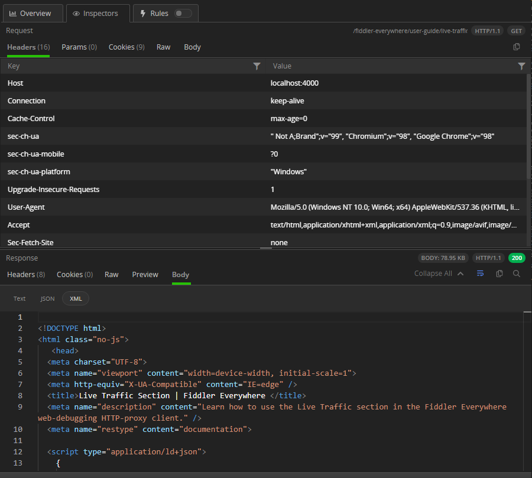

To switch the loaded name of the inspector, click the desired inspector name&mdash;for example, __Image__ or __Raw__.

## HTTP(S) Inspectors

The **HTTP(S) Inspectors** provide the following types of inspecting tools that enable you to examine different parts of the requests and responses:

* [Headers inspector](#headers-inspector)
* [Params inspector](#params-inspector)
* [Cookies inspector](#cookies-inspector)
* [Raw inspector](#raw-inspector)
* [Preview inspector](#preview-inspector)
* [Body inspector](#body-inspector)

### Headers Inspector

The __Headers__ inspector allows you to view the HTTP headers of the request and the response.

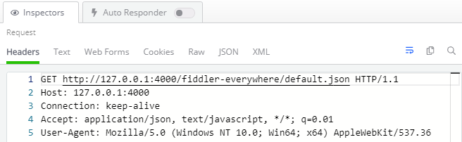

#### Request Headers Inspector

Every HTTP(S) request begins with plain text headers that describe what the client requests as a resource or operation. The first line of the request (the **Request line**) contains the following values:

* The HTTP method&mdash;For example, __GET__.
* The URL path which is being requested&mdash;For example `/index.html`.
* The HTTP version&mdash;For example, `HTTP/1.2`.

The **Request line** can consist of one or more rows containing name-value pairs of metadata about the request and the client, such as the `User-Agent` and `Accept-Language`.

#### Response Headers

Like the HTTP request, every HTTP response begins with plain text headers that describe the result of the request. The first line of the response (the **Status line**) contains the following values:

* The HTTP version&mdash;For example, `HTTP/1.1`.
* The response status code&mdash;For example, `200`.
* The response status text&mdash;For example, `OK`.

The **Status line** can consist of one or more lines containing name-value pairs of metadata about the response and the server, such as the length of the response file, the content type, and how the response can be cached.

### Params Inspector

The **Params inspector**, available in the **Request** section only, displays the content from any input endpoints parameters.

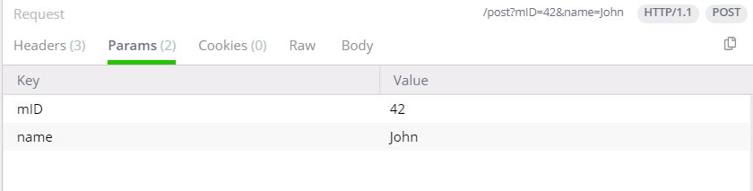

### Cookies Inspector

The **Cookies inspector** displays the contents of any outbound `Cookie` and `Cookie2` request headers and any inbound `Set-Cookie`, `Set-Cookie2`, and `P3P` response headers.

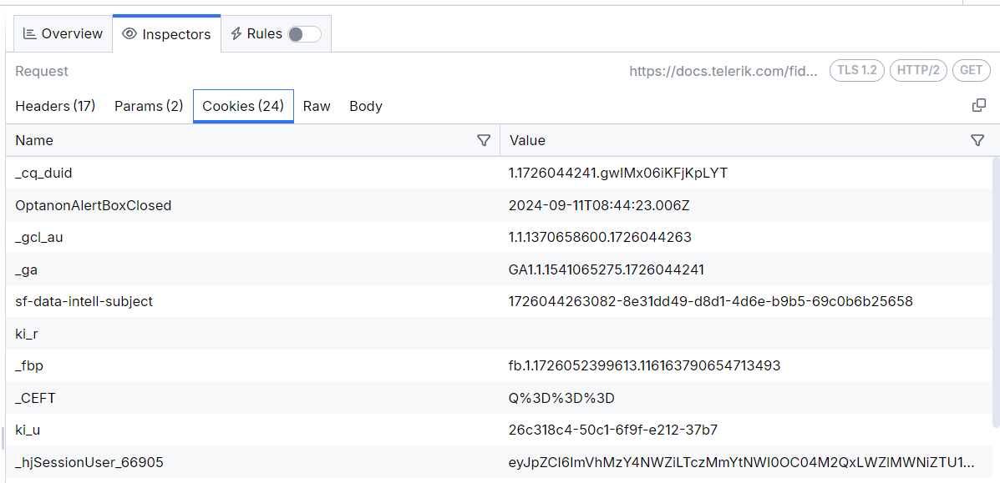

### Raw Inspector

The **Raw Inspector** allows you to view the complete request and response, including headers and bodies, as text. Most of the inspector represents a large text area that displays the body text interpreted using the detected character set with the headers, the byte-order-marker, or an embedded `META` tag declaration.

By default, the request or response will be displayed as received, which means that encoded or compressed content will be in a non-human readable format and received as is. The **Raw Inspector** comes with a special **decode** button (located in the inspector toolbar), decoding encoded content.

The following figure displays the inactive encoded raw content with the **decode** button.

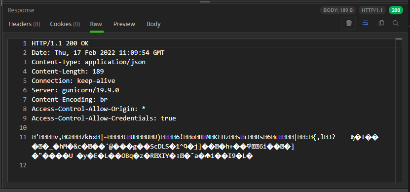

The following figure displays decoded raw content with the **decode** button active.

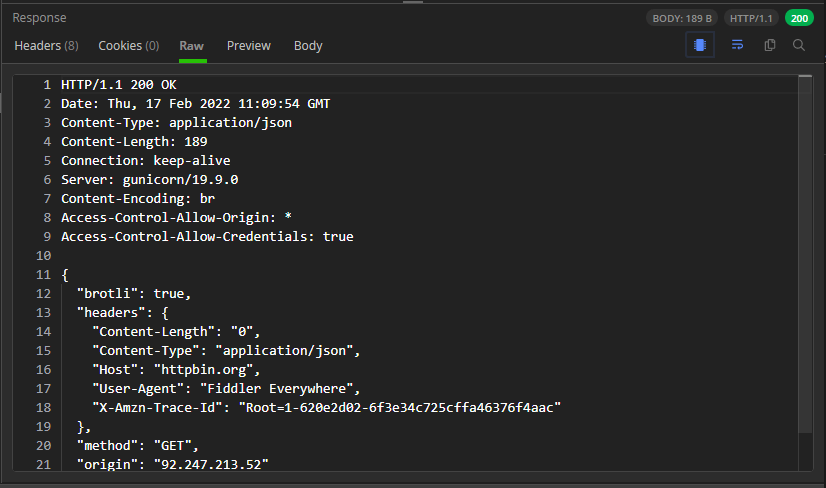

### Preview Inspector

The **Preview Inspector**, available in the **Request** section only, allows you to view the response bodies as an image or an HTML page, depending on the response content. The inspector can display the most common web image formats, including JPEG, PNG, GIF, and less common formats like cursors, WebP, JPEG-XR, bitmaps, and TIFF.

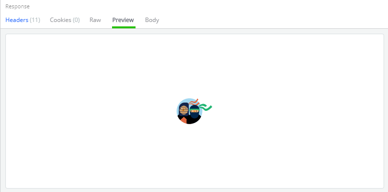

If the content is in HTML format, then the **Preview** inspector allows you to view responses in a web browser control, which provides a quick preview of how a given response may appear in a browser. To avoid flooding the **Live Traffic** list, the web browser control is configured to prevent additional downloads when rendering the response, which means that most images and styles will not be displayed. Additionally, scripting and navigating are blocked and provide a read-only preview.

### Body Inspectors

The **Body** inspectors are suitable for different types of requests and responses. Fiddler Everywhere automatically tries to load the most appropriate body inspector, depending on the content.

#### Text

The **Text** inspector allows you to view the request and response bodies as text. It truncates the data it renders at the first null byte it finds, making it inappropriate for displaying binary content. Most body inspectors represent a large text area that reveals the body text interpreted using the detected character set with the headers, the byte-order-marker, or an embedded META tag declaration.

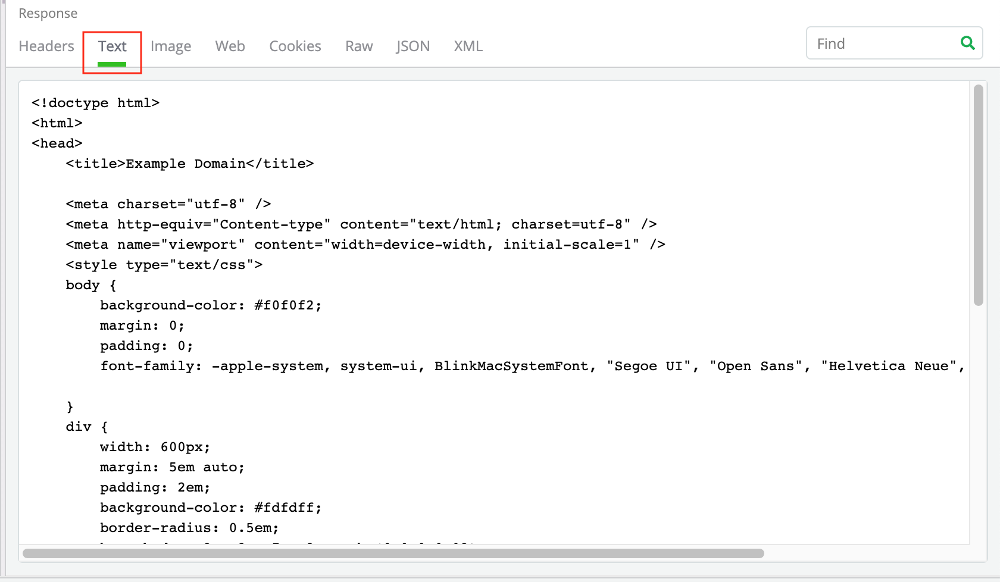

#### JSON

The **JSON** inspector interprets the selected request or response body as a JavaScript Object Notation (JSON) formatted string, showing a tree view of the JSON object nodes. If the body can't be interpreted as JSON, the tree view will remain empty. The JSON inspector can render the data even if the request or response is compressed or has HTTP chunked encoding applied. The JSON inspector provides an __Expand All / Collapse All__ toggle button to expand or collapse all JSON tree nodes.

>important If the JSON data is malformed, for example, the name component of a name/value pair is unquoted, the JSON inspector will show a warning in the footer.

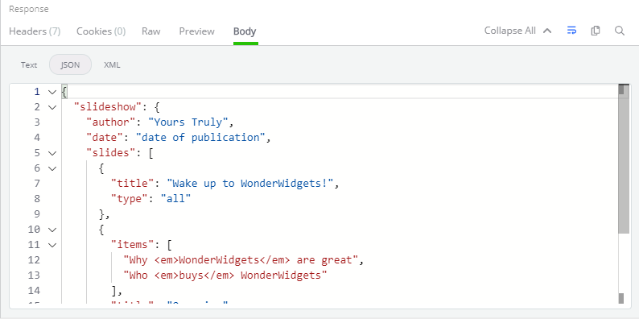

#### XML

The **XML** inspector interprets the selected request or response body as an Extensible Markup Language (XML) document, showing a tree view of the XML document nodes. The tree view will remain empty if the body can't be interpreted as XML. Each XML element is represented as a node in the tree. The attributes of the element are displayed in square brackets after its name. The inspector provides an __Expand All / Collapse All__ toggle button to expand or collapse all XML tree nodes.

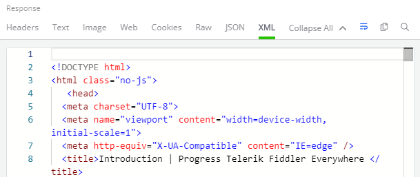

#### Form Data

The **Form Data** inspector, available in the **Request** section only, parses the request query string and body for any HTML form-data. If a form is found, it is parsed, and the name/value pairs are displayed in the grid view. The inspector works best with application/x-www-form-urlencoded data used by most simple web forms.

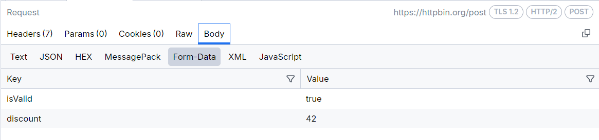

The **Form Data** inspector provides the following options for copying the parameter content from the context menu:

- **Copy Value**&mdash;Copies only the value of the selected parameter from the key-value pair.
- **Copy Key/Value**&mdash;Copies the key-value pair of the selected parameter.

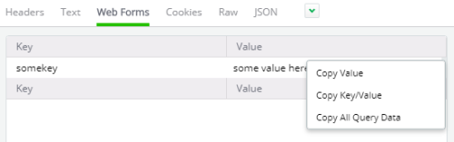

## WebSocket Inspectors

The **WebSocket Inspectors** provide the following types of inspecting tools that enable you to examine different parts of a WebSocket connection:

- [Handshake tab](#handshake-tab)
- [Messages tab](#messages-tab)

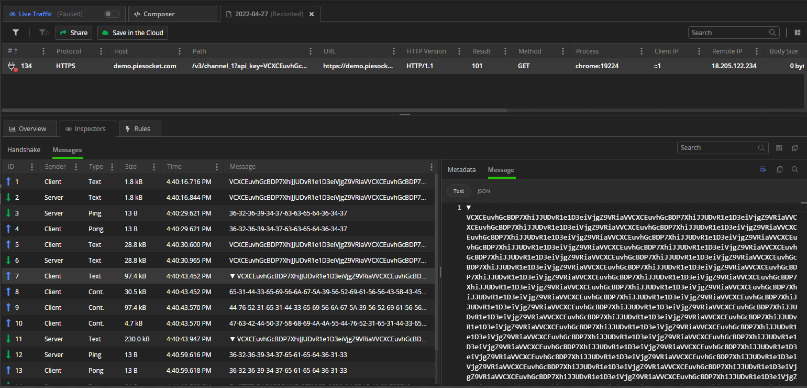

### Handshake Tab

Similarly to an HTTP(S) request and response, the **Handshake tab** for the WebSocket API provides the following types of inspecting tools that enable you to examine different parts of the WebSocket requests and responses:

- [Headers inspector](#headers-inspector)

- [Params inspector](#params-inspector)

- [Cookies inspector](#cookies-inspector)

- [Raw inspector](#raw-inspector)

- [Preview inspector](#preview-inspector)

- [Body inspector](#body-inspector)

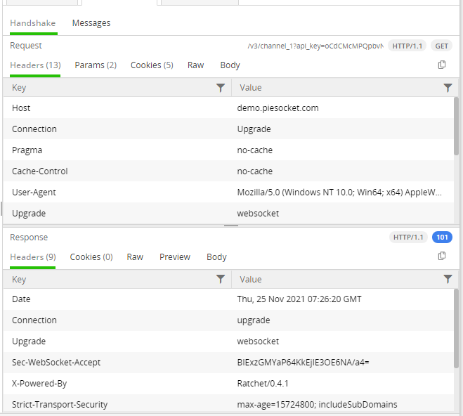

### Messages Tab

The **Messages tab** renders a list of the WebSocket messages sent from the client or received from the server. The list is constantly populated with new upcoming messages until the two-way communication is disconnected. Each received WebSocket message can be inspected separately through the [**Metadata inspector**](#metadata-inspector) and through the [**Message Inspector**](#message-inspector).

The list of messages is rendered as a grid with multiple columns:

- **ID**&mdash;Number indicating the consecutive number of the message.

- **Sender**&mdash;Inidicates whether the **Client** or **Server** sent the message.

- **Type**&mdash;Inidicates the type of the message. Te supported values are as follows:
    * **Text**&mdash;message with text payload.
    * **Binary**&mdash;message with binary payload.
    * **Cont.**&mdash;represents a continuation message from a fragmented message. Use the **Unfragment all messages** button to unfragment messages of type **Cont.** and remove them from the **Messages** list.
    * [**Ping**](https://datatracker.ietf.org/doc/html/rfc6455#section-5.5.2).
    * [**Pong**](https://datatracker.ietf.org/doc/html/rfc6455#section-5.5.3).

- **Size**&mdash;The length of the message in bytes.

- **Time**&mdash;Renders the date and the time when the message is received.

- **Message Preview**&mdash;The string representation of the message sent/received.

#### Messages Toolbar

The top-right corner of the **Messages tab** contains a toolbar with the following functionalities:

- **Search** field to filter received WebSocket messages.

- **Unfragment all messages** button to combine all continuation type messages with their original message and remove them from the **Messages** list.

- **Copy all content to clipboard** button that immediately puts all captured messages into the operating system clipboard.

#### Metadata inspector

The **Metadata inspector** contains timestamps and masking information about the selected WebSocket message.

- **DoneRead**&mdash;Timestamp that indicates when the Client/Server finished processing the message.

- **BeginSend**&mdash;Timestamp that indicates when the Client/Server sent the message.

- **DoneSend**&mdash;Timestamp that indicates when the Client/Server finished sending the message.

- **Data masked by key**&mdash;The key that masked the message.

#### Message Inspector

The **Message Inspector** contains the non-masked message content in plain text or JSON (depending on the message format). The inspector has a toolbar that allows you to word-wrap the message content and highlight content through a search term.

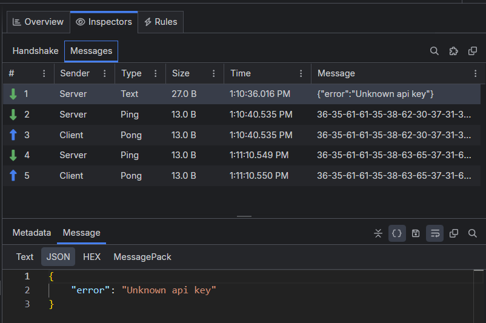

## Server Certificate Details

The Response Inspectors for ongoing capture (Live Traffic list) in Fiddler Everywhere contain [indicators and notifications](#certificate-indicators) that show if a server certificate is valid, expiring, or causes errors. 

[Learn more on how to inspect and use the certificate details with Fiddler Everywhere here...]()