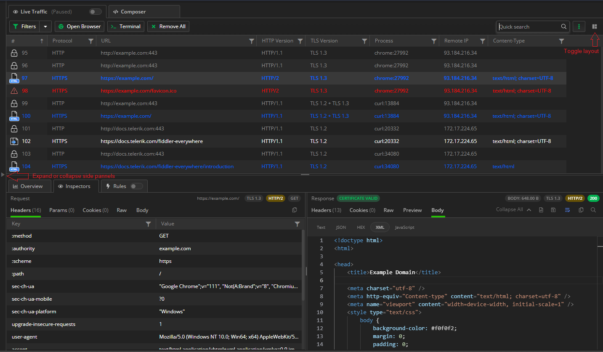

# Live Traffic Section

The **Live Traffic** section provides essential features of Fiddler Everywhere.

**Live Traffic** displays a summary of each captured session in the **Live Traffic** list. It also provides functionalities to work with these sessions through the **Live Traffic** toolbar, the [**Inspectors**]() types, and the corresponding [**Rules**]() tab. The feature enables the saving and sharing of sessions, editing issued requests, marking, commenting sessions, and applying rules.

## Defining a Session

A (web) session represents a single transaction between a client and a server, sometimes known as a request/response pair. Each session appears as a single entry in **Live Traffic**. Each session object has a **Request** and a **Response**, representing the data that the client has sent to the server and the data that the server has returned to the client. The session object also maintains a set of flags that record metadata about the session and a timers object that stores timestamps logged during the processing of the session.


## Live Traffic Toolbar

The toolbar of the **Live Traffic** section provides various functionalities such as modes for streaming, decoding of content, filtering by various criteria, and saving and sharing of sessions.

To start capturing traffic, enable **Live Traffic** by switching to the **Capturing** mode. To go into the **Paused** mode, use the **Off** switch state to pause the traffic capturing.


The **Live Traffic** toolbar provides the following functionalities:

- [Streaming](#streaming) (**Stream**)
- [Advanced filters](#advanced-filters) (**Advanced Filters**)
- [Clearing all filters](#clearing-all-filters) (**Clear All Filters**)
- [Removing all](#removing-all) (**Remove All**)
- [Preconfigured Browser Capturing](#preconfigured-browser-capturing) (**Open Browser**)
- [Saving](#saving) (**Save**)
- [Sharing](#sharing) (**Share**)
- [Searching](#searching) (**Search**)
- [Toggling Layout](#toggling-layout)(**Toggle Layout Change**)

### Streaming

By default, Fiddler Everywhere uses the buffering mode, which means that the responses are fully collected before any part is sent to the client. Buffering alters the responses&mdash;for example, an image won't begin to download until the containing page download is complete. With the streaming mode, the server responses are immediately returned to the client as it is downloaded. In the streaming mode, tampering with the response body is not possible.

The streaming mode is helpful for low-level network timing scenarios&mdash;for example, by design, some browsers will parse partially downloaded HTML, which will start the download of external resources in parallel before the remote server has finished delivering the content. The streaming mode is also useful if a site offers audio or video streams, as Fiddler Everywhere cannot buffer such constant streams.


To toggle between the buffering and the streaming mode, click the **Stream** button.

### Advanced Filters

Use the **Advanced Filters** to apply filters based on the **Request** and **Response** headers. Only sessions that cover the filter criteria will appear in the **Live Traffic** list. The **Advanced Filters** entry uses several different logical constructions to create a matching condition.

Set the advanced filters as follows:

1. Click the **Advanced Filters** button to open the advanced filters popup window.
1. The **Advanced Filters** window allows you to set specific criteria to filter the captured traffic.
1. Set the **When** rule based on one of the following statements:
    - **all these conditions**&mdash;The rule applies when all conditions are true (logical TRUE).
    - **any of these conditions**&mdash;The rule applies when any conditions are true (logical OR).
    - **none of these conditions**&mdash;The rule applies when none of the conditions is true (logical FALSE).
    >tip Learn more about the available [**match conditions**](#conditions), which apply for both in the advanced filters and rule creation.
1. Add one or more match conditions based on the HTTP Request and Response headers and provide logical operators.
1. Click **Apply** to close the **Advanced Filters** and activate the newly created filter.    


>tip All condition values connected to a **Live Traffic** column can be auto-completed, and the auto-completion suggestions are based on the captured data. Additionally, after adding a condition, a counter will show the number of matches (from the currently captured sessions).

Alternatively, you can apply filters through the **more** option (three vertical dots) on each Live Traffic column (for example, apply a filter for the _Host_ column ). The [column filtering](#column-filters) allows you to use the AND and OR logical operators (for two lines) and multiple logical operators (for example, **Is equal to**, **contains**, **ends with**, etc.). Learn more about [individual column sorting and filtering options](#sort-and-filter-traffic).


### Clearing All Filters

To reset all the filters applied through the advanced filters feature or to each column, use **Clear All Filters**.


### Removing All

To remove all captured sessions, use the **Remove All** button, which automatically removes all captured traffic from the **Live Traffic** list. To remove only specific sessions, select the desired ones and use the remove options from [the context menu](#remove).


### Preconfigured Browser Capturing

Use the **Open Browser** button to capture traffic from a specific browser instance without the need to modify the system proxy settings. [Learn more about the preconfigured browser capturing...](#preconfigured-browser-capturing)


### Saving

To save captured sessions, use the **Save** button, which will automatically save all captured traffic. To save only specific sessions, select the desired ones and use the advanced saving options from [the context menu](#save).

To save sessions for later or prepare sessions for sharing:

1. Click the **Save** button. As a result, a **Save Sessions** prompt window appears.

1. In the **Save Sessions** prompt window, enter a valid name and choose a folder to store the session.

1. (Optional) Use the **password protection** switch to enable encryption and set a password. Only users with knowledge of the password can open the entry.

1. Click **Save**. The saved session immediately loads in the **Sessions** list.

1. Double-click the saved session to load it in a new **Composer** tab. Note that encrypted sessions will prompt for a password before loading.

### Sharing

Sharing sessions dramatically improve collaboration, and Fiddler Everywhere provides the following options to export and share sessions:

- Sharing through the **Share** button from a saved session entry in [the **Sessions** list](#sharing-sessions)).

- Sharing through the **Share** option from [the **Live Traffic** list context menu](#share).

- Sharing through the **Share** button from the **Live Traffic** list toolbar. The **Live Traffic** toolbar comes with a **Share** button that will save in a file the currently displayed sessions, captured from **Live Traffic**, and then will share them through an explicitly provided email.

To share a session through the toolbar:

1. Click the **Share** button. As a result, the **Save Session** prompt window appears.

1. In the **Save Sessions** prompt window, enter a valid name and choose a folder to store the session.

1. In the **Share Sessions** prompt window, enter a valid email and click **Share**. Entering notes is optional.

### Searching

To search for specific values in the URL and the headers of all sessions, use the **Search** text input. The search action will immediately filter and show all sessions containing the search terms.


### Toggling Layout

The last icon on the right side of the toolbar presents an option to restructure the foremost Fiddler Everywhere layout structure for the [**Live Traffic List**](#live-traffic-list) and the [**Inspectors**](). The layout change option is available for the **Live traffic** tab, comparison tabs, and saved sessions tabs. The layout options are as follows:

- (Default layout) **Live Traffic List** on the left side and the **Inspectors** on the right (top for **Request Inspectors** and bottom for **Response Inspectors**).
- (Alternative layout) **Live Traffic List** at the top and the **Inspectors** at the bottom (left for **Request Inspectors** and right for **Response Inspectors**).


>tip You can collpase the side-panels ([**Sessions**]() and [**Requests**]()) and toggle the main layout to optimize your working space.



## Live Traffic List

The **Live Traffic** list displays a list of web sessions with a summary of each captured session.


Many operations begin by selecting one or more entries in the **Live Traffic** and activating other features.

- To select more than one session, hold the **Ctrl** (**Command** on Mac) or **Shift** keys while clicking the desired rows.

- Double-click or press **Enter** (**Return** on Mac) to activate the default inspectors for a single selected session.

When the **Inspectors** are activated, they will automatically decide which inspector type is best suited to display the request and response of the selected session.

### List Icons

The **Live Traffic List** uses icons to provide additional context for each recorded session. To trigger an explanatory tooltip, hover over a **Live Traffic** list entry icon.

The following table displays the icons which **Live Traffic** supports for its list:


<table style="width: 80%; border-collapse: collapse;">
    <colgroup>
       <col span="1" style="width: 10%;">
       <col span="1" style="width: 90%;">
    </colgroup>
    <thead>
        <tr>
            <th>Column name</th>
            <th>Description</th>
        </tr>
    </thead>
    <tbody>
        <tr>
            <td></td>
            <td>Represents a generic successful response.</td>
        </tr>
        <tr>
            <td></td>
            <td>Uploading content for a session in progress (the request is being sent to the server).</td>
        </tr>
        <tr>
            <td></td>
            <td>Uploading paused for session in progress.</td>
        </tr>
        <tr>
            <td></td>
            <td>Downloading content for session in progress (the response is being read from the server).</td>
        </tr>
        <tr>
            <td></td>
            <td>Downloading paused for session in progress.</td>
        </tr>
        <tr>
            <td></td>
            <td>The session was aborted by the client, Fiddler, or the Server.</td>
        </tr>
        <tr>
            <td></td>
            <td>The response was a server error.</td>
        </tr>
        <tr>
            <td></td>
            <td>The response returned status code 401 Unauthorized.</td>
        </tr>
        <tr>
            <td></td>
            <td>The response redirect status code 300, 301, 302, 303 or 307.</td>
        </tr>
        <tr>
            <td></td>
            <td>A tunnel is used for WebSocket traffic.</td>
        </tr>
        <tr>
            <td></td>
            <td>The request used the <b>HTTP CONNECT</b> method - establishes a tunnel used for HTTPS traffic.</td>
        </tr>
        <tr>
            <td></td>
            <td>A tunnel used for RPC traffic.</td>
        </tr>
        <tr>
            <td></td>
            <td>No content loaded.</td>
        </tr>
        <tr>
            <td></td>
            <td>Not modified.</td>
        </tr>
        <tr>
            <td></td>
            <td>Partial content.</td>
        </tr>
        <tr>
            <td></td>
            <td>The response was an image.</td>
        </tr>
        <tr>
            <td></td>
            <td>The response was a JavaScript file.</td>
        </tr>
        <tr>
            <td></td>
            <td>The response was a CSS file.</td>
        </tr>
        <tr>
            <td></td>
            <td>The response was an HTML file.</td>
        </tr>
        <tr>
            <td></td>
            <td>The response was a Flash file.</td>
        </tr>
        <tr>
            <td></td>
            <td>The response was an XML file.</td>
        </tr>
        <tr>
            <td></td>
            <td>The response was a Silverlight file.</td>
        </tr>
        <tr>
            <td></td>
            <td>The response was an audio file.</td>
        </tr>
        <tr>
            <td></td>
            <td>The response was a video file.</td>
        </tr>
        <tr>
            <td></td>
            <td>The response was a font file.</td>
        </tr>
        <tr>
            <td></td>
            <td>The response was a JSON file.</td>
        </tr>
        <tr>
            <td></td>
            <td>The request used the POST method.</td>
        </tr>
    </tbody>
</table>

### Certificate Indicators

Each [list icon](#list-icons) can contain an additional triangle warning that indicates different server certificate issues.

- A small orange triangle warning indicates that the server uses a certificate that is about to expire within 30 days. You can expand and inspect the certificate expiration warning in detail through the Response inspector notification.

    

- A small red triangle warning indicates that there are certificate errors. You can expand and inspect the certificate error in detail through the Response inspector notification.

    

- Absence of the triangle warning means no issues with the server certificate. You can still expand and inspect the used certificate in detail through the Response inspector notification. 

    

[Learn more about how to use the server certificate details in Fiddler Everywhere here...]()


## Columns

The following table lists the **Live Traffic** columns and the key information they display.

<table style="width: 100%">
    <colgroup>
       <col span="1" style="width: 20%;">
       <col span="1" style="width: 80%;">
    </colgroup>
    <thead>
        <tr>
            <th>Column name</th>
            <th>Description</th>
        </tr>
    </thead>
    <tbody>
        <tr>
            <td><b>#</b></td>
            <td>A unique identification number generated by Fiddler Everywhere. The column also contains <a href="#list-icons">an icon</a> that represents the session type and might contain <a href="#certificate-indicators">certificate expiration indicator.</a></td>
        </tr>
        <tr>
            <td><b>Result</b></td>
            <td>The HTTP response <a href="https://developer.mozilla.org/en-US/docs/Web/HTTP/Status">status code</a></td>
        </tr>
        <tr>
            <td><b>Protocol</b></td>
            <td>The protocol type (HTTP or HTTPS) used by the session.</td>
        </tr>
        <tr>
            <td><b>Host</b></td>
            <td>The hostname and the server's port to which the request was sent. The column also indicates requests with <b>CONNECT</b> method with the <b>Tunnel to</b> value (<a href="https://textslashplain.com/2015/11/19/understanding-connect-tunnels/">CONNECT tunnels in Fiddler</a>).</td>
        </tr>
        <tr>
            <td><b>Path</b></td>
            <td>The path refers to the exact location of a page, post, file, or another asset. The path resides after the hostname and is separated by a forward slash (<code>/</code>).</td>
        </tr>
        <tr>
            <td><b>URL</b></td>
            <td>The URL contains the protocol, the hostname, the port, and the path from the request.</td>
        </tr>
        <tr>
            <td><b>HTTP Version</b></td>
            <td>The protocol version used for communication between the client and the server (<b>HTTP/1.1</b>, <b>HTTP/2</b>, <b>HTTP/2 + HTTP/1.1</b>, and <b>HTTP/1.1 + HTTP/2</b></td>
        </tr>
        <tr>
            <td><b>Method</b></td>
            <td>The HTTP method used by the request that was made (<b>GET</b>, <b>POST</b>, <b>PUT</b>, and so on)</td>
        </tr>
        <tr>
            <td><b>Process</b></td>
            <td>The local OS process from which the traffic originated&mdash;for example, `chrome:8212` indicates a Google Chrome browser instance.</td>
        </tr>
        <tr>
            <td><b>Client IP</b></td>
            <td>Indicates the client IP that sent this request. Mostly applicable when multiple computers on a network are pointed to a single Fiddler instance.</td>
        </tr>
        <tr>
            <td><b>Remote IP</b></td>
            <td>Indicates the IP address of the server used for this request.</td>
        </tr>
        <tr>
            <td><b>Body Size</b></td>
            <td>The number of bytes in the response body.</td>
        </tr>
        <tr>
            <td><b>Caching</b></td>
            <td>Values from the <b>Expires</b> and <b>Cache-Control</b> headers of the response.</td>
        </tr>
        <tr>
            <td><b>Content-Type</b></td>
            <td>The <b>Content-Type</b> header from the response.</td>
        </tr>
        <tr>
            <td><b>Time</b></td>
            <td>Indicates when the session was executed in an <code>HH:MM:SS:ms</code> format.</td>
        </tr>
        <tr>
            <td><b>Date</b></td>
            <td>Indicates the date when the session was executed in a <code>MM:DD:YYYY</code> format.</td>
        </tr>
        <tr>
            <td><b>Duration</b></td>
            <td>Indicates the duration (in milliseconds) that took for the session to complete.</td>
        </tr>
        <tr>
            <td><b>Rules Modified</b></td>
            <td>Indicates if the session is modified by active rules from the <b>Rules</b> tab.</td>
        </tr>
        <tr>
            <td><b>Comments</b></td>
            <td>Shows the custom comments added by you or the author of a shared session.</td>
        </tr>
     </tbody>
</table>


## Traffic Sorting and Filtering

By default, the captured traffic is sorted in the order sessions appear during the traffic capturing, sorted by the unique identification number column, and no active filters are applied. You can use the built-in [sorting](#sorting-options) and [filtering](#filtering-options) options to optimize the outcome.

### Sorting Options

To create a custom sorting order, click the desired column. For example, click the **URL** column to sort alphabetically based on the URL, or click the **Body Size** column to sort based on the session size in bytes. The default sorting order is based on the unique identification number (order of appearance).

### Filtering Options

Each column comes with a **more** button (three vertical dots), which opens a popup with additional **Filter** and **Columns** submenus.

The **Filter** submenu enables you to apply filters to the currently selected column only&mdash;for example, filter all the traffic by the **host** name or by a specific **status code**. Columns with active filters will have a blue filter indicator. You can clear active filters through the **Filter** popup (for the filtered column) or the global [**Clear All Filters** button](##clearing-all-filters).


Use the **Columns** submenu to select which column will be visible in the **Live Traffic** list. By default, the following columns are visible:

- **URL**
- **Result**
- **Method**
- **Process**
- **Remote IP**
- **Body Size**
- **Comments**

Refer to the [KB article "How to View Web Session Summary"]() for detailed information about each column type.


To apply more complex filtering rules, use the [**Advanced Filters**](#advanced-filters).

## Context Menu Options

The context menu for the **Live Traffic** exposes actions that you can apply for one or more sessions. To show the context menu, right-click (Windows OS), or press **Control** and mouse-click (macOS).

- [Editing in the Composer](#editing-in-the-composer) (**Edit in Composer**)
- [Saving](#saving) (**Save**)
- [Sharing](#sharing) (**Share**)
- [Exporting](#exporting) (**Export**)
- [Removing](#removing) (**Remove**)
- [Commenting](#commenting) (**Comment**)
- [Marking](#marking) (**Mark**)
- [Replaying](#replaying) (**Replay**)
- [Selecting](#selecting) (**Select**)
- [Copying](#copying) (**Copy**)
- [Comparing](#comparing) (**Compare**)
- [Adding Sessions to Compare Groups](#adding-sessions-to-compare-groups) (**Add to compare group**)
- [Adding New Rules](#adding-new-rules) (**Add New Rule**)


### Editing in the Composer

The **Edit in Composer** context menu option loads the selected request in a new composer window where it can be edited, saved for later usage and sharing, and reissued.


### Saving

To save selected sessions, use the **Save** context menu option. The saved sessions will appear in the **Sessions** list to the left of the Fiddler Everywhere interface and from there you can later re-open, export, and share them.

- **Selected sessions**&mdash;Saves all chosen sessions; can be accessed with the keyboard by pressing `S`.

- **Unselected sessions**&mdash;Saves all unselected Sessions; can be accessed with the keyboard by pressing `Shift` +`Cmd` +`S` (on Mac), or `Shift`+`S` (on Windows).

- **All Sessions**&mdash;Saves all captured traffic; can be accessed with the keyboard by pressing `Cmd`+`S` (on Mac), or `Ctrl`+`S` (on Windows).

All options will display a **Save** prompt window. To save the desired sessions:

1. Select the sessions, open the context menu, and click the **Save** option.

1. Enter your session name and choose the folder that will store the entry.

1. (Optional) Use the **password protection** switch to enable encryption and set a password. Only users with knowledge of the password will be able to open the entry.

1. Click **Save**. The saved session immediately loads in the **Sessions** list.

1. Double-click the saved session to load it in a new **Composer** tab. Note that encrypted sessions will prompt for a password before loading.

Alternatively, you can save all captured traffic [through the **Save** button from the toolbar](#save).


### Sharing

The **Share** context menu option enables the sharing of sessions. Before any session is shared, it is saved as an entry in the **Sessions** list. Then, the entry can be transmitted through the email.

- **Selected sessions**&mdash;Saves and shares all selected sessions.

- **Unselected sessions**&mdash;Saves and shares all unselected sessions.

- **All Sessions**&mdash;Saves and shares all captured traffic.

All options will initially display a **Save** and then a **Share** prompt window.

1. Select the sessions, open the context menu, and click the **Share** option.

1. The selected sessions are being saved. Enter your session name and click **Save and proceed**.

1. The **Share** prompt window appears. Enter a valid email and, optionally, add notes. Once ready, click **Share**. Note that when sharing an encrypted session, the recipient will need the password to access it.

Alternatively, you can share captured traffic [through the **Share** button from the toolbar](#share).


### Exporting

The **Export** context menu option allows you to export the captured traffic in various formats such as SAZ, HTTPArchive, WCAT, MeddlerScript, cURLScript, and more.

- **Selected sessions**&mdash;Saves and shares all selected sessions.

- **Unselected sessions**&mdash;Saves and shares all unselected sessions.

- **All Sessions**&mdash;Saves and shares all captured traffic.


### Removing

To delete sessions from your **Live Traffic** list, use the **Remove** context menu options.

- **Selected sessions**&mdash;Removes all selected sessions; can be accessed with the keyboard by pressing `Cmd`+`Back` (on Mac), `Del` (on Windows).

- **Unselected sessions**&mdash;Removes all unselected sessions; can be accessed with the keyboard by pressing `Shift`+`Cmd`+`Back` (on Mac), or `Shift`+`Del` (on Windows).

- **All Sessions**&mdash;Removes all captured traffic; can be accessed with the keyboard by pressing `Cmd`+`X` (on Mac), or `Ctrl`+`X` (on Windows).


### Commenting

To add comments on single or multiple sessions, use the **Comment** context menu option.

1. Select the sessions, open the context menu, and click the **Comment** option, which can be accessed with the keyboard by pressing `M`.

1. A **Comment** dialog appears. Enter the comment and click **Ok**.

1. The text is added to the comment field for the selected sessions.

Saved and shared sessions will contain the added comments.

### Marking

To apply colors or to strike out single or multiple sessions, use the **Mark** context menu option.

1. Select the sessions, open the context menu, and click the **Mark** option.

1. Click the preferred marking style to apply it.

Saved and shared sessions will contain the custom marking.

### Replaying

To replay previously captured sessions, use the **Replay** context menu option, which can be accessed with the keyboard by pressing `R`.

### Selecting

To select sessions directly related to the currently selected session, use the **Select** context menu option. You choose **parent**, **children**, and **duplicate** sessions.

- **Parent request** selects the session that is a parent of the currently selected session; can be accessed with the keyboard by pressing `P`.

- **Children requests** selects the sessions that are children of the currently selected session; can be accessed with the keyboard by pressing `C`.

- **Duplicate request** selects the session that is identical to the currently selected session; can be accessed with the keyboard by pressing `D`.

### Copying

To place session information in the clipboard, use the **Copy** context menu option, which supports the following options:

- **URL** provides the session URL; can be accessed with the keyboard by pressing `Cmd`+`U` (on Mac), or `Ctrl`+`U` (on Windows).

- **Full Summary** provides verbose session details; can be accessed with the keyboard by pressing `Cmd`+`C` (on Mac), or `Ctrl`+`C` (on Windows).

The following example demonstrates how to copy a URL.

```
http://0.0.0.0:4000/fiddler-everywhere/images/livetraffic/websessions/websessions-list-share-options.png
```

The following example demonstrates how to the full information.

```
#   RESULT  PROTOCOL    HOST    URL METHOD  BODY    CACHING CONTENT-TYPE    PROCESS COMMENTS
277 200 HTTP    0.0.0.0:4000    /fiddler-everywhere/images/livetraffic/websessions/websessions-list-share-options.png   GET 207,094 private, max-age=0, proxy-revalidate, no-store, no-cache, must-revalidate   image/png; charset=utf-8        
```

### Comparing

Select two sessions or group more sessions and use the **Compare** context menu option to load the **Compare Sessions** tab.

[Learn more on how to compare sessions with Fiddler Everywhere here...]()

### Adding Sessions to Compare Groups

Add sessions to compare groups through the **Add to compare groups**. This functionality allows you to add and inspect more sessions in the **Compare Sessions** tab.

[Learn more on how to work with compare groups here...](#adding-sessions-to-the-compare-groups)


### Adding New Rules

You can use a captured session entry to mock some server behavior. For similar cases, you can use the session URL alongside the [**Rules** tab](). Creating rules allows you to test complex scenarios and various mock responses.

To add a new rule:

1. Select the desired session entry and right-click to open the context menu. Select **Add New Rule**.

1. A new rule is automatically created. The rule will use the URL from the selected session entry and, by default, will apply the initial response through the **Return manually crafted response** action option.

