## AutoResponder Tab

The __AutoResponder__ is one of the most powerful features of Fiddler Everywhere. It enables you to create __rules__ that will automatically trigger in response to requests. The functionality provides means to easily and quickly test changes to web code without updating the production server, to reproduce previously captured bugs (in SAZ files), or to run website demos while being entirely offline.

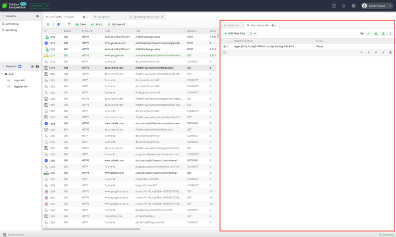

The [AutoResponder Rules Editor](#rules-editor)  allows you to create new rules and edit existing ones.

The [AutoResponder Queue Viewer](#queue-viewer) lists the currently used rules and provides additional control over them. The tab also exposes options to import/export rules files (__FARX__), to change the priority of the rules (of execution) and to entirely enable/disable the __AutoResponder__ or specific rules.

>tip You need to enable Live Traffic _Capturing_ to be able to apply AutoResponder rules.

## Rules Editor

The __Rules Editor__ interface enables creating and editing rules. You need to enter a __match rule__ and an __action string__, and Fiddler Everywhere will undertake the action if the request URI matches the __match rule__.

## Create New Rule

1. Click on __Create New Rule__ button in the __Rules Editor__.

    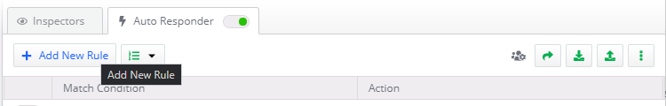

2. Enter a __match rule__. See the [match rule section](#match-rules) for more details.

    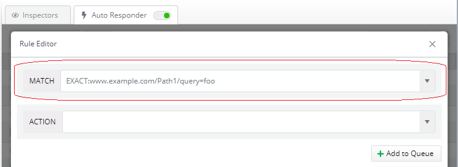

3. Enter an __action string__. See the [action string section](#action-strings) for more details.

    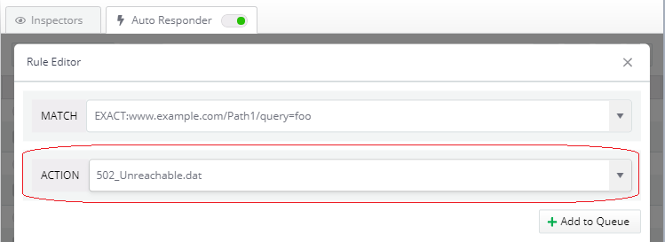

4. Add the newly created rule to the __Queue Viewer__ list of rules.

    Tips:
    - Rules are applied in the order that they appear in the __Queue Viewer__. Hit the __Down Arrow__ to demote a rule.
    - You can export the current queue of rules [via the __Export__ button](#export-rules) from the __Queue Viewer__ toolbar.
    - You can import a __*.FARX__ file [via the __Import__ button](#import-rules) to queue rules based on previously captured traffic.


## Match Rules

Fiddler Everywhere will accept string literals, regular expressions, and a set of some special match rules as listed below.

### String Literals

They will match string literals (case insensitively).

- __*__ will match everything
```
http://www.example.com/Path1/query=example
http://www.example.com/SomethingCompletelyDifferent
```
- __EXAMPLE__ will match URLs
```
http://www.**example**.com/Path1/
http://www.something.com/Path1/query=**Example**
```
- __path1/__ will match URLs
```
http://www.example.com/**Path1/**query=example
http://www.example.com/returnUrl=**Path1/**OtherPlace
```
- __query__ will match URLs
```
http://www.example.com/Path1/q=**Query**
http://www.example.com/Path1/**query**=hello
```

### NOT rules (for String Literals)

The __NOT:__ rule is applied only if the string does not match.

- __NOT:EXAMPLE__ will match URLs that do not contain the **EXAMPLE** string.
```
NOT:google.com

www.example.com/Path1/query=foo // (MATCH)
```
- __NOT:path1/__ will match URL that do not contain **path1/**.
```
NOT:path2/

www.example.com/path1/query=foo // (MATCH)
www.example.com/path2/query=foo // (No Match)
```

- __NOT:query__ wWill match URLs that do not contain **query**.
```
NOT:query/

www.example.com/path1/query=foo // (No Match)
www.example.com/path2/somethingElse=foo // (MATCH)
```

### EXACT Match

The __EXACT:__ is a case-sensitive match syntax for expressions and strings.

- __EXACT:URL__ - Will match URL that is identical to the passed **URL** parameter. Note that the __EXACT:__ rule is case-sensitive.
```
EXACT:www.example.com/Path1/query=foo

www.example.com/Path1/query=foo // (MATCH)
www.example.com/PATH1/query=foo // (No Match - mismatched case)
```

### Regular Expressions

Fiddler Everywhere supports regular expressions syntax for expressions that begin with __regex:__. The regular expression will be used to replace the inbound URL with the string in the Actions row. Use __.+__ to match a sequence of one or more characters or __.*__ to match zero or more characters. Use __^__ at the front of your regex to mean "Start of the URL" and use __$__ at the tail of the regex to mean "End of the URL".

- __regex:.+__ will match all URLs
```
regex:.+

www.example.com/Path1/query=foo // (MATCH)
```

- __regex:.+.jpg$__ will match URLs that are ending with __.jpg__
```
regex:.+.jpg$

www.example.com/Path1/query=foo.jpg&bar // (MATCH)
www.example.com/Path1/query=example.jpg // (MATCH)
```

- __regex:.+.(jpg|gif|bmp)$__ will match URLs that are ending with the listed image extensions (case-sensitive!).
```HTML
regex:+.(jpg|gif|bmp)$

www.example.com/Path1/query=foo.jpg&bar // (No Match - improper ending)
www.example.com/Path1/query=exam ple.jpg // (MATCH)
www.example.com/Path1/query=foo.JPG // (No Match - mismatched case)
www.example.com/Path1/query=somegif.gif // (MATCH)
```

## Action Strings

When Fiddler Everywhere identifies a request which matches the Auto Responder **Match** Rule, it automatically bypasses the server and maps it to the **ACTION** mentioned in the ruleset. Beyond simply returning files, the __AutoResponder__ can perform some specific actions:


| Action String     | Description | Action Type |
| :---- | :---- | :---- |
| __filename__      | Return contents of the filename as the response. | Final |
| __http://targetURL__ | Returns the content of the __targetURL__ as the response. | Final |
| __*redir:http://targetURL__ | Returns a HTTP Redirect to the target URL. Unlike the simple URL rule, this ensures that the client knows where its request is going so proper cookies are sent, etc. | Final |
| __*bpu__ | Breaks on request before hitting the server. | Non-final|
| __*delay:###__ | Delay sending request to the server by __###__ of milliseconds. | Non-final |
| __*header:Name=Value__ | Set the Request header with the given __Name__ to the specified __Value__. If no header of that name exists, a new header will be created. | Non-final |
| __*flag:Name=Value__ | Set the Session Flag, with the given __Name__ to the specified __Value__. If no header of that name exists, a new header will be created. | Non-final |
| __*CORSPreflightAllow__ | Returns a response that indicates that CORS is allowed. | Final |
| __*reset__ | Reset the client connection immediately using a TCP/IP RST to the client. | Final |
| __*drop__ | Close the client connection immediately without sending a response. | Final |
| __*exit__ | Stop processing rules at this point. | Final |
| __Return manually crafted response__ | Allows modifying the current response (HTML, JS, JSON) previously returned by the server. | Final |
| __Find a file...__ | The __Find a file…__ option in the Actions dropdown displays a file picker to allow you to select a filename that should be returned.| Final |

__Rules with Non-final__ actions will allow the request to match multiple AutoResponder rules. As soon a rule specifying a final action is reached, the matching process exists, and no further rules are processed for that session.

## Queue Viewer

The __Queue Viewer__ (a.k.a. __Queue Rules Viewer__) interface is a queue of the created AutoResponder rules. The __Queue Viewer__ allows the listed rules to be enabled and disabled, to be promoted and demoted (by changing their queue position), to be edited, to be exported and imported. The option to enable the __AutoResponder__ and to allow a non-matching request to pass-through is also part of the __Queue Viewer__.

### Rules Grouping & Priority

By default, the __Queue Viewer__ will list all created & imported rules based on their priority (see [Rule Options](#rule-options) for details on how to promote/demote a rule in the queue). You can also create a custom group for the rules in the queue by using __Group View/Priority View__ toggle button. 

Use __Group View/Priority View__ toggle to switch the rules in the queue based on priority vs. group identity.
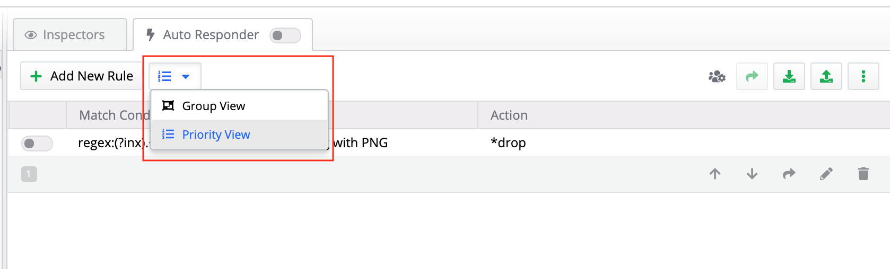

Use __Group/Ungroup__ toggle button to create croups for selected rules in the queue. Note that the __Group/Ungroup__ button is visible only when you have toggled to __Group View__.
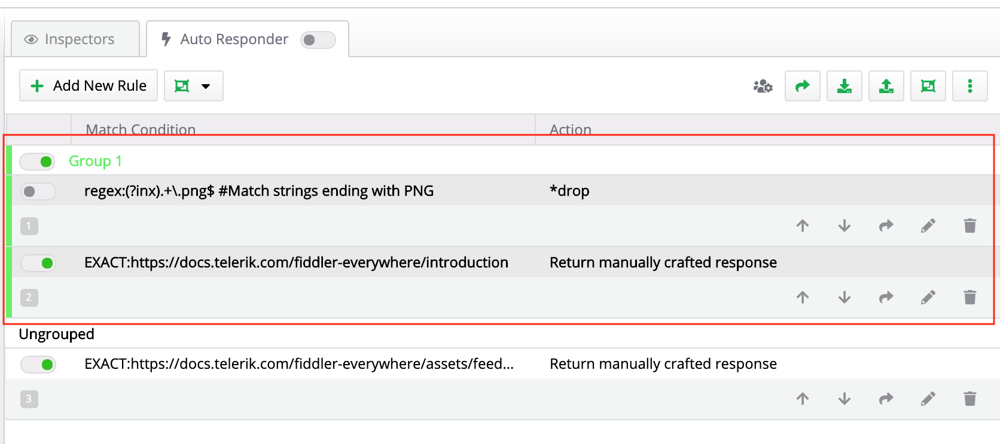

### Enable Auto Responses

Use the __Enable Auto Responses__ checkbox to activate the __AutoResponder__. Note that __Live Traffic__ switch should also be turned on to _Capturing_ mode.
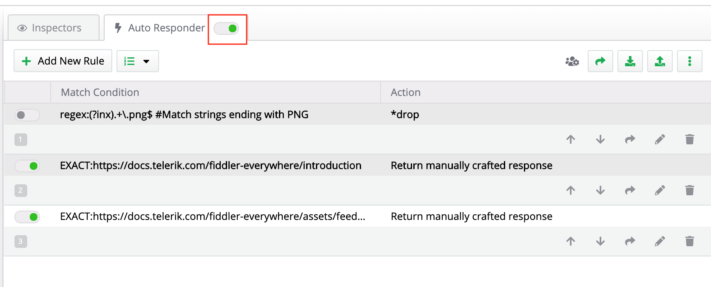

### Import Rules

You can import rules from a __FARX__ (Fiddler AutoResponder XML) file. The __FARX__ file contains a set of previously created AutoResponder rules. Your current set of rules is automatically saved on exit and reloaded when you start Fiddler Everywhere again.

Use the __Import__ button to provide a FARX file that contains the set of rules.
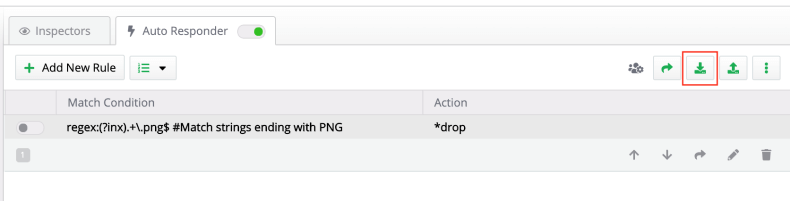

### Export Rules

You can export rules in a FARX file (Fiddler AutoResponder XML). The exported file can be easily reused via the [import functionality](#import-rules).

Use the __Export__ button to create a FARX file that contains the set of rules.
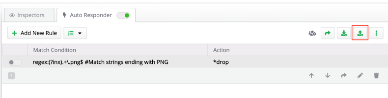

### Unmatched Requests Passthrough

The __Unmatched Requests Passthrough__ option controls what happens when a Session does not match any of the applied rules. When the checkbox is checked, the unmatched requests are sent to the server normally, without any interference from the AutoResponder. When the option is OFF (the checkbox is unchecked), Fiddler will generate a __404__ Not Found response for any _unconditional_ requests that are not matching the applied rules.

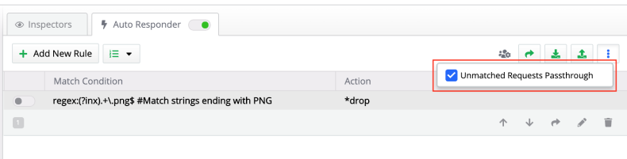

>important By default, when the __AutoResponder__ is enabled, the __Unmatch Requests Passthrough__ option is turned off, meaning that all unmatched requests will start to fail with a __404 (Fiddled)__ response.

For example, Fiddler generated a 404 response due to a request that is not matching the applied rules when __Unmatch Requests Passthrough__ option is turned off.
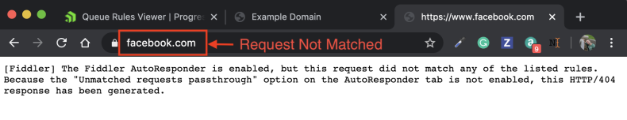

### Rule Options

Each rule present in the __Queue Viewer__ can be controlled via the following options:

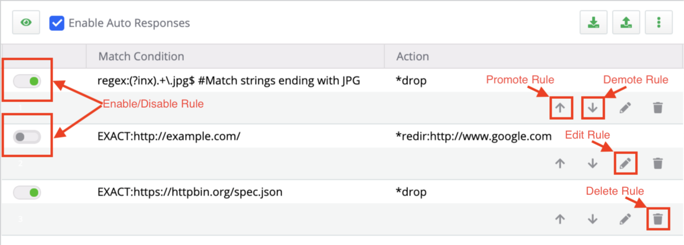

- __Enable & Disable Rule__ sets if the specified rule will be applied or not.

- __Promote__ raises the priority of the specified rule in the queue. If the rule has applied a final action, the lower priority rules won't be applied.

- __Demote__ lowers the priority of the specified rule in the queue.

- __Edit__ opens the specified rule in the [__Rules Editor__]() where it can be edited and saved.

- __Delete__ deletes the specified rule permanently.


