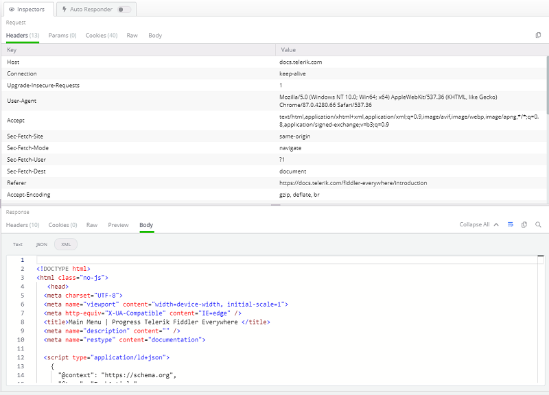

# Inspector Types

Fiddler Everywhere's inspectors display the **request** and the **response** for the selected session in the **Live Traffic list**. The inspectors are located in the right panel with the Request inspectors above the Response inspectors.

Select a session (from the __Live Traffic__ list) to load its data into the Inspector's section. Request inspectors are located at the top, and Response inspectors are located at the bottom (on the right panel).

The Fiddler Everywhere' Inspectors allow you to view the content of each session's request and response in a variety of different formats. Fiddler supports multiple inspector types for the sessions' request (at the top) and response (at the bottom). Click on the desired Inspector's name (for example, __Image__ or __Raw__) to switch the loaded Inspector.

The inspectors are based on the Monaco editor and are coming with a lot of perks:

- Great performance for loading large chunks of data
- Line IDs to quickly identify and mark a specific portion of the request/response.
- Powerful search functionality that supports strings and regular expressions.
- Context styling that highlights the content based on its type (e.g. Image renderers, HTML & XML formatters, JSON formatter, etc.).

>tip All inspector types (except **Preview**) are coming with **Copy all content to clipboard** button at the top-right corner.

## Headers Inspector

The __Headers__ Inspector allows you to view the HTTP headers of the request and the response.

There are some conceptual differences between Request Headers and Response Headers, as listed below.

### Request Headers

Every HTTP request begins with plaintext headers that describe what the client requests as a resource or operation. The first line of the request (the _"Request line"_) contains three values: the HTTP method (for example __GET__), the URL path which is being requested (for example __"/index.html"__), and the HTTP version (for example __"HTTP/1.2"__). Request line can consist of one or more rows containing name-value pairs of metadata about the request and the client, such as the _User-Agent_ and _Accept-Language_.

### Response Header

Like the HTTP request, every HTTP response begins with plaintext headers that describe the result from the request. The first line of the response (the _"Status line"_) contains the HTTP version (for example __"HTTP/1.1"__), the response status code (for example __"200"__), and the response status text (for instance __"OK"__). Following the _"Status line"_ one or more lines contain name-value pairs of metadata about the response and the server, such as the length of the response file, the Content-Type, and how the response may be cached.

## Params Inspector

The **Params inspector** (_Request_ only) displays the content from any input endpoints parameters. 

## Cookies Inspector

The **Cookies inspector** displays the contents of any outbound `Cookie` and `Cookie2` request headers and any inbound `Set-Cookie`, `Set-Cookie2`, and `P3P` response headers.

## Raw Inspector

The **Raw Inspector** allows you to view the complete request and response, including headers and bodies, as text. Most of the inspector is a large text area that displays the body text interpreted using the character set detected using the headers, the byte-order-marker, or an embedded META tag declaration. By default, the request/response will be displayed as received, which means that encoded or compressed content won't be in readable form (received as is). The **Raw Inspector** comes with a special **decode** button in the inspector toolbar to decode encoded/compressed content.

- Encoded raw content (the **decode** button is inactive).

    

- Decoded raw content (the **decode** button is active).

    

## Preview Inspector

The **Preview Inspector** (_Response_ only) allows you to view the response bodies as an image or an HTML page, depending on the response content. The Inspector can display most common web image formats, including JPEG, PNG, GIF, and less common formats like cursors, WebP, JPEG-XR, bitmaps, TIFF.

If the content is in HTML format, then the **Preview Inspector**  allows you to view responses in a web browser control, which provides a quick preview of how a given response may appear in a browser. The web browser control is configured to prevent additional downloads when rendering the response (to avoid flooding the Live Traffic list), meaning that most images and styles will not be displayed. Additionally, scripting and navigating are blocked, providing a read-only preview.

## Body Inspectors

There are several different **Body Inspectors** suitable for different types of requests and responses. Fiddler Everywhere will try to automatically load the most appropriate type of Body Inspector depending on the content. 

### Text

The **Text inspector** allows you to view the request and response bodies as text. The **Text Inspector** truncates the data it shows at the first null byte it finds, making it an inappropriate choice for displaying binary content.
Most of the Inspector is a large text area that displays the body text interpreted using the character set detected using the headers, the byte-order-marker, or an embedded META tag declaration.

### JSON

The **JSON Inspector** interprets the selected request or response body as a JavaScript Object Notation (JSON) formatted string, showing a tree view of the JSON object's nodes. In case when the body can't be interpreted as JSON, the tree view will remain empty (as demonstrated for the request in the screenshot below). The JSON inspector can render the data even if the request/response is compressed or has HTTP chunked encoding applied. The Inspector provides __Expand All / Collapse All__ toggle button that will expand or collapse all JSON tree nodes.

>important If the JSON data is malformed (if, for instance, the name component of a name/value pair is unquoted), the JSON inspector will show a warning in the footer.

### XML

The **XML Inspector** interprets the selected request or response body as an Extensible Markup Language (XML) document, showing a tree view of the XML document's nodes. If the body can't be interpreted as XML, the tree view will remain empty (as demonstrated for the request in the screenshot below). Each XML element is represented as a node in the tree. The attributes of the element are displayed in square brackets after the element's name. The Inspector provides __Expand All / Collapse All__ toggle button that will expand or collapse all XML tree nodes.

### Form Data

The **Form Data inspector** (_Request_ only) parses the request's query string and body for any HTML form-data. If a form is found, it is parsed, and the name/value pairs are displayed in the grid view. The Inspector works best with application/x-www-form-urlencoded data used by most simple web forms.

The **Form Data inspector** provides several options to copy the parameter's content from the context menu:

- **_Copy Value_** - copies only the value of the selected parameter key-value pair.
- **_Copy Key/Value_** - copies the key-value pair of the selected parameter.

